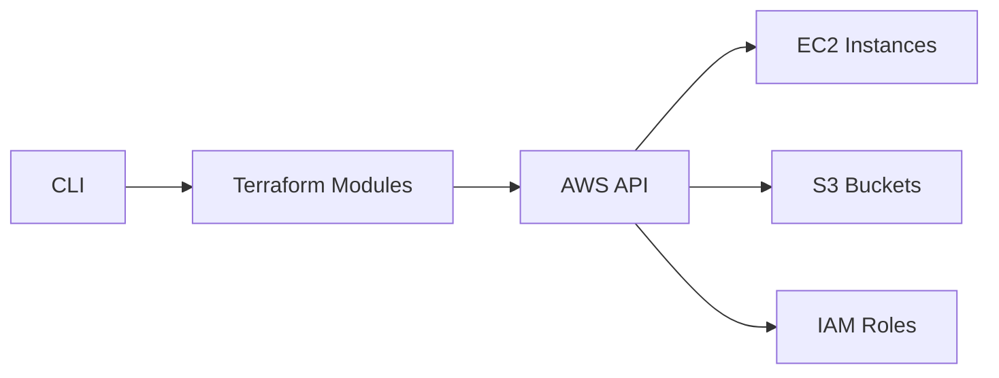

## What's New

The IaC Toolbox CLI now includes a powerful terminal UI for managing your Raspberry Pi infrastructure. Built with clack, it provides an intuitive interface for provisioning AWS resources and deploying applications.

## Getting Started

Install the CLI globally using npm:

```bash
npx iac-toolbox-cli init
```

The interactive wizard will guide you through:

- Selecting your AWS region
- Configuring S3 backend for Terraform state
- Setting up credentials
- Choosing deployment profiles

## Key Features

### Interactive Provisioning

No more remembering complex Terraform commands. The CLI provides guided workflows for:

- Initializing new projects
- Deploying infrastructure
- Managing configurations
- Validating ARM64 compatibility

### Profile Management

Switch between environments seamlessly:

```bash
iac-toolbox profile switch production
iac-toolbox profile switch development
```

### Integration Support

The CLI integrates with popular tools:

- **HashiCorp Vault** for secrets management
- **Grafana** for monitoring dashboards
- **Cloudflare** for DNS and edge services

## Architecture

The CLI is built on top of Terraform modules designed specifically for Raspberry Pi deployments:



## Next Steps

Check out the [installation guide](/docs/installation) to get started, or explore the [CLI reference](/docs/cli-reference) for detailed command documentation.

## Community

We're building a community of indie developers and small startup founders using IaC Toolbox. Join us on GitHub to contribute, report issues, or share your deployment stories.
