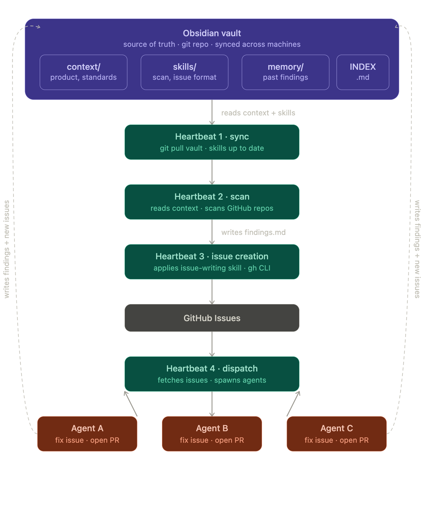

After setting up my Raspberry Pi with complete observability, secrets management, and CI/CD pipelines, I realized I had built the perfect platform for something more ambitious: an autonomous AI coding assistant that could work while I sleep.

This guide documents my journey building a self-hosted AI coding bot that:
- Runs entirely on a Raspberry Pi (no cloud costs)
- Delegates work to specialized AI agents (OpenClaw + Codex)
- Maintains its own knowledge base (Obsidian vault)
- Generates its own work queue from business roadmaps
- Works autonomously 24/7 without human intervention

## What You'll Build

By the end of this series, you'll have an AI coding system that:

1. **Reads your product roadmap** written in plain Markdown
2. **Generates GitHub issues** from business requirements
3. **Picks up issues automatically** and delegates to Codex for implementation
4. **Writes, tests, and commits code** with full validation
5. **Opens pull requests** and notifies you on Discord
6. **Stores findings** in an Obsidian vault as institutional memory

The entire system runs on a single Raspberry Pi 4B, costs pennies per month in electricity, and operates completely under your control.

## Why This Matters

Most AI coding assistants are:
- **Cloud-dependent** - require internet, subscriptions, and trust in third parties
- **Interactive** - need you to give them every instruction
- **Stateless** - forget everything between sessions
- **Expensive** - $20-50/month per developer

This system is:
- **Self-hosted** - runs on your hardware, your network, your rules
- **Autonomous** - generates its own work from your roadmap
- **Persistent** - builds institutional knowledge in Obsidian
- **Cost-effective** - $2-5/year in electricity after initial hardware cost

## Table of Contents

This tutorial series is organized into six parts:

1. **[Secure Setup](./open-claw-1-secure-setup)** - Security-first configuration: Docker isolation, fine-grained GitHub PATs, and Anthropic spending caps
2. **[Installing OpenClaw](./open-claw-2-installing-openclaw)** - Node.js setup, OpenClaw installation, Discord integration, and resolving dependency issues
3. **[Performance & Stability](./open-claw-3-performance-stability)** - Expanding swap, tuning memory, systemd service setup, and log routing to Grafana
4. **[Codex Delegation](./open-claw-4-codex-delegation)** - Setting up OpenClaw as coordinator, ACP configuration, tmux sessions, and the mailbox protocol
5. **[Heartbeats & Notifications](./open-claw-5-heartbeats-notifications)** - Wake triggers, completion signals, HEARTBEAT.md registry, and parallel agent spawning
6. **[Obsidian & Autonomous Loop](./open-claw-6-obsidian-autonomous-loop)** - Obsidian vault as second brain, roadmap parsing, automatic issue creation, and the full autonomous loop

## Prerequisites

Before starting, you should have:

- **Raspberry Pi 4B** (4GB or 8GB RAM) with Raspberry Pi OS
- **Docker** installed and configured
- **GitHub account** with repository access
- **Anthropic API key** for Claude access
- **Discord account** for bot interaction
- **Basic command line familiarity** (SSH, tmux, systemd)

If you don't have the basic Pi infrastructure set up yet, check out my [Private On-Premises Infrastructure guide](./v0-01-raspberry-pi-infrastructure-intro) which covers the foundation:
- Raspberry Pi OS setup
- Docker configuration
- Grafana + Prometheus + Loki observability stack
- HashiCorp Vault for secrets management

## What This Series Is Not

This is **not** a guide for enterprise production AI systems. We won't cover:
- Multi-tenant isolation
- High availability or load balancing
- Compliance or audit logging
- Enterprise identity management

This **is** a guide for:
- Personal development infrastructure
- Learning AI agent orchestration
- Cost-effective experimentation
- Understanding autonomous AI systems

## The Philosophy

The core insight is **separation of concerns**:

- **OpenClaw** = Coordinator and interface (Discord, HTTP, dashboard)
- **Codex** = Specialist worker for coding tasks
- **Obsidian** = Persistent memory and knowledge base
- **GitHub** = Source of truth for code and tasks

Each component does one thing well, and they communicate through simple, inspectable interfaces (files, HTTP, Discord messages).

## Cost Breakdown

**One-time hardware:**
- Raspberry Pi 4B (8GB): ~$75
- MicroSD card (64GB): ~$12
- Power supply: ~$10
- Case (optional): ~$8
- **Total: ~$105**

**Recurring costs:**
- Electricity (~5W): ~$2-5/year
- Anthropic API: Pay only for tokens used
- **Total: $10/year **

Compare this to cloud-hosted AI assistants at $240-600/year and you break even in 2-4 months.

## Code Repository

All configuration files, scripts, and examples from this series are available in the GitHub repository:

**https://github.com/IaC-Toolbox/iac-toolbox-raspberrypi**

The OpenClaw-specific configurations are in the `openclaw/` directory.

## Let's Begin

Ready to build your own autonomous coding assistant? Start with [Part 1: Secure Setup](./open-claw-1-secure-setup) where we lay the security foundation before installing anything.

The series is designed to be followed in order - each part builds on the previous one. By the end, you'll have a fully autonomous AI coding system running on hardware you control.

---

**Next:** [Part 1 - Secure Setup](./open-claw-1-secure-setup)
