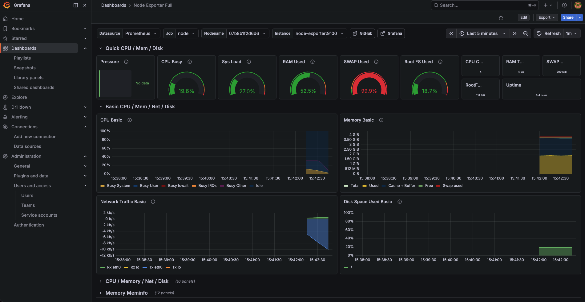
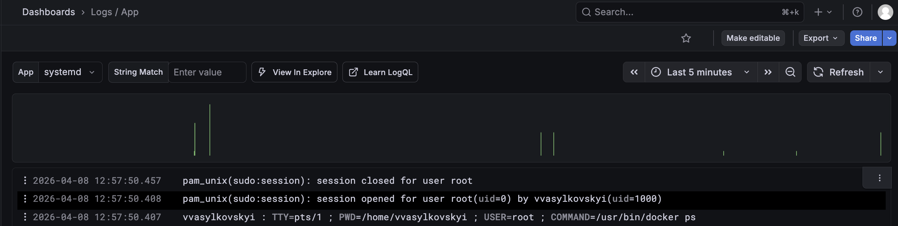

**Previous:** [Part 2 - Installing OpenClaw](./open-claw-2-installing-openclaw)

After a couple of hours of use, my OpenClaw stopped responding on Discord without any warning. No error, no notification — just silence. This post is about fixing the two main failure modes I ran into: the Pi running out of swap memory, and the bot process dying with no logs to debug it.

## The SWAP problem

From Grafana, I could see SWAP usage sitting at 99.9%. With 4GB RAM, my Pi was heavily memory-pressured — everything in RAM was actively needed, and it was spilling everything else to disk. This causes significant slowdowns, and eventually the OOM killer starts taking things down.




### What swap is

Swap is virtual memory on disk — when the Pi runs out of physical RAM, the OS moves less-used memory pages to a swap file on the SD card/SSD to free up real RAM. It's much slower than RAM but prevents out-of-memory crashes.

### Checking current swap

```sh
vvasylkovskyi@raspberry-4b:~ $ swapon --show
NAME      TYPE SIZE   USED PRIO
/var/swap file 200M 199.8M   -2
```

Raspberry Pi OS allocates 200MB of swap by default. That's nowhere near enough when you're running an LLM gateway, a Discord client, and a browser control server simultaneously.

### Allocating 2GB of swap

```sh
sudo fallocate -l 2G /swapfile
sudo chmod 600 /swapfile
sudo mkswap /swapfile
sudo swapon /swapfile
echo '/swapfile none swap sw 0 0' | sudo tee -a /etc/fstab

# Reduce swappiness for low-RAM devices
echo 'vm.swappiness=10' | sudo tee -a /etc/sysctl.conf
sudo sysctl -p
```

What each command does:

- `sudo fallocate -l 2G /swapfile` — allocates a 2GB file on disk instantly. This becomes your swap space.
- `sudo chmod 600 /swapfile` — restricts the file to root-only read/write. Required by Linux — `mkswap` will refuse to use a swap file that other users can read.
- `sudo mkswap /swapfile` — formats the file with swap metadata so the kernel knows it's a swap area.
- `sudo swapon /swapfile` — activates the swap file immediately for the current session.
- `echo '/swapfile none swap sw 0 0' | sudo tee -a /etc/fstab` — makes the swap persistent across reboots. Without this, the swap disappears on restart.
- `echo 'vm.swappiness=10'` — sets swappiness to 10 (default is 60). This tells the kernel to prefer keeping things in RAM and only spill to swap when really necessary. Important on a Pi because SD card I/O is slow and has limited write cycles.
- `sudo sysctl -p` — reloads `/etc/sysctl.conf` to apply the swappiness change immediately without rebooting.

### The swap priority problem

After applying the script, I had two swap files:

```sh
vvasylkovskyi@raspberry-4b:~ $ swapon --show
NAME      TYPE SIZE USED PRIO
/var/swap file 200M 200M   -2
/swapfile file   2G   0B   -3
```

The Pi was ignoring the big 2GB swapfile and hammering the tiny 200MB one. That's a priority problem — `/var/swap` has priority -2 (higher) and `/swapfile` has -3 (lower), so the system fills the small one first and never touches the big one.

Fix — disable the small one since the 2GB one is sufficient:

```sh
sudo swapoff /var/swap
```

After expanding swap and fixing the priority, Grafana shows the improvement:


## Increasing OpenClaw timeout

I was getting lots of timeouts especially when asking the bot to run commands on the device. The error in chat flow:

```sh
Request timed out before a response was generated. Please try again, or increase agents.defaults.timeoutSeconds in your config.
```

Update it in the config:

```sh
sudo nano ~/.openclaw/openclaw.json
```

Find `agents.defaults.timeoutSeconds` and increase it. Then restart the gateway to apply:

```sh
openclaw gateway stop
openclaw gateway > /dev/null 2>&1 &
```

## Making the bot persistent — the silent death problem

After using it for a couple of hours, OpenClaw failed to respond on Discord. This raised two questions:

1. What did we miss to make OpenClaw persistent and auto-restart?
2. How do we react to a failure and get notified?

### The DISCORD_BOT_TOKEN problem

This time it was my Discord bot token that got lost from the env variable after a session restart. Although not ideal from a security standpoint, I replaced the env var reference with the token stored as plaintext in `~/.openclaw/openclaw.json`:

```json
"channels": {
  "discord": {
    "enabled": true,
    "token": "YOUR_ACTUAL_DISCORD_BOT_TOKEN",
    ...
  }
}
```

This is a tradeoff — it's less clean than env vars, but it survives restarts. If you're security-conscious about this file, restrict its permissions.

### Installing as a systemd service

To address both reliability and the lack of persistent logs, I built an automation that installs OpenClaw as a systemd service. With systemd managing the process:

- It auto-restarts on crash
- Logs go to the journal and can be forwarded to Grafana Loki
- You can check status with `systemctl --user status openclaw`

The gateway service is actually already installed by `--install-daemon` during onboard:

```sh
systemctl --user status openclaw-gateway.service
● openclaw-gateway.service - OpenClaw Gateway (v2026.4.2)
     Loaded: loaded (/home/vvasylkovskyi/.config/systemd/user/openclaw-gateway.service; enabled; preset: enabled)
     Active: active (running) since Sun 2026-04-05 14:05:29 WEST; 23min ago
```

### Routing logs to Grafana Loki

I have Grafana Loki configured with Grafana Alloy for log collection, and I can see my systemd logs in Grafana. This means two ways to pull logs from OpenClaw:

1. Make it a systemd service (already done above)
2. Run it inside a Docker container

The systemd route is easier — it avoids the potential of scoped Docker permissions limiting features. The Docker approach would be more secure if configured correctly, but for now systemd does the job.

With systemd + Loki, when the bot dies overnight I now have logs to debug it instead of just staring at silence.



## Enabling elevated exec from Discord

When I tried to install something on the Pi via the bot, I hit this:

```sh
sudo apt-get update && sudo apt-get install -y ansible

elevated exec is unavailable in this Discord session
```

To enable this, add to your config:

```json
{
  "tools": {
    "elevated": {
      "enabled": true,
      "allowFrom": {
        "discord": ["YOUR_DISCORD_USER_ID"]
      }
    }
  }
}
```

Or via CLI (ask your bot for your Discord user ID first):

```sh
openclaw config set tools.elevated.enabled true --strict-json
openclaw config set tools.elevated.allowFrom.discord '["YOUR_DISCORD_USER_ID"]' --strict-json
openclaw config validate
openclaw gateway restart
```

Then from Discord you can use:
- `/elevated on` — elevated host exec, approvals still apply
- `/elevated full` — elevated host exec without exec approvals

## Message streaming

One more quality of life improvement — by default the bot sends a full wall of text when it finishes. To see progress as it arrives:

```sh
openclaw config set channels.discord.streaming partial
openclaw gateway restart
```

Modes available: `off` (final reply only), `partial` (temp message edited as text arrives), `block` (chunked), `progress` (maps to partial on Discord).

Note: Discord edit-based streaming can hit rate limits, which is why it's off by default. For long tasks it's worth it though.

## What's stable now

- 2GB swap with correct priority — no more memory pressure
- OpenClaw managed by systemd — auto-restarts on crash
- Logs forwarded to Grafana Loki — can debug failures after the fact
- Discord token persisted in config — survives restarts
- Elevated exec enabled — can run sudo commands from Discord
- Streaming enabled — can see progress on long tasks

The bot is now actually reliable. The next post gets into the interesting part — delegating coding work to Codex running as a separate agent process.

---

**Previous:** [Part 2 - Installing OpenClaw](./open-claw-2-installing-openclaw) | **Next:** [Part 4 - Codex Delegation](./open-claw-4-codex-delegation)
