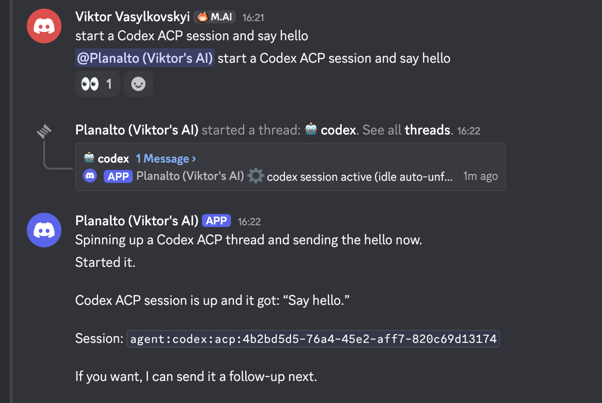
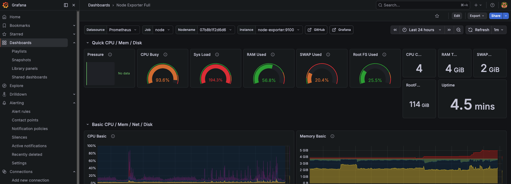

**Previous:** [Part 3 - Performance & Stability](./open-claw-3-performance-stability)

OpenClaw is good at talking and coordinating, but for serious coding work I want to delegate to something specialized. The idea is a clean separation: OpenClaw is the frontline assistant that understands what I want, and Codex is the coding worker that actually writes code. This post covers getting that delegation working — including a nasty arm64 binary problem that only shows up on Raspberry Pi.

## Why delegate at all

OpenClaw alone can write code, but it's interactive — it's tied to a Discord session, and long coding tasks block the conversation. Codex runs as a separate process that can work for 30+ minutes without holding up the bot. The coordination model I settled on:

1. OpenClaw understands the request and creates a plan
2. OpenClaw writes a detailed prompt and spawns Codex
3. Codex works, validates, commits, pushes
4. Codex signals completion back to OpenClaw
5. OpenClaw opens a PR and notifies me

## Adding the GitHub key

Before the agent can push code, the Pi needs git credentials. The cleanest approach is SSH:

```sh
ssh-keygen -t ed25519 -C "your_email@example.com"
eval "$(ssh-agent -s)"
ssh-add ~/.ssh/id_ed25519
cat ~/.ssh/id_ed25519.pub
# add key to GitHub
ssh -T git@github.com
git remote set-url origin git@github.com:OWNER/REPO.git
```

Also set git identity for commits:

```sh
git config --global user.name "Your Name"
git config --global user.email "you@example.com"
```

Check your remote is SSH and not HTTPS:

```sh
git remote -v
# should show git@github.com:... not https://github.com/...
```

For the GitHub token itself, create one at `https://github.com/settings/tokens` with these permissions:
- `repo` — full control of private repositories
- `workflow` — update GitHub Actions
- `read:org` — read org membership
- `admin:public_key` — for SSH key management
- `project` — full control of projects (needed later for reading issues)

Then authenticate:

```sh
gh auth login
```

## Setting up ACP

ACP (Agent Communication Protocol) is the protocol for OpenClaw to delegate to Codex. Enable it:

```sh
openclaw config set acp.enabled true
openclaw config set acp.backend acpx
openclaw config set acp.defaultAgent codex
openclaw config set acp.allowedAgents '["codex"]'
```

Set permissions for headless coding sessions:

```sh
openclaw config set plugins.entries.acpx.config.permissionMode approve-all
openclaw config set plugins.entries.acpx.config.nonInteractivePermissions deny
```

## Install Codex

```sh
npm i -g @openai/codex
codex
# Follow through prompts. Choose Device Code for Auth
```

## The arm64 binary problem

After all the ACP setup, running `acpx codex sessions new` threw:

```sh
ACP agent exited before initialize completed (exit=1, signal=null): Error resolving package: Error [ERR_MODULE_NOT_FOUND]: Cannot find package '@zed-industries/codex-acp-linux-arm64' imported from /home/vvasylkovskyi/.npm/_npx/d285e17b0418cc35/node_modules/@zed-industries/codex-acp/bin/codex-acp.js Failed to locate @zed-industries/codex-acp-linux-arm64 binary. This usually means the optional dependency was not installed. Platform: linux, Architecture: arm64
```

The Codex ACP package uses platform-specific binaries, and the Linux ARM64 package isn't pulled in automatically. Fix:

```sh
# 1) clear the broken npx cache for this package
rm -rf ~/.npm/_npx
npm cache clean --force

# 2) install the adapter explicitly, including the arm64 binary package
npm install -g @zed-industries/codex-acp @zed-industries/codex-acp-linux-arm64

# 3) verify the adapter starts
npx @zed-industries/codex-acp --help
```

If that outputs usage info, the binary is working. Then verify a session can start:

```sh
acpx codex sessions new
# Should output a session UUID
```

## Approving gateway pairing

The local CLI also needs to be approved by the gateway:

```sh
openclaw devices approve --latest
```

With ACP working, you can delegate to Codex from Discord:



## Why we eventually pivoted from ACP to tmux

ACP has a lot of open issues — sessions timing out, the gateway pairing dance, the arm64 binary problem. After getting it working, I kept hitting reliability problems. There are also open GitHub issues specifically about this:

- https://github.com/openclaw/openclaw/issues/29195
- https://github.com/openclaw/openclaw/issues/38419

Under heavy load, the ACP system would overload:



The alternative I landed on is much simpler: a filesystem mailbox and tmux. OpenClaw writes a task to a JSON file, Codex reads it from a tmux session, does the work, writes results back, and sends a wake signal. No ACP protocol, no session management, no pairing dance.

## The filesystem mailbox protocol

The mailbox lives at `~/agent-mailbox/`:

```
~/agent-mailbox/
  codex/
    {task_id}/
      inbox.json     ← OpenClaw writes tasks here
      outbox.json    ← Codex writes results here
```

Using task ID subfolders (rather than a single inbox.json) avoids the stale task problem — an old result from a previous run can't accidentally be picked up as the current one.

**inbox.json schema** (OpenClaw writes):

```json
{
  "from": "OPENCLAW",
  "to": "CODEX",
  "task_id": "unique-slug-or-uuid",
  "type": "one_shot",
  "prompt": "Full task description including validation commands and definition of done",
  "sent_at": "ISO8601"
}
```

**outbox.json schema** (Codex writes):

```json
{
  "from": "CODEX",
  "to": "OPENCLAW",
  "task_id": "echo task_id from inbox",
  "status": "ready | in_progress | done | failed",
  "result": {
    "summary": "One sentence of what was done",
    "files_modified": ["relative/path/to/file.ts"],
    "validation_output": "Test output or relevant stdout",
    "error": null
  },
  "updated_at": "ISO8601"
}
```

## spawn-agent.sh

This is the main script that wires everything together. When invoked, it:

1. Creates a tmux session for the task
2. Creates a git worktree on a new branch (so multiple agents can work in parallel without stepping on each other)
3. Writes the task to the mailbox inbox
4. Registers the task in `active-tasks.json`
5. Sends the prompt to Codex running in the tmux session

```sh
chmod +x spawn-agent.sh check-agents.sh cleanup-worktrees.sh
```

The `active-tasks.json` tracks running tasks:

```json
{
  "tasks": [
    {
      "id": "feat-custom-templates-3",
      "tmuxSession": "codex-feat-custom-templates-3",
      "agent": "codex",
      "repo": "iac-toolbox-cli",
      "repoPath": "/home/vvasylkovskyi/.openclaw/workspace/git/iac-toolbox-cli",
      "worktree": "/home/vvasylkovskyi/.openclaw/workspace/worktrees/feat-custom-templates-3",
      "branch": "feat/custom-templates-3",
      "startedAt": 1776023448308,
      "status": "running",
      "attempts": 1,
      "notifyOnComplete": true
    }
  ]
}
```

To monitor a running session:

```sh
tmux attach -t <tmux_session_name>   # enters terminal session with full control
tmux capture-pane -t codex-feat-custom-templates-4 -p  # captures the screen non-interactively
```

## Writing a good Codex prompt

The quality of the prompt you send to Codex determines whether it succeeds or spins in circles. Here's an example from a real pnpm migration task:

```sh
Repo path: /home/vvasylkovskyi/.openclaw/workspace/git/iac-toolbox-cli
Branch / PR context: create branch chore/pnpm-migration from current main and open/update a PR.
Approved plan summary: migrate this repo from npm to pnpm. This is a small obvious package-manager migration, no docs-first proposal needed.
Exact task scope:
- Switch the project to pnpm instead of npm.
- Update package metadata and scripts as appropriate for pnpm.
- Replace npm-specific script invocations in package.json with pnpm-friendly equivalents where needed.
- Remove package-lock.json and generate pnpm-lock.yaml.
- Update README and any repo docs/configs that mention npm commands so they use pnpm.
- Ensure install/dev/build/lint/format flows work with pnpm.
Constraints / non-goals:
- Do not make unrelated code changes.
- Do not change runtime behavior of the CLI beyond package-manager migration.
Validation commands:
- pnpm install
- pnpm run build
- pnpm run typecheck
- pnpm run lint
- pnpm run format:check
Definition of done:
- Repo uses pnpm cleanly.
- Lockfile is pnpm-lock.yaml, not package-lock.json.
- Validation commands pass.
- Commit, push branch, and open/update a PR.
- Report back with PR link, commit hash, files changed, and validation summary.
```

The key parts: explicit validation commands, a definition of done, and the git lifecycle (commit, push, open PR). Without those, Codex will write code but not tell you when it's done or what to check.

## AGENTS.md for the Codex worker

Codex needs its own instructions for how to behave as a worker. Global worker instructions live at `~/.codex/AGENTS.md`. The critical piece is the milestone-first execution loop:

For each milestone:
1. implement
2. run validation
3. inspect failures
4. fix
5. rerun validation
6. repeat until done or blocked
7. commit
8. push
9. report back

Codex should never claim success without running validation, and should never give vague failure messages — it should say exactly which layer failed.

## The SKILL.md for OpenClaw

The coordinator skill lives at `~/.openclaw/workspace/skills/codex-orchestrated-dev/SKILL.md`. It defines when to create a docs-first plan (for non-trivial work) vs skip straight to implementation, what to include in the Codex ACP prompt, and how to monitor and verify the result before handing over a PR.

The delegation rule in the skill: if ACP fails, OpenClaw explains the failure and identifies which layer failed. It does not silently switch to direct CLI unless I explicitly ask for that.

## What's working now

- Codex running in tmux sessions with git worktrees
- spawn-agent.sh wiring up the whole lifecycle
- Active task registry in active-tasks.json
- Good prompt structure that produces reliable results

The next post covers the last piece: how does OpenClaw know when Codex is done, and how do I get notified on Discord without watching a terminal?

---

**Previous:** [Part 3 - Performance & Stability](./open-claw-3-performance-stability) | **Next:** [Part 5 - Heartbeats & Notifications](./open-claw-5-heartbeats-notifications)
