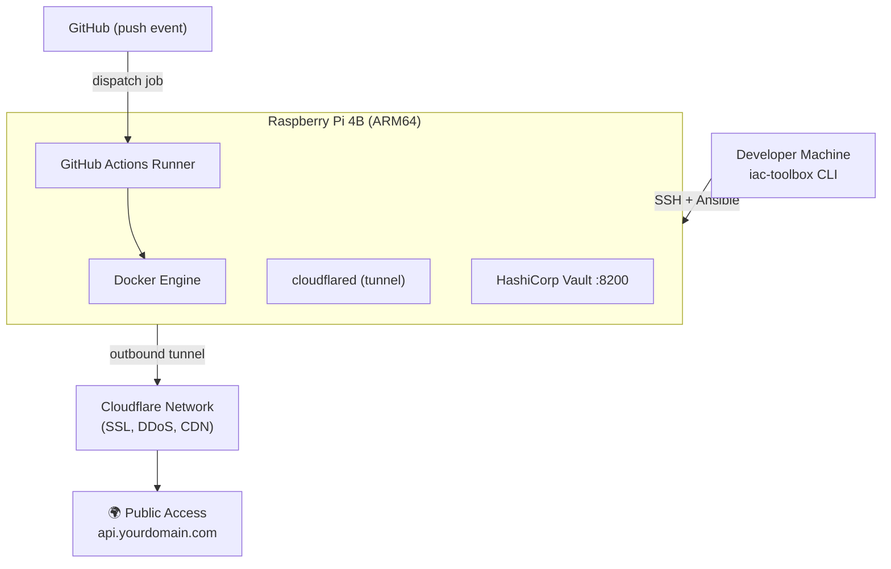

Building your own on-premises infrastructure gives you complete control over your compute resources without recurring cloud costs. Whether you're running personal projects, development environments, or simply learning infrastructure concepts, a Raspberry Pi can serve as a powerful, energy-efficient compute platform that won't break the bank.

In this guide, we'll walk through setting up a working Raspberry Pi infrastructure from scratch - from flashing the OS all the way to deploying containerized applications with automated CI/CD pipelines. Think of it as your personal cloud, but one that sits on your desk and costs almost nothing to run.

## What you'll build

We're going to build a complete on-premises infrastructure setup featuring:

1. **Raspberry Pi as Compute**: Headless Raspberry Pi running OS Lite with SSH access
2. **Automated Configuration**: Ansible playbooks for reproducible system setup (so you never have to manually configure a Pi again!)
3. **Self-Hosted CI/CD**: GitHub Actions runner running directly on your Pi
4. **Public Access**: Cloudflare tunnel for secure internet exposure without port forwarding
5. **Continuous Deployment**: Automated Docker image builds and deployments on ARM64 architecture

By the end of this guide, you'll have a Raspberry Pi that:
- Automatically builds and deploys Docker containers on every git push
- Is securely accessible from anywhere via HTTPS
- Costs only the electricity to run it (we're talking ~$2-5/year here!)

## Code Repository

All the Ansible playbooks, configuration files, and example code from this tutorial are available in the GitHub repository:

**https://github.com/IaC-Toolbox/iac-toolbox-raspberrypi**

Feel free to clone it and follow along! Each section of this tutorial corresponds to files in the repository.

## Why On-Premises?

Let me share why this approach makes sense for many projects:

**Cost-Effective**: A Raspberry Pi 4B costs around $50-80 one-time, with minimal electricity costs (~$2-5/year). Compare this to cloud compute which can easily run $15-50+ per month. The Pi pays for itself in just a few months!

**Full Control**: You own the hardware, your data, and your infrastructure. No vendor lock-in, no surprise billing at the end of the month, and no one throttling your resources.

**Learning Platform**: Perfect for understanding infrastructure concepts without worrying about cloud costs during experimentation. Want to break something? Go ahead - it's your hardware!

**ARM64 Development**: Ideal for building and testing ARM64 applications, which are increasingly common in edge computing and mobile devices. You're building on the same architecture that powers billions of devices.

## What This Tutorial Is Not

Before we dive in, let's be clear about what this tutorial is NOT. This is not a guide for enterprise production infrastructure. We won't cover high availability, load balancing, or disaster recovery. The goal here is to build a functional, cost-effective personal infrastructure that you can expand upon as your needs grow.

## Prerequisites

Before starting, you'll need a few things:

- **Raspberry Pi 4B** (4GB or 8GB RAM recommended)
- **MicroSD card** (32GB or larger, Class 10)
- **Power supply** for Raspberry Pi
- **WiFi network** or Ethernet connection
- **Mac or Linux machine** for running Ansible (this can be your laptop)
- **GitHub account** for CI/CD setup
- **Domain name** (optional, for Cloudflare tunnel)

## Table of Contents

This tutorial series is organized into the following guides:

1. **[Hardware Requirements](./v0-02-hardware-requirements)** - Essential hardware components needed for your Raspberry Pi setup
2. **[Raspberry Pi OS Setup](./v0-03-raspberry-pi-os-setup)** - Install and configure Raspberry Pi OS Lite for headless operation
3. **[Ansible Base Software Setup](./v0-04-ansible-base-software-setup)** - Automate configuration with Ansible playbooks for Docker and system packages
4. **[Configure Cloudflare Tunnel](./v0-05-configure-cloudflare-tunnel)** - Set up secure public access without port forwarding
5. **[Configure GitHub Runner](./v0-06-configure-github-runner)** - Install self-hosted GitHub Actions runner for ARM64 CI/CD
6. **[Docker Build Deployment](./v0-07-docker-build-deployment)** - Implement automated Docker image builds and deployments
7. **[Managing Secrets](./v0-08-managing-secrets)** - Securely manage secrets and credentials for your infrastructure
8. **[Managing Secrets with Vault](./v0-09-managing-secrets-vault)** - Deploy HashiCorp Vault for centralized secrets management
9. **[Grafana Setup](./v0-10-grafana-setup)** - Set up Grafana for monitoring and observability dashboards
10. **[Prometheus Metrics Setup](./v0-11-prometheus-metrics-setup)** - Configure Prometheus for hardware and system metrics
11. **[Logs with Loki](./v0-12-logs-with-loki)** - Implement centralized logging with Grafana Loki
12. **[Grafana Alerts](./v0-13-grafana-alerts)** - Configure alerting rules for proactive monitoring
13. **[Grafana PagerDuty Integration](./v0-14-grafana-pagerduty)** - Integrate PagerDuty for incident management
14. **[Conclusion](./v0-15-conclusion)** - Summary and next steps for expanding your infrastructure

Each section builds upon the previous one, creating a complete infrastructure setup you can adapt for your own projects. Think of it as building with LEGO blocks - each piece connects to the next until you have something amazing.

Let's dive in! First, we'll cover what hardware you need to get started.

---

**Next:** [Hardware Requirements](./v0-02-hardware-requirements)
