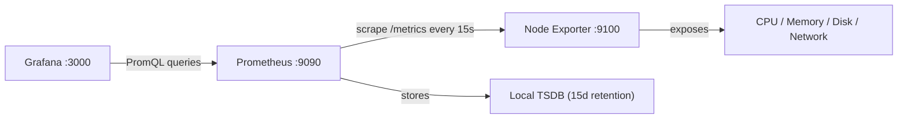
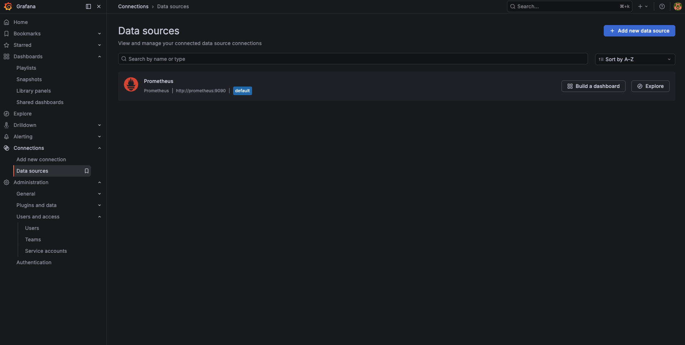

**Previous:** [Grafana Setup](./v0-10-grafana-setup)


You've got Grafana running, but it's pretty useless without data. In this guide, we'll add Prometheus (metrics storage) and Node Exporter (system metrics collector) using automated Ansible deployment to actually start tracking what's happening on your Raspberry Pi.

Think of it this way: Grafana is your dashboard, Prometheus is your database, and Node Exporter is your sensor. Let's wire them up automatically!



**What this tutorial covers:**
- Automated Prometheus + Node Exporter deployment using Ansible
- Auto-configuring Prometheus as Grafana data source
- Auto-importing Node Exporter Full dashboard
- Understanding the metrics architecture

**Time to complete:** 5 minutes (automated deployment)

## Github Repository

All the configuration and deployment scripts from this guide are available in https://github.com/IaC-Toolbox/iac-toolbox-raspberrypi. Clone it and follow along!

## What Are We Adding?

**Prometheus**: A time-series database that scrapes metrics from targets every 15 seconds and stores them. It's like a database specifically designed for metrics - CPU usage over time, memory consumption, network traffic, etc.

**Node Exporter**: Exposes your Raspberry Pi's hardware and OS metrics at an HTTP endpoint that Prometheus can scrape. It reads from `/proc`, `/sys`, and other system directories to get CPU, memory, disk, and network stats.

Together they give you:
- Real-time system metrics (CPU, RAM, disk, network)
- Historical data (see what happened yesterday or last week)
- A data source for Grafana to query and visualize

## How It Fits Together

Here's the full observability stack after this tutorial:

```
┌────────────────────────────────────────────────────────────────┐
│                   FULL METRICS STACK                           │
└────────────────────────────────────────────────────────────────┘

  🌍 You → https://grafana.iac-toolbox.com
       │
       ▼
  ┌─────────────────────────────────────────────────┐
  │  Grafana (Port 3000)                            │
  │  • Queries Prometheus for data                  │
  │  • Displays dashboards                          │
  │  • Prometheus auto-configured as data source    │
  └────────────────┬────────────────────────────────┘
                   │
                   │ PromQL queries
                   │ "What's the CPU usage?"
                   ▼
  ┌─────────────────────────────────────────────────┐
  │  Prometheus (Port 9090)                         │
  │  • Scrapes metrics every 15s                    │
  │  • Stores time-series data                      │
  │  • Keeps last 15 days                           │
  └────────────────┬────────────────────────────────┘
                   │
                   │ HTTP GET /metrics
                   │ every 15 seconds
                   ▼
  ┌─────────────────────────────────────────────────┐
  │  Node Exporter (Port 9100)                      │
  │  • Reads /proc, /sys                            │
  │  • Exposes metrics at /metrics                  │
  │  • CPU, memory, disk, network stats             │
  └─────────────────────────────────────────────────┘

  Data flows: Node Exporter → Prometheus → Grafana
  All connected via shared 'monitoring' Docker network
```

## What You Need

Before starting:
- Grafana already running (previous tutorial)
- SSH access to your Raspberry Pi
- The [iac-toolbox-raspberrypi](https://github.com/IaC-Toolbox/iac-toolbox-raspberrypi) repository

## Game Plan

Here's what Ansible will do automatically:
1. Deploy Prometheus and Node Exporter containers
2. Join them to the `monitoring` Docker network (same as Grafana)
3. Configure Prometheus to scrape Node Exporter every 15 seconds
4. Create Prometheus data source in Grafana via API
5. Import Node Exporter Full dashboard (Dashboard ID 1860)
6. Set up systemd service for auto-start on reboot

All with one command!

## Step 1: Optional Configuration

The default Prometheus retention is 15 days, which is perfect for a Raspberry Pi. If you want to change it, edit the configuration:

```bash
# Edit Ansible configuration
nano ansible-configurations/inventory/group_vars/all.yml
```

Find the prometheus section and adjust retention:

```yaml
prometheus:
  enabled: true
  retention: "15d"  # Change to: 7d, 30d, 60d, etc.
```

**Why 15 days?**

Prometheus stores data on your SD card/SSD. Time-series data grows fast. For a Raspberry Pi with limited storage, 15 days is a good balance between historical data and disk usage.

Check your disk space:
```bash
ssh <user>@<pi> 'df -h /'
```

If you have lots of space, increase retention. If running low, decrease it.

## Step 2: Deploy with Ansible

Navigate to your Ansible directory and run the playbook:

```bash
cd ansible-configurations
source .env

# Deploy Prometheus and Node Exporter
./run-playbook.sh playbooks/main.yml --tags prometheus
```

The playbook will automatically:
1. Deploy Prometheus container on port 9090
2. Deploy Node Exporter container on port 9100
3. Join both to the `monitoring` Docker network
4. Configure Prometheus to scrape Node Exporter every 15 seconds
5. Wait for services to be healthy
6. Create "Prometheus" data source in Grafana
7. Import "Node Exporter Full" dashboard
8. Create systemd service for auto-start on reboot

Takes about 2-3 minutes to pull images and configure everything.

## What Gets Deployed

Here's the Docker Compose configuration that Ansible generates:

```yaml
services:
  prometheus:
    image: prom/prometheus:latest
    container_name: prometheus
    restart: unless-stopped
    ports:
      - "9090:9090"
    volumes:
      - ./prometheus.yml:/etc/prometheus/prometheus.yml:ro
      - prometheus_data:/prometheus
    command:
      - '--config.file=/etc/prometheus/prometheus.yml'
      - '--storage.tsdb.retention.time=15d'
      - '--storage.tsdb.path=/prometheus'
    networks:
      - monitoring

  node-exporter:
    image: prom/node-exporter:latest
    container_name: node-exporter
    restart: unless-stopped
    pid: host
    ports:
      - "9100:9100"
    volumes:
      - /proc:/host/proc:ro
      - /sys:/host/sys:ro
      - /:/rootfs:ro
    command:
      - '--path.procfs=/host/proc'
      - '--path.sysfs=/host/sys'
      - '--collector.filesystem.mount-points-exclude=^/(sys|proc|dev|host|etc)($$|/)'
    networks:
      - monitoring

volumes:
  prometheus_data:

networks:
  monitoring:
    name: monitoring
    external: true
```

**Key points:**
- `--storage.tsdb.retention.time=15d` keeps metrics for 15 days to save disk space
- Node Exporter runs with `pid: host` to access system-level metrics
- Volumes mount `/proc`, `/sys`, and `/` as read-only so Node Exporter can read system stats
- Both services auto-restart if they crash
- Both join the `monitoring` network to communicate with Grafana

## Prometheus Configuration

Ansible creates `prometheus.yml` with this scrape config:

```yaml
global:
  scrape_interval: 15s
  evaluation_interval: 15s

scrape_configs:
  - job_name: 'prometheus'
    static_configs:
      - targets: ['localhost:9090']

  - job_name: 'node'
    static_configs:
      - targets: ['node-exporter:9100']
```

**What this does:**
- `scrape_interval: 15s` - Collect metrics every 15 seconds
- `job_name: 'prometheus'` - Prometheus monitors itself (meta!)
- `job_name: 'node'` - Scrapes Node Exporter for system metrics

**Important**: It's `node-exporter:9100` not `node-exporter:9090`. Port 9090 is Prometheus, port 9100 is Node Exporter!

Prometheus will hit `http://node-exporter:9100/metrics` every 15 seconds to grab fresh data.

## Step 3: Verify Everything Is Running

SSH to your Pi and check the containers:

```bash
ssh <your-user>@<raspberry-pi>

# Check containers
docker ps | grep -E 'prometheus|node-exporter'
```

You should see both running.

Check systemd service:

```bash
sudo systemctl status prometheus
```

Should be active (running).

## Step 4: Check Prometheus Targets

Verify Prometheus is scraping Node Exporter:

```bash
# Access Prometheus UI via SSH tunnel
ssh -L 9090:localhost:9090 <your-user>@<raspberry-pi>
```

Then open in your browser:
```
http://localhost:9090
```

In the Prometheus UI:
1. Go to **Status** → **Targets**
2. You should see two targets:
   - `prometheus (1/1 up)` - green
   - `node (1/1 up)` - green

If they show "UP", Prometheus is successfully scraping metrics!

## Step 5: View Your Dashboard in Grafana

The Ansible playbook automatically imported the "Node Exporter Full" dashboard. Let's view it!

Open Grafana in your browser:
```
https://grafana.iac-toolbox.com
```

Login with your admin credentials.

**Access the dashboard:**
1. Click the menu icon (☰) → **Dashboards**
2. Click on **Node Exporter Full**

Or go directly to:
```
https://grafana.iac-toolbox.com/d/rYdddlPWk/node-exporter-full
```

You should see a beautiful dashboard with:
- CPU usage graphs
- Memory usage
- Disk I/O
- Network traffic
- System load
- Filesystem usage
- And many more metrics!

All updating in real-time every 15 seconds! 📊


## Step 6: Verify Data Source

Check that Prometheus was auto-configured:

1. In Grafana, go to **Menu (☰)** → **Connections** → **Data sources**
2. You should see **Prometheus** listed
3. Click on it
4. URL should be: `http://prometheus:9090`
5. At the bottom, you should see "Data source is working" ✅

The Ansible playbook created this for you automatically!



## Testing Metrics in Prometheus UI

Before building custom dashboards, you can query metrics directly in Prometheus:

Open the Prometheus UI (via SSH tunnel):
```bash
ssh -L 9090:localhost:9090 <your-user>@<raspberry-pi>
```

Navigate to: `http://localhost:9090`

Go to **Graph** and try these queries:

**Current CPU idle percentage:**
```
avg(rate(node_cpu_seconds_total{mode="idle"}[5m])) * 100
```

**Available memory (bytes):**
```
node_memory_MemAvailable_bytes
```

**Root filesystem free space:**
```
node_filesystem_free_bytes{mountpoint="/"}
```

**Network bytes received:**
```
rate(node_network_receive_bytes_total{device="eth0"}[5m])
```

Click **Execute** and switch to the **Graph** tab. You should see data!

This is useful for testing queries before adding them to Grafana dashboards.

## What Node Exporter Exposes

Curious what metrics you're collecting? Check the raw endpoint:

```bash
ssh <your-user>@<raspberry-pi>
curl http://localhost:9100/metrics | less
```

You'll see hundreds of metrics like:
```
# CPU
node_cpu_seconds_total{cpu="0",mode="idle"} 234567.89
node_cpu_seconds_total{cpu="0",mode="system"} 1234.56

# Memory
node_memory_MemTotal_bytes 4147871744
node_memory_MemAvailable_bytes 2894520320

# Disk
node_filesystem_avail_bytes{device="/dev/mmcblk0p2",mountpoint="/"} 25769803776

# Network
node_network_receive_bytes_total{device="eth0"} 123456789
```

These are all the metrics Prometheus is collecting every 15 seconds!

## Understanding Retention

We set Prometheus to keep data for 15 days:

```bash
--storage.tsdb.retention.time=15d
```

**Why only 15 days?**

Prometheus stores data on your SD card or SSD. Time-series data grows fast:
- 15 seconds × 4 samples/min × 60 min × 24 hours × 15 days = ~86,400 data points per metric
- Node Exporter exposes 100+ metrics
- That adds up!

For a Raspberry Pi with limited storage, 15 days is a good balance between historical data and disk usage.

**Check your storage:**

```bash
# Overall disk space
ssh <user>@<pi> 'df -h /'

# Prometheus data size
ssh <user>@<pi> 'docker exec prometheus du -sh /prometheus'
```

Want to keep more? Edit `inventory/group_vars/all.yml` and change `retention: "30d"`, then redeploy.

## Storage Location

Prometheus data is stored in a Docker volume:

```bash
# Check volume size
ssh <user>@<pi> 'docker exec prometheus du -sh /prometheus'

# List volumes
ssh <user>@<pi> 'docker volume ls | grep prometheus'
```

The volume persists even if you restart containers, so you won't lose your metrics history.

## Troubleshooting

### Containers Won't Start

Check the logs for each service:
```bash
ssh <user>@<pi>
docker logs prometheus
docker logs node-exporter
```

Common issues:
- Port 9090 or 9100 already in use
- Prometheus config syntax error
- Node Exporter permission issues
- Network `monitoring` doesn't exist (Grafana must be deployed first!)

### Targets Show "DOWN" in Prometheus

Check if Node Exporter is reachable:
```bash
ssh <user>@<pi>
docker exec prometheus curl http://node-exporter:9100/metrics
```

If that fails, check they're on the same network:
```bash
docker inspect prometheus | grep -A 5 Networks
docker inspect node-exporter | grep -A 5 Networks
```

Both should show `monitoring` network.

### Grafana Can't Connect to Prometheus

Verify the data source URL is `http://prometheus:9090` not `http://localhost:9090`.

Test from Grafana container:
```bash
ssh <user>@<pi>
docker exec grafana curl http://prometheus:9090/-/healthy
```

Should return "Prometheus Server is Healthy."

### No Metrics Showing Up in Dashboard

Wait 15-30 seconds - Prometheus scrapes every 15 seconds, so fresh data takes a moment.

Check Prometheus is scraping:
```bash
# Via SSH tunnel
ssh -L 9090:localhost:9090 <user>@<pi>
# Then visit: http://localhost:9090/targets
```

Both targets should show "UP".

### Dashboard Shows "No Data"

Check the time range in Grafana (top right). Make sure it's set to "Last 5 minutes" or "Last 1 hour".

Also verify Prometheus data source is set as default:
1. Go to **Connections** → **Data sources**
2. Click **Prometheus**
3. Ensure "Default" toggle is ON

### Disk Space Issues

Check your storage:
```bash
ssh <user>@<pi>
df -h /
docker exec prometheus du -sh /prometheus
```

If you're running low:
- Reduce retention in `group_vars/all.yml` to `7d` or `3d`
- Redeploy: `./run-playbook.sh playbooks/main.yml --tags prometheus`

### Reset Prometheus and Node Exporter

If you need to start fresh:

```bash
# SSH to Pi
ssh <user>@<pi>

# Stop and remove
sudo systemctl stop prometheus
docker stop prometheus node-exporter
docker rm prometheus node-exporter

# Remove data volume (optional - loses all historical data)
docker volume rm observability_prometheus_data

# Redeploy
exit
cd ansible-configurations
source .env
./run-playbook.sh playbooks/main.yml --tags prometheus
```

## Next Steps

You now have a complete metrics collection stack! Here's what you can do:

### Explore More Dashboards

Grafana has thousands of community dashboards:
1. Go to https://grafana.com/grafana/dashboards/
2. Search for "Node Exporter", "Raspberry Pi", or "Docker"
3. Note the Dashboard ID
4. In Grafana, go to **Dashboards** → **New** → **Import**
5. Enter the Dashboard ID and click **Load**

Popular options:
- **1860**: Node Exporter Full (already installed!)
- **11074**: Node Exporter for Prometheus Dashboard
- **10180**: Raspberry Pi Monitoring

### Add More Exporters

Want to monitor more than just system metrics?

- **cAdvisor**: Docker container metrics
- **Blackbox Exporter**: Endpoint monitoring (HTTP, TCP, ICMP)
- **postgres_exporter**: PostgreSQL database metrics
- **nginx_exporter**: Nginx web server metrics

Each exporter can be added to Prometheus scrape config.

### Set Up Alerts

Configure Grafana alerts when metrics cross thresholds:
1. Edit a dashboard panel
2. Go to **Alert** tab
3. Set conditions (e.g., CPU > 80%)
4. Configure notifications (Slack, email, webhook)

### Custom Queries

Build your own queries in the Explore view:
1. Click **Explore** (compass icon)
2. Select **Prometheus** data source
3. Use PromQL to build queries
4. Save useful queries as dashboard panels

Example queries:
```
# CPU usage per core
rate(node_cpu_seconds_total[5m])

# Memory usage percentage
100 * (1 - (node_memory_MemAvailable_bytes / node_memory_MemTotal_bytes))

# Disk write rate
rate(node_disk_written_bytes_total[5m])

# Network receive rate (Mbps)
rate(node_network_receive_bytes_total[5m]) * 8 / 1000000
```

## Summary

Congratulations! You've successfully deployed a complete metrics collection and visualization stack.

**✅ What You Accomplished:**
- Prometheus time-series database collecting metrics
- Node Exporter exposing system metrics
- Auto-configured Grafana data source
- Node Exporter Full dashboard imported and working
- 15-day metrics retention
- Systemd services for auto-start on reboot
- All services on shared Docker network

**📝 Key Files Created:**
- `/home/<user>/observability/docker-compose.yml` - Prometheus + Node Exporter config
- `/home/<user>/observability/prometheus.yml` - Scrape configuration
- `/etc/systemd/system/prometheus.service` - Systemd service
- Grafana dashboard: Node Exporter Full (auto-imported)

**🔑 Access Details:**
- **Grafana Dashboard**: https://grafana.iac-toolbox.com/d/rYdddlPWk/node-exporter-full
- **Prometheus UI** (via SSH tunnel): `ssh -L 9090:localhost:9090 <user>@<pi>` then http://localhost:9090
- **Node Exporter metrics**: `http://<pi-ip>:9100/metrics`

**🎯 What Makes This Different:**

Unlike manual deployment, this automated approach:
- Takes 5 minutes instead of 20-30 minutes
- Auto-configures Grafana data source (no manual steps!)
- Auto-imports dashboard (ready immediately)
- Eliminates configuration errors
- Configurable retention via Ansible variables
- All services on same Docker network
- Systemd managed for reliability

**🚀 You Now Have:**

A production-ready observability stack with:
- Real-time system monitoring
- Historical metrics (15 days)
- Beautiful dashboards
- Foundation for alerting
- Scalable architecture for adding more exporters

Go explore your metrics and see what your Pi is really doing! 📊

---

**Previous:** [Grafana Setup](./v0-10-grafana-setup) | **Next:** [Logs with Loki](./v0-12-logs-with-loki)
