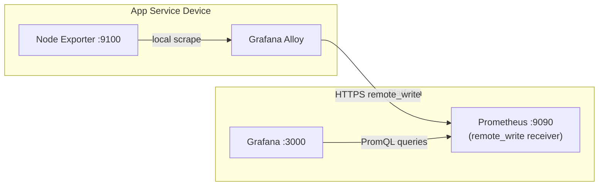

**Previous:** [Prometheus Metrics Setup](./v0-11-prometheus-metrics-setup)

The previous guide set up Prometheus to *pull* metrics from Node Exporter on a single device. That works fine when you have one Raspberry Pi — but it breaks down as soon as you add a second device or run into firewall restrictions.

This guide upgrades the architecture: each device now runs **Grafana Alloy**, which scrapes Node Exporter locally and *pushes* metrics to a central Prometheus on the platform. Grafana visualises everything without ever needing inbound access to your devices.



**What this tutorial covers:**
- Why pull-based scraping doesn't scale
- Deploying Grafana Alloy on each device via Ansible
- Configuring Prometheus to accept pushed metrics
- Zero-touch device registration — add a device to inventory and run the playbook

**Time to complete:** 10 minutes (automated deployment)

## Github Repository

All configuration and Ansible roles are available in https://github.com/IaC-Toolbox/iac-toolbox-raspberrypi. Clone it and follow along.

## Why Change the Architecture?

The pull model from the previous guide has two hard problems as you scale:

**1. Manual registration.** Every new device requires editing the Prometheus scrape config on the platform and re-running the playbook *targeting the platform*. With three devices that's manageable. With twenty it's a maintenance burden.

**2. Network access to devices.** Prometheus needs to reach port `9100` on every device. If a device is behind NAT or a firewall, or sits on a different network segment, scraping silently fails and you get no metrics — no errors, just missing data.

The push model solves both. Devices initiate the connection outbound to the platform over HTTPS. Prometheus on the platform only needs to be reachable from devices, not the other way around.

```
OLD (pull model)              NEW (push model)
─────────────────             ────────────────────
Platform → Device :9100       Device → Platform :443
                              (outbound, HTTPS)

Adding a device:              Adding a device:
  1. Edit prometheus.yml        1. Add to [app_services]
  2. Re-run platform playbook   2. Run playbook once
  3. Verify scrape target       Done — metrics appear
```

## New Architecture

```
App Service Device                        Platform (grafana.iac-toolbox.com)
──────────────────                        ──────────────────────────────────

Node Exporter :9100                       Prometheus :9090
      │                                   (remote_write receiver)
      │ local scrape                             │
      ▼                                          │
Grafana Alloy ──── HTTPS remote_write ──────────►
                   (port 443)                    │
                                            Grafana :3000
                                            (datasource: localhost:9090)
```

**Network requirements:**

| Direction | From        | To          | Port | Protocol |
| --------- | ----------- | ----------- | ---- | -------- |
| Outbound  | App service | Platform    | 443  | HTTPS    |
| Inbound   | —           | App service | —    | None     |

No inbound firewall rules needed on your devices.

## Components Overview

| Component       | Role                                                     | Runs on        |
| --------------- | -------------------------------------------------------- | -------------- |
| `node_exporter` | Expose system metrics at `localhost:9100`                | Each device    |
| `grafana-alloy` | Scrape Node Exporter, push via `remote_write`            | Each device    |
| `prometheus`    | Accept pushed metrics, store time-series                 | Platform       |
| `grafana`       | Visualise metrics, auto-provisioned datasource           | Platform       |

## What You Need

Before starting:
- Grafana already running on the platform (previous tutorial)
- SSH access to your devices
- The [iac-toolbox-raspberrypi](https://github.com/IaC-Toolbox/iac-toolbox-raspberrypi) repository
- Devices reachable from the platform (outbound on port 443)

## Inventory Structure

Update your Ansible inventory to separate the platform from app service devices:

```ini
# ansible-configurations/inventory/hosts.ini

[platform]
platform-host ansible_host=<platform-ip>

[app_services]
device-01 ansible_host=<device-01-ip>
device-02 ansible_host=<device-02-ip>
```

Adding a new device later is just adding a line to `[app_services]` and re-running the playbook. No platform changes needed.

## Step 1: Configure Variables

Open the group vars file:

```bash
nano ansible-configurations/inventory/group_vars/all.yml
```

Set the remote_write endpoint and versions:

```yaml
# Alloy config — points to your platform's Prometheus
alloy_remote_write_url: "https://grafana.iac-toolbox.com/prometheus/api/v1/write"
node_exporter_port: 9100
node_exporter_version: "1.8.1"

# Prometheus on the platform
prometheus_version: "2.52.0"
prometheus_port: 9090

# Grafana on the platform
grafana_port: 3000
grafana_admin_password: "{{ vault_grafana_admin_password }}"
```

The `alloy_remote_write_url` is the only value that must match your actual platform domain.

## Step 2: Deploy the Platform

Run the platform playbook first. This sets up Prometheus with the remote_write receiver enabled, and Grafana with auto-provisioned datasource and dashboard:

```bash
cd ansible-configurations
source .env

./run-playbook.sh playbooks/main.yml --limit platform
```

The playbook:
1. Installs Prometheus with `--enable-feature=remote-write-receiver`
2. Creates a minimal `prometheus.yml` (no static scrape targets for devices)
3. Installs Grafana
4. Provisions the Prometheus datasource automatically
5. Imports the Node Exporter Full dashboard (ID `1860`)

## Step 3: Deploy to App Service Devices

Now deploy Node Exporter and Grafana Alloy to your devices:

```bash
./run-playbook.sh playbooks/main.yml --limit app_services
```

The playbook:
1. Installs Node Exporter, creates a system user, starts the service
2. Installs Grafana Alloy
3. Templates `config.alloy` with your remote_write URL
4. Starts Alloy — it immediately begins scraping and pushing

## What Gets Deployed

### On Each Device: Node Exporter

Node Exporter is installed as a system binary with a systemd unit (Debian) or launchd plist (macOS). It exposes system metrics at `localhost:9100/metrics`.

```bash
# Verify it's running
systemctl status node_exporter

# Check it exposes metrics
curl http://localhost:9100/metrics | head -20
```

### On Each Device: Grafana Alloy Config

Ansible templates `config.alloy` with two blocks — a scrape job and a remote_write target:

```sh
prometheus.scrape "node_exporter" {
  targets = [{ __address__ = "localhost:9100" }]
  forward_to = [prometheus.remote_write.platform.receiver]
}

prometheus.remote_write "platform" {
  endpoint {
    url = "https://grafana.iac-toolbox.com/prometheus/api/v1/write"
  }
}
```

**What this does:**
- `prometheus.scrape` — hits `localhost:9100/metrics` on a 15-second interval
- `forward_to` — passes scraped metrics directly to the remote_write block
- `prometheus.remote_write` — ships metrics to your platform over HTTPS

Alloy adds an `instance` label automatically so you can filter by device in Grafana.

### On the Platform: Prometheus Config

Prometheus runs with a minimal scrape config — no `static_configs` for app service devices. They push to it instead:

```yaml
global:
  scrape_interval: 15s

scrape_configs:
  - job_name: "prometheus"
    static_configs:
      - targets: ["localhost:9090"]
```

The key is the startup flag:
```
--enable-feature=remote-write-receiver
```

This activates the `/api/v1/write` endpoint that Alloy pushes to. Without it, Prometheus returns 404 on remote_write requests.

### On the Platform: Grafana Datasource Provisioning

Grafana is provisioned automatically with a YAML file — no manual datasource setup:

```yaml
apiVersion: 1
datasources:
  - name: Prometheus
    type: prometheus
    url: http://localhost:9090
    isDefault: true
```

This file is written by Ansible to Grafana's provisioning directory. On startup, Grafana loads it and the datasource is available immediately.

## Step 4: Verify Metrics Are Arriving

### Check Alloy on a Device

```bash
# Service status
systemctl status grafana-alloy

# Live logs — look for successful remote_write
journalctl -u grafana-alloy -n 50 -f
```

A healthy Alloy log looks like:
```
level=info msg="Scrape completed" target=localhost:9100 duration=2.4ms
level=info msg="remote_write batch sent" url=https://grafana.iac-toolbox.com/...
```

### Check Prometheus on the Platform

Query the Prometheus API to confirm metrics are arriving from your devices:

```bash
# Should return targets from app service devices
curl "http://localhost:9090/api/v1/query?query=up"
```

You should see entries with `job="node_exporter"` and `instance` labels matching your device hostnames.

```bash
# Check a specific metric
curl "http://localhost:9090/api/v1/query?query=node_memory_MemAvailable_bytes"
```

### Check in Grafana

Open Grafana in your browser:
```
https://grafana.iac-toolbox.com
```

1. Click **Dashboards** → **Node Exporter Full**
2. At the top of the dashboard, use the **Instance** drop-down to select your device
3. You should see CPU, memory, disk, and network metrics updating every 15 seconds

Each device appears as a separate instance in the drop-down. No dashboard changes needed when you add more devices — they appear automatically.

## Adding a New Device

This is where the push model pays off. To add `device-03`:

1. Add it to inventory:
   ```ini
   [app_services]
   device-01 ansible_host=<device-01-ip>
   device-02 ansible_host=<device-02-ip>
   device-03 ansible_host=<device-03-ip>   # new
   ```

2. Run the playbook targeting only the new device:
   ```bash
   ./run-playbook.sh playbooks/main.yml --limit device-03
   ```

3. Within 60 seconds, `device-03` metrics appear in Grafana.

No platform changes. No Prometheus config edits. No restarts.

## Troubleshooting

### Alloy Won't Start

Check configuration syntax:
```bash
grafana-alloy fmt /etc/alloy/config.alloy
```

Check logs for errors:
```bash
journalctl -u grafana-alloy -n 100
```

Common causes:
- `alloy_remote_write_url` is unreachable from the device (test with `curl <url>`)
- Config template has a syntax error (re-run the Ansible role)
- Node Exporter isn't running yet (check `systemctl status node_exporter`)

### Remote Write Returns 404

Prometheus is running but rejecting remote_write requests. Verify the feature flag is set:

```bash
# On the platform
systemctl cat prometheus | grep enable-feature
# Should show: --enable-feature=remote-write-receiver
```

If the flag is missing, re-run the platform playbook — the role templates the service unit with the correct flags.

### Metrics Arrive but Show Wrong Instance Label

Alloy auto-sets `instance` from the device hostname. If you want a custom label, add an `extra_labels` block to the Alloy config template in the Ansible role:

```sh
prometheus.scrape "node_exporter" {
  targets = [{ __address__ = "localhost:9100" }]
  extra_labels = { "site" = "home-lab", "rack" = "A1" }
  forward_to = [prometheus.remote_write.platform.receiver]
}
```

Re-run the `grafana-alloy` role to apply it.

### No Data After 5 Minutes

Run through this checklist:

```bash
# 1. Node Exporter responding?
curl http://localhost:9100/metrics | head -5

# 2. Alloy running and pushing?
systemctl status grafana-alloy
journalctl -u grafana-alloy -n 20

# 3. Platform Prometheus reachable from device?
curl https://grafana.iac-toolbox.com/prometheus/-/healthy

# 4. Metrics in Prometheus?
curl "http://localhost:9090/api/v1/query?query=up{job='node_exporter'}"
```

Work through each step in order. The first failure is where to focus.

### Grafana Dashboard Shows "No Data"

Check the time range (top right) — set it to **Last 15 minutes**.

Verify the datasource is pointing to `http://localhost:9090`:
1. **Connections** → **Data sources** → **Prometheus**
2. Click **Save & test** — should show "Data source is working"

If the datasource was provisioned correctly by Ansible, this is typically a time range issue.

## Summary

You've upgraded from a single-device pull model to a scalable push-based pipeline.

**What you accomplished:**
- Grafana Alloy installed on each device, scraping Node Exporter and pushing to the platform
- Prometheus running with `remote-write-receiver` enabled — no static scrape configs for devices
- Grafana auto-provisioned with Prometheus datasource and Node Exporter dashboard
- Zero-touch device registration — inventory change + playbook run is all it takes

**Key files deployed:**

On each device:
- `/etc/alloy/config.alloy` — Alloy scrape and remote_write config
- `/etc/systemd/system/grafana-alloy.service` — systemd unit

On the platform:
- `/etc/prometheus/prometheus.yml` — minimal config, remote_write receiver enabled
- `/etc/grafana/provisioning/datasources/prometheus.yml` — auto-provisioned datasource

**Access:**
- **Grafana Dashboard**: https://grafana.iac-toolbox.com/d/rYdddlPWk/node-exporter-full
- **Prometheus API** (on platform): `http://localhost:9090/api/v1/query?query=up`
- **Alloy logs** (on device): `journalctl -u grafana-alloy -f`

**What makes this different from the pull model:**
- No inbound firewall rules needed on devices
- Adding devices requires only an inventory change — no platform edits
- Each device manages its own metrics pipeline independently
- Works across network topologies: NAT, VPN, cloud VMs, Raspberry Pis on home networks

---

**Previous:** [Prometheus Metrics Setup](./v0-11-prometheus-metrics-setup) | **Next:** [Logs with Loki](./v0-12-logs-with-loki)
