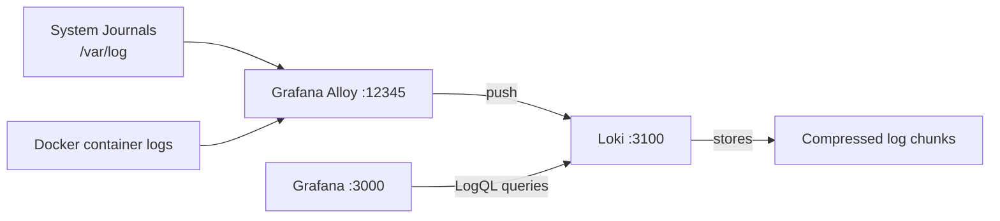

**Previous:** [Prometheus Metrics Setup](./v0-11-prometheus-metrics-setup)


You've got metrics, but what happens when something breaks? Metrics tell you CPU spiked, but logs tell you why - which process crashed, what error it threw, which user triggered it. In this guide, we'll add Loki (log aggregation) and Grafana Alloy (log collection) using automated Ansible deployment to complete your observability stack.

Think of it this way: Prometheus stores metrics (numbers over time), Loki stores logs (text over time). Both query similarly, both visualize in Grafana.



**What this tutorial covers:**
- Automated Loki + Alloy deployment using Ansible
- Auto-configuring Loki as Grafana data source
- Auto-importing log dashboards
- Collecting systemd journal, Docker containers, and /var/log files
- Querying logs in Grafana
- Correlating logs with metrics

**Time to complete:** 5-10 minutes (automated deployment)

## Github Repository

All the configuration and deployment scripts from this guide are available in https://github.com/IaC-Toolbox/iac-toolbox-raspberrypi. Clone it and follow along!

## What Are We Adding?

**Loki**: A log aggregation system designed to be lightweight and cost-effective. It's like Prometheus, but for logs instead of metrics.

**Grafana Alloy**: A modern log and metrics collector that ships logs to Loki. Replaces the older Promtail tool with better performance and automatic service discovery.

Together they give you:
- Centralized log storage from all your services
- Full-text search across logs
- Correlation between logs and metrics
- Log-based alerting

## Why Not Just Use Docker Logs or journalctl?

**Docker logs are scattered**: Each container has its own logs. Want to search across all containers? Good luck.

**journalctl is local-only**: SSH into your Pi every time you want to check logs? That's tedious.

**No retention control**: Docker logs grow unbounded unless you configure limits per-container.

**Loki centralizes everything**: Query all logs from Grafana's web UI, correlate with metrics, and set up alerts.

## The Complete Stack

Here's how logs flow in your observability setup:

```
┌────────────────────────────────────────────────────────────────┐
│                   LOGS + METRICS STACK                         │
└────────────────────────────────────────────────────────────────┘

  🌍 You → https://grafana.iac-toolbox.com
       │
       ▼
  ┌─────────────────────────────────────────────────┐
  │  Grafana (Port 3000)                            │
  │  • Queries Prometheus (metrics)                 │
  │  • Queries Loki (logs)                          │
  │  • Dashboards with metrics + logs               │
  │  • Auto-configured via Ansible                  │
  └────────┬────────────────────────┬─────────────── ┘
           │                        │
           │ Metrics                │ Logs
           ▼                        ▼
  ┌─────────────────┐      ┌─────────────────────┐
  │  Prometheus     │      │  Loki (Port 3100)   │
  │  (Port 9090)    │      │  • Stores logs      │
  │                 │      │  • Configurable     │
  │                 │      │    retention        │
  └─────────────────┘      └─────────▲───────────┘
                                     │
                                     │ Ships logs
                          ┌──────────┴──────────┐
                          │  Grafana Alloy      │
                          │  (Port 12345)       │
                          │  • Collects logs    │
                          │  • Tags & filters   │
                          └─────────────────────┘
                                     │
                 ┌───────────────────┼───────────────────┐
                 │                   │                   │
           systemd journal    Docker containers    /var/log files
           • Service logs     • stdout/stderr      • auth.log
           • Boot events      • All containers     • syslog
           • OOM kills

  Data flows: Sources → Alloy → Loki → Grafana
  All connected via shared 'monitoring' Docker network
```

## What Logs We're Collecting

We'll collect from three sources to cover all failure modes:

**1. Systemd Journal**
- Service crashes and restarts
- Out-of-memory (OOM) kills
- Boot events
- Any systemd-managed service on your Pi

**2. Docker Container Logs**
- stdout/stderr from all containers
- Grafana, Prometheus, Vault, your apps
- Automatically tags each container

**3. System Logs (/var/log)**
- Authentication attempts (auth.log)
- Kernel messages (syslog)
- Cron job output
- Network events

This covers OS-level, container-level, and application-level logs.

## What You Need

Before starting:
- Grafana and Prometheus already running (previous tutorials)
- SSH access to your Raspberry Pi
- The [iac-toolbox-raspberrypi](https://github.com/IaC-Toolbox/iac-toolbox-raspberrypi) repository
- About 2-3GB free disk space for log storage

## Game Plan

Here's what Ansible will do automatically:
1. Deploy Loki and Grafana Alloy containers
2. Join them to the `monitoring` Docker network (same as Grafana)
3. Configure Loki for 7-day retention (configurable)
4. Configure Alloy to collect logs from systemd, Docker, and /var/log
5. Create Loki data source in Grafana via API
6. Import log dashboards automatically
7. Set up systemd service for auto-start on reboot
8. Optionally expose Alloy UI via Cloudflare tunnel

All with one command!

## How Ansible Deploys This

Behind the scenes, the Ansible `loki` role:

1. **Creates directory structure** - `~/loki/` on Raspberry Pi
2. **Generates configuration files** from templates
   - `loki-config.yml` with TSDB storage and retention
   - `alloy-config.alloy` with three log sources
   - `docker-compose.yml` with both services
3. **Creates monitoring network** (if not exists) - shared with Grafana/Prometheus
4. **Pulls container images** - `grafana/loki:latest` and `grafana/alloy:latest`
5. **Deploys systemd service** - `loki.service` for auto-start
6. **Waits for Loki to be ready** - polls the `/ready` endpoint
7. **Configures Grafana data source** via API
   - Creates Loki data source at `http://loki:3100`
   - Uses Docker DNS (containers on same network)
8. **Imports log dashboards** via Grafana API
   - Dashboard ID 13639: "Loki Dashboard - simple log viewer"

The entire deployment is idempotent - you can re-run it safely.

**Why the monitoring network?**

All observability components (Grafana, Prometheus, Loki, Alloy) join the `monitoring` Docker network. This enables:
- **Docker DNS resolution** - Grafana reaches Loki at `http://loki:3100`
- **Container-to-container communication** - No need to expose ports to host
- **Isolation** - Monitoring stack is separated from other containers

## Step 1: Optional Configuration

The default Loki retention is 7 days (168 hours), which is perfect for most Raspberry Pi setups. If you want to change it, edit the configuration:

```bash
# Edit Ansible configuration
nano ansible-configurations/inventory/group_vars/all.yml
```

Find the `loki` section and adjust retention:

```yaml
# Loki Log Aggregation Configuration
loki:
  enabled: true
  version: "latest"
  base_dir: "/home/{{ ansible_user }}/loki"
  port: 3100
  retention_hours: 168  # 7 days (72=3d, 168=7d, 336=14d, 720=30d)
```

**Retention options:**
- `72` - 3 days (minimal storage)
- `168` - 7 days (default, recommended)
- `336` - 14 days (more history)
- `720` - 30 days (high storage)

If you want to expose the Alloy monitoring UI (optional), add it to the Cloudflare domains list:

```yaml
cloudflare:
  domains:
    # ... existing domains ...
    - hostname: alloy.iac-toolbox.com
      service_port: 12345
```

This gives you a web UI to monitor log collection status at `https://alloy.iac-toolbox.com`.

**Advanced: Configuring Alloy collection sources**

The default configuration collects from three sources. If you need to add more sources or modify collection, edit:

```bash
nano ansible-configurations/playbooks/roles/loki/templates/alloy-config.alloy.j2
```

For example, to add a custom application log file, add a new `local.file_match` and `loki.source.file` block (see "Next Steps" section for examples).

## Step 2: Deploy Loki and Alloy

Run the Ansible playbook to deploy the entire log collection stack:

```bash
cd ansible-configurations

# Deploy Loki + Alloy
./scripts/setup.sh --tags loki
```

This single command:
- Deploys Loki container for log storage
- Deploys Grafana Alloy container for log collection
- Configures Alloy to collect from systemd, Docker, and /var/log
- Creates the Loki data source in Grafana automatically
- Imports log dashboards
- Sets up systemd service for auto-start

**What Ansible deploys behind the scenes:**

### Loki Configuration

Ansible creates a modern Loki config with TSDB (Time Series Database) storage:

```yaml
auth_enabled: false

server:
  http_listen_port: 3100

common:
  ring:
    kvstore:
      store: inmemory
  replication_factor: 1
  path_prefix: /loki

schema_config:
  configs:
    - from: 2024-01-01
      store: tsdb              # Modern TSDB storage
      object_store: filesystem
      schema: v13              # Latest schema
      index:
        prefix: index_
        period: 24h

storage_config:
  tsdb_shipper:
    active_index_directory: /loki/index
    cache_location: /loki/cache
  filesystem:
    directory: /loki/chunks

ingester:
  chunk_idle_period: 5m
  chunk_retain_period: 30s
  max_chunk_age: 1h
  wal:
    dir: /loki/wal           # Write-Ahead Log for durability

limits_config:
  reject_old_samples: true
  reject_old_samples_max_age: 168h  # 7 days default
  ingestion_rate_mb: 16
  ingestion_burst_size_mb: 32
  retention_period: 168h            # Configurable via group_vars

compactor:
  working_directory: /loki/compactor
  retention_enabled: true
  retention_delete_delay: 2h
  retention_delete_worker_count: 150
  delete_request_store: filesystem
```

**Key improvements over older configs:**
- **TSDB storage** - More efficient than boltdb-shipper (older storage backend)
- **Schema v13** - Latest Loki schema version (older: v11)
- **WAL (Write-Ahead Log)** - Prevents log loss on crashes or restarts
- **Compactor with retention** - Automatically deletes old logs based on `retention_hours`
- **delete_request_store** - Required for retention to work properly

If you've seen older Loki tutorials, they might use `boltdb-shipper` storage and schema `v11`. This automated deployment uses the modern TSDB approach which is:
- Faster for queries (better indexing)
- More space-efficient (better compression)
- Simpler configuration (fewer moving parts)

### Alloy Configuration

Alloy collects logs from three sources and ships them to Loki:

```hcl
// Scrape systemd journal (service logs, boot events, OOM kills)
loki.source.journal "systemd" {
  max_age       = "24h"
  forward_to    = [loki.write.local.receiver]
  labels        = {
    job  = "systemd",
    host = "{{ ansible_hostname }}",
  }
}

// Scrape Docker container logs
loki.source.docker "containers" {
  host       = "unix:///var/run/docker.sock"
  targets    = []
  forward_to = [loki.write.local.receiver]
  labels     = {
    job  = "docker",
    host = "{{ ansible_hostname }}",
  }
}

// Scrape /var/log files (auth, syslog, etc.)
local.file_match "system_logs" {
  path_targets = [
    {
      __address__ = "localhost",
      __path__    = "/var/log/syslog",
      job         = "syslog",
      host        = "{{ ansible_hostname }}",
    },
    {
      __address__ = "localhost",
      __path__    = "/var/log/auth.log",
      job         = "auth",
      host        = "{{ ansible_hostname }}",
    },
  ]
}

loki.source.file "system_logs" {
  targets    = local.file_match.system_logs.targets
  forward_to = [loki.write.local.receiver]
}

// Send all logs to Loki
loki.write "local" {
  endpoint {
    url = "http://loki:3100/loki/api/v1/push"
  }
}
```

**What each component does:**
- `loki.source.journal` - Reads systemd journal (service crashes, OOM kills, boot events)
- `loki.source.docker` - Monitors all Docker containers via socket, auto-discovers new containers
- `loki.source.file` - Tails /var/log files (authentication attempts, system logs)
- `loki.write` - Ships all collected logs to Loki via HTTP

Each source tags logs with `job` and `host` labels for easy filtering in Grafana.

## Step 3: Verify Deployment

After Ansible completes, verify everything is running:

```bash
# SSH to your Raspberry Pi
ssh <your-user>@<raspberry-pi>

# Check containers are running
docker ps | grep -E 'loki|alloy'
```

You should see:
```
loki        grafana/loki:latest        Up X minutes
alloy       grafana/alloy:latest       Up X minutes
```

Check the logs for successful startup:

```bash
# Check Loki is ready
docker logs loki | tail -20

# Check Alloy is collecting logs
docker logs alloy | tail -20
```

Verify the systemd service is enabled:

```bash
systemctl status loki.service
```

Should show `Active: active (running)` and `Enabled: enabled`.

**What got deployed:**
- Loki container on port 3100 (log storage)
- Alloy container on port 12345 (log collector)
- Both joined the `monitoring` network
- Systemd service `loki.service` for auto-start
- Configuration files in `~/loki/`

**File structure on Raspberry Pi:**
```
/home/<your-user>/loki/
├── docker-compose.yml      # Service definitions
├── loki-config.yml         # Loki configuration
├── alloy-config.alloy      # Alloy collection config
└── loki_data/              # Volume for log storage (created by Docker)

/etc/systemd/system/
└── loki.service            # Systemd service for auto-start
```

## Step 4: Verify Grafana Integration

Ansible automatically configured Loki as a Grafana data source and imported log dashboards. Let's verify:

Open Grafana:
```
https://grafana.iac-toolbox.com
```

Login with your admin credentials.

### Verify Data Source

1. Click the menu (☰) → **Connections** → **Data sources**
2. You should see **Loki** in the list
3. Click on it to verify the connection
4. Should show: **"Data source connected and labels found"**

**What Ansible configured:**
- Data source name: `Loki`
- URL: `http://loki:3100`
- Access mode: `proxy` (Grafana queries Loki on your behalf)
- Max lines: 1000 (prevents overwhelming the UI)

### Verify Dashboards

1. Click **Dashboards** (left sidebar)
2. Search for **"Logs"**
3. You should see imported log dashboards

Ansible imported the community dashboard **"Loki Dashboard - simple log viewer"** (Dashboard ID 13639) which provides:
- Log search interface
- Time range selector  
- Log level filters
- Multi-source view (systemd, Docker, auth, syslog)

**Using the dashboard:**

1. Go to **Dashboards** → Search for **"Logs"**
2. Click to open the log viewer dashboard
3. Use the **job** dropdown to filter:
   - `systemd` - Service logs, OOM kills, boot events
   - `docker` - All container logs
   - `auth` - SSH login attempts
   - `syslog` - System logs
4. Adjust time range (top right)
5. Use search box to filter log lines

This dashboard is great for quick log browsing. For more advanced queries (regex, rate calculations), use the **Explore** view.

**Note**: Loki has no web UI of its own. All log querying and visualization happens in Grafana through Explore and Dashboards. This is intentional - Grafana is your single pane of glass for metrics AND logs.

### Optional: Accessing Alloy UI

If you configured the Alloy domain in Cloudflare (Step 1), you can monitor log collection status:

```
https://alloy.iac-toolbox.com
```

The Alloy UI shows:
- Active log sources (systemd, Docker, /var/log)
- Logs per second being collected
- Pipeline health
- Component status

This is useful for debugging collection issues, but not required for normal operation.

## Step 5: Query Your Logs

Let's verify logs are flowing. In Grafana:

1. Click **Explore** (compass icon) in the left sidebar
2. Select **Loki** as the data source (top dropdown)
3. Try these queries:

**All logs from systemd journal:**
```
{job="systemd"}
```

**All Docker container logs:**
```
{job="docker"}
```

**Logs from a specific container (e.g., grafana):**
```
{job="docker", container_name="grafana"}
```

**Authentication logs:**
```
{job="auth"}
```

**Syslog:**
```
{job="syslog"}
```

Click **Run query** and you should see logs streaming in!

### Search Within Logs

Want to find specific text? Use filters:

**Find all errors:**
```
{job="systemd"} |= "error"
```

**Find OOM kills:**
```
{job="systemd"} |= "Out of memory"
```

**Find failed SSH attempts:**
```
{job="auth"} |= "Failed password"
```

The `|=` operator searches for text within log lines.

**Common use cases:**

```
# Find service restart events
{job="systemd"} |= "Started" or "Stopped"

# Find container crashes
{job="docker"} |= "Exited"

# Monitor authentication attempts
{job="auth"} |= "Accepted" or "Failed"

# Count failed login attempts in last hour
count_over_time({job="auth"} |= "Failed password" [1h])
```

The last query shows number of failed SSH attempts - useful for alerting!

### Debugging Your Application Containers

Want to check logs from your own app? Here's how:

**First, see which containers are being monitored:**

In Grafana Explore with Loki selected, query:
```
{job="docker"}
```

Click on a log line, then expand the "Labels" section. You'll see all available labels including:
- `container_name` - The actual container name (e.g., "my-app", "grafana", "vault")
- `container_id` - Docker container ID
- `container_image` - Image name

**List all unique container names:**

Use the label browser in Grafana (click the label icon) or query specific labels to see what's available.

**View logs from a specific app (e.g., my-app):**
```
{job="docker", container_name="my-app"}
```

**Find errors in your app:**
```
{job="docker", container_name="my-app"} |= "error"
```

**Find exceptions:**
```
{job="docker", container_name="my-app"} |~ "exception|Exception|ERROR"
```

The `|~` operator does regex matching - this finds "exception", "Exception", or "ERROR".

**Check app startup logs:**
```
{job="docker", container_name="my-app"} |= "started"
```

**Tail logs in real-time:**

Set the time range to "Last 5 minutes" and enable "Live" mode (top right). Now you're watching logs stream in real-time, just like `docker logs -f my-app`!

### Common Debugging Scenarios

**App crashed, what happened?**
```
{job="docker", container_name="my-app"} |~ "crash|killed|exit"
```

Look at logs right before the container stopped.

**Performance issues - find slow requests:**
```
{job="docker", container_name="my-app"} |= "slow" or |= "timeout"
```

**Database connection issues:**
```
{job="docker", container_name="my-app"} |= "database" |= "connection"
```

**API errors:**
```
{job="docker", container_name="my-app"} |= "status" |~ "5[0-9][0-9]"
```

This finds HTTP 5xx errors in logs.

### Multiple Containers

Running multiple instances of your app? Query them all:

```
{job="docker", container_name=~"my-app.*"}
```

The `=~` operator matches regex, so this gets `my-app`, `my-app-worker`, `my-app-api`, etc.

### Pro Tip: Debugging with Time Windows

When your app breaks, compare logs before and after:

1. Set time range to when the issue happened (e.g., "Last 15 minutes")
2. Query your app logs
3. Look for errors or exceptions
4. Adjust time range to just before the issue
5. See what changed

**Example workflow:**
```
# Current errors (app is broken)
{job="docker", container_name="my-app"} |= "error"

# Check what happened 5 minutes before
{job="docker", container_name="my-app"} 
```

Adjust the time range to see the pattern. This helps identify what triggered the issue.

## Step 6: Correlate Logs with Metrics

The real power is combining logs and metrics. When CPU spikes, what logs appeared at that time?

### Split View in Explore

1. In Grafana Explore, click **Split** (top right)
2. Left panel: Select **Prometheus**, query CPU:
   ```
   100 - (avg(rate(node_cpu_seconds_total{mode="idle"}[5m])) * 100)
   ```
3. Right panel: Select **Loki**, query systemd logs:
   ```
   {job="systemd"}
   ```
4. Sync the time ranges

Now you can see CPU usage graph on the left and logs on the right. When CPU spikes, check what logs appeared at that moment!

### Link from Dashboards

When building dashboards, you can add log panels alongside metric panels:
- Metrics panel shows CPU over time
- Logs panel shows recent errors
- Both update in real-time

This helps diagnose issues faster - metrics show the symptom, logs show the cause.

## Understanding Loki Query Language (LogQL)

Loki uses a query language similar to Prometheus:

**Label matchers:**
```
{job="docker"}                     # Exact match
{job=~"docker|systemd"}           # Regex match
{job!="auth"}                     # Not equal
```

**Log filters:**
```
{job="systemd"} |= "error"        # Contains "error"
{job="systemd"} != "debug"        # Does not contain "debug"
{job="systemd"} |~ "error|fail"   # Regex match
```

**Rate queries (like Prometheus):**
```
rate({job="docker"}[5m])          # Log lines per second
```

**Count occurrences:**
```
count_over_time({job="auth"} |= "Failed password" [1h])
```

This counts failed login attempts in the last hour. You can alert on this!

## When Things Break

**No logs showing up in Grafana?**

Check Alloy is collecting:
```bash
docker logs alloy | grep "push request"
```

You should see lines like:
```
level=info msg="successful push" bytes=1234
```

If not, Alloy isn't shipping logs to Loki.

**Loki connection fails?**

Test from Alloy container:
```bash
docker exec alloy curl http://loki:3100/ready
```

Should return `ready`. If not, Loki isn't accessible from Alloy.

**"No labels found" error in Grafana?**

Loki isn't receiving any logs. Check:
```bash
# Check Loki received anything
curl http://localhost:3100/loki/api/v1/label
```

Should return JSON with labels like `{job="systemd"}`. If empty, no logs have reached Loki yet.

**Docker logs not appearing?**

Check Alloy has access to Docker socket:
```bash
docker exec alloy ls -la /var/run/docker.sock
```

Should show the socket file. If "permission denied", Alloy user needs Docker group access.

**Systemd journal logs missing?**

Check journal is accessible:
```bash
docker exec alloy ls -la /run/log/journal
```

Should show journal files. If empty, journal might not be enabled on your Pi.

**Disk space filling up?**

Check Loki data size:
```bash
du -sh ~/loki/loki_data
```

If it's huge, reduce retention period in Ansible configuration:

```bash
# Edit the config
nano ansible-configurations/inventory/group_vars/all.yml

# Change retention_hours
loki:
  retention_hours: 72  # 3 days instead of 7
```

Re-run Ansible to apply changes:
```bash
cd ansible-configurations
./scripts/setup.sh --tags loki
```

**Data source not showing in Grafana?**

Ansible creates it automatically. If missing, check Ansible output:
```bash
# Check if data source creation succeeded
grep -i "loki.*datasource" ansible-configurations/logs/*.log
```

You can manually verify via Grafana API:
```bash
curl -u admin:your-password http://localhost:3000/api/datasources/name/Loki
```

**Dashboards not imported?**

Check Ansible task output. Dashboard import happens after data source creation. If it failed:

```bash
# Re-run just the Loki tasks
cd ansible-configurations
./scripts/setup.sh --tags loki
```

## Storage and Retention

Logs can grow fast. Here's what you should know:

**Default retention: 7 days**

Our config keeps logs for 7 days, then deletes them. For a typical home setup with a few containers, this uses 1-2GB.

**Check disk usage:**
```bash
# SSH to Raspberry Pi
ssh <your-user>@<raspberry-pi>

# Check Loki data size
du -sh ~/loki/loki_data

# Check total logging stack
du -sh ~/loki
```

**Adjust retention:**

Edit Ansible group_vars:
```bash
# On your local machine
cd ansible-configurations
nano inventory/group_vars/all.yml
```

Find the loki section:
```yaml
loki:
  retention_hours: 168  # Change to desired value
```

Options:
- `72` - 3 days (minimal)
- `168` - 7 days (default)
- `336` - 14 days
- `720` - 30 days

Re-deploy to apply changes:
```bash
./scripts/setup.sh --tags loki
```

**What uses the most space:**

Docker container logs usually dominate. If one noisy container floods your logs, you can exclude it by modifying the Alloy template in your Ansible role:

```bash
# Edit the Alloy template
nano ansible-configurations/playbooks/roles/loki/templates/alloy-config.alloy.j2
```

Add filtering to the Docker source:

```hcl
loki.source.docker "containers" {
  host       = "unix:///var/run/docker.sock"
  targets    = []
  forward_to = [loki.write.local.receiver]
  labels     = {
    job  = "docker",
    host = "{{ ansible_hostname }}",
  }
  
  // Exclude noisy container
  relabel_configs {
    source_labels = ["__meta_docker_container_name"]
    regex         = "noisy-container"
    action        = "drop"
  }
}
```

Then re-deploy:
```bash
cd ansible-configurations
./scripts/setup.sh --tags loki
```

## Next Steps

You now have complete observability! Here's what to do next:

**Build log dashboards:**
- Create panels showing recent errors
- Display container restart counts
- Track failed login attempts
- Monitor disk space warnings

**Set up log-based alerts:**

Alert when specific patterns appear:
```
count_over_time({job="auth"} |= "Failed password" [5m]) > 5
```

This alerts on more than 5 failed logins in 5 minutes (possible brute-force attack).

**Add application logs:**

Once you deploy applications, add their log files to Alloy. Edit the Alloy template:

```bash
nano ansible-configurations/playbooks/roles/loki/templates/alloy-config.alloy.j2
```

Add new file sources:
```hcl
local.file_match "myapp" {
  path_targets = [{
    __address__ = "localhost",
    __path__    = "/var/log/myapp/*.log",
    job         = "myapp",
    host        = "{{ ansible_hostname }}",
  }]
}

loki.source.file "myapp" {
  targets    = local.file_match.myapp.targets
  forward_to = [loki.write.local.receiver]
}
```

Re-deploy:
```bash
cd ansible-configurations
./scripts/setup.sh --tags loki
```

**Parse structured logs:**

If your app logs JSON, Alloy can parse it:
```hcl
loki.source.file "myapp" {
  targets    = local.file_match.myapp.targets
  forward_to = [loki.process.json.receiver]
}

loki.process "json" {
  forward_to = [loki.write.local.receiver]

  stage.json {
    expressions = {
      level = "level",
      msg   = "message",
    }
  }
}
```

Now you can query by JSON fields: `{job="myapp"} | json | level="error"`

## Summary

And that's a wrap! You've added automated centralized logging to your Raspberry Pi:

**What you deployed:**
- Loki for log storage (configurable retention, default 7 days)
- Grafana Alloy for log collection
- Three log sources: systemd, Docker, /var/log
- Loki data source auto-configured in Grafana
- Log dashboards auto-imported
- Systemd service for auto-start

**Deployment method:**
```bash
cd ansible-configurations
./scripts/setup.sh --tags loki
```

**Files created on Raspberry Pi:**
- `~/loki/loki-config.yml` - Loki configuration (TSDB, schema v13)
- `~/loki/alloy-config.alloy` - Alloy collection config
- `~/loki/docker-compose.yml` - Both services
- `/etc/systemd/system/loki.service` - Systemd service

**What you can do now:**
- Search all logs from Grafana UI
- Correlate logs with metrics using split view
- Track down why services crashed
- Find authentication failures
- Monitor container restarts
- Set up log-based alerts (next tutorial)

**Configuration management:**
All settings in `ansible-configurations/inventory/group_vars/all.yml`:
- Retention period (72h, 168h, 336h, 720h)
- Port configuration
- Cloudflare tunnel for Alloy UI (optional)

Your observability stack is complete: metrics (Prometheus) + logs (Loki) + visualization (Grafana) + alerting (PagerDuty). When something breaks, you'll know what happened and why!

**Next steps:**
- Set up log-based alerts (OOM kills, failed logins, container crashes)
- Add custom application logs
- Create custom log dashboards

The complete Ansible role is in the [iac-toolbox-raspberrypi](https://github.com/IaC-Toolbox/iac-toolbox-raspberrypi) repository under `playbooks/roles/loki/`.

---

**Previous:** [Prometheus Metrics Setup](./v0-11-prometheus-metrics-setup) | **Next:** [Grafana Alerts](./v0-13-grafana-alerts)
