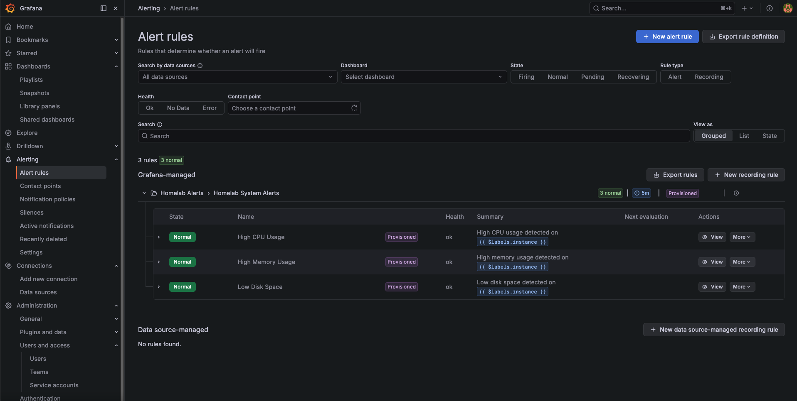
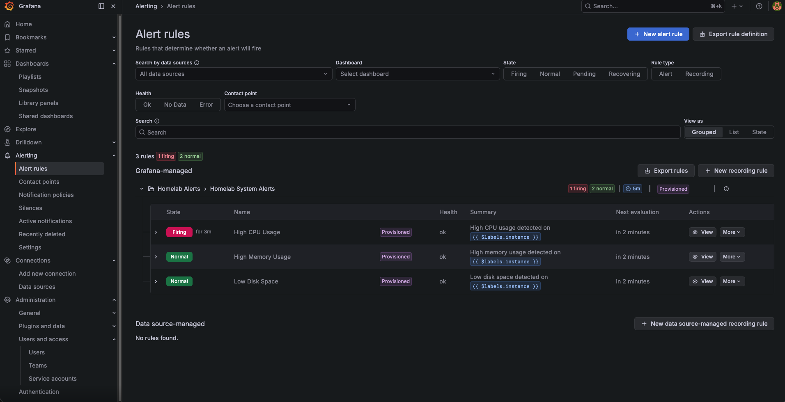
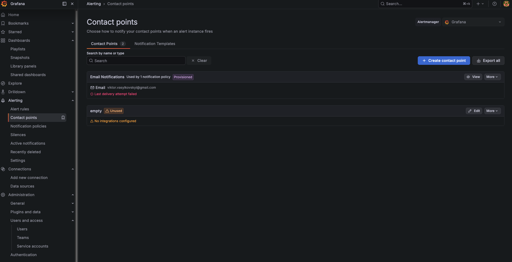
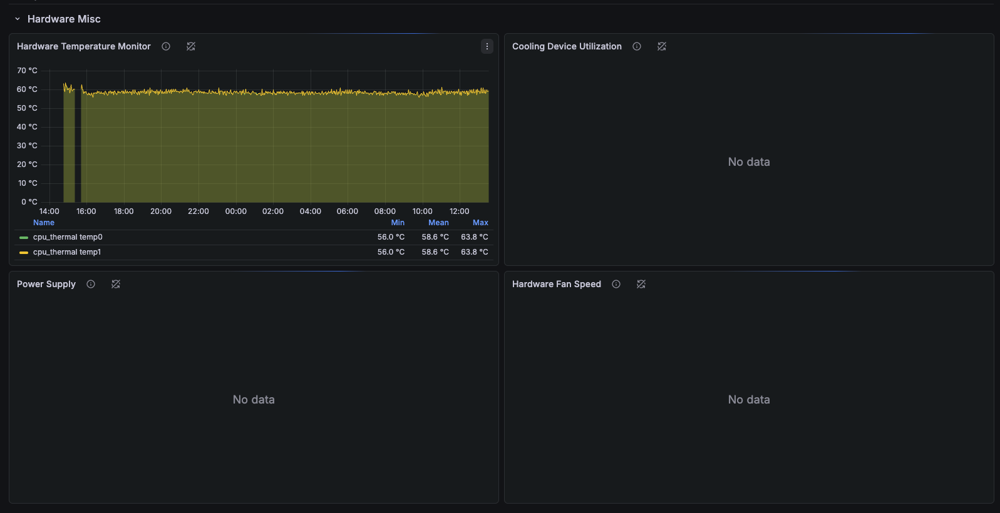

**Previous:** [Logs with Loki](./v0-12-logs-with-loki)


You've got Grafana showing beautiful dashboards and Prometheus collecting metrics. But are you really going to sit there refreshing dashboards all day? Of course not. Let's set up automated alerts that notify you when things go wrong - high CPU, low disk space, device offline, or temperature spikes.

We'll use Terraform to manage alerts as code, integrated directly into your one-script setup. No clicking through Grafana UI forms, no manual configuration - just run `./scripts/setup.sh` and you're done.

**What this tutorial covers:**
- Automated deployment of 5 Grafana alert rules using Terraform
- System resource alerts: CPU, Memory, Disk Space
- Hardware monitoring: Device Offline, CPU Temperature
- Email notifications configured from environment variables
- Integration with existing Ansible deployment workflow

**Time to complete:** 10-15 minutes (automated deployment + testing)

## Github Repository

All the Terraform configuration and setup scripts from this guide are available in https://github.com/IaC-Toolbox/iac-toolbox-raspberrypi. Clone it and follow along!

## Why Terraform for Alerts?

**Clickops is tedious**: Creating alerts in the Grafana UI means clicking through forms, copying PromQL queries, and manually configuring notification channels. One typo and your alert doesn't work.

**Version control**: Alerts defined in Terraform live in git. You can review changes, rollback mistakes, and see exactly who changed what threshold.

**Reproducible**: Blow away your Grafana instance? Run `terraform apply` and all alerts come back exactly as they were.

**Integrated workflow**: Our setup script handles both Ansible (infrastructure) and Terraform (alerts) in one command. No manual steps.

## What We're Building

We'll create 5 essential alerts for Raspberry Pi homelab monitoring:

**System Resource Alerts (Warning Level):**
- **High CPU Usage**: Fires when CPU > 85% for 5 minutes
- **High Memory Usage**: Fires when memory > 90% for 5 minutes
- **Low Disk Space**: Fires when disk usage > 80% for 5 minutes

**Hardware Monitoring Alerts (Critical Level):**
- **Device Offline**: Fires when Raspberry Pi is unreachable for 5+ minutes
- **High CPU Temperature**: Fires when CPU temp > 75°C for 5 minutes

All alerts send to email (configured via environment variables). SMTP setup is optional and done manually in Grafana UI.

## Architecture Overview

Here's how the automated alert system fits into your infrastructure:

```
┌────────────────────────────────────────────────────────────────┐
│              GRAFANA ALERTS ARCHITECTURE                       │
└────────────────────────────────────────────────────────────────┘

  You run: ./scripts/setup.sh
       │
       ├─► Ansible Playbook
       │    ├─► Deploy Docker
       │    ├─► Deploy Grafana + Prometheus
       │    ├─► Create Prometheus data source
       │    └─► Deploy node_exporter (metrics collection)
       │
       └─► Terraform (automatic after Ansible)
            ├─► Connect to Grafana API
            ├─► Create "Homelab Alerts" folder
            ├─► Create email contact point
            ├─► Create notification policy
            └─► Deploy 5 alert rules:
                 • High CPU (85%)
                 • High Memory (90%)
                 • Low Disk Space (80%)
                 • Device Offline (5m)
                 • High CPU Temperature (75°C)

  ┌────────────────────────────────────────────────────────┐
  │  Raspberry Pi - Alert Evaluation Flow                  │
  │                                                         │
  │  Prometheus ─► Scrapes metrics every 15s               │
  │       │                                                 │
  │       ▼                                                 │
  │  Grafana Alerting Engine                               │
  │   • Evaluates rules every 5 minutes                    │
  │   • Runs PromQL queries against Prometheus             │
  │   • Checks if values exceed thresholds                 │
  │       │                                                 │
  │       ▼                                                 │
  │  Alert fires (if threshold exceeded for 5m)            │
  │       │                                                 │
  │       ▼                                                 │
  │  Notification sent to email contact point              │
  └────────────────────────────────────────────────────────┘
```

**How it works:**

1. **Setup script** orchestrates both Ansible and Terraform
2. **Ansible** deploys infrastructure (Grafana, Prometheus, node_exporter)
3. **Terraform** provisions alert rules automatically
4. **Grafana** evaluates alerts every 5 minutes
5. **Prometheus** provides metric data via PromQL queries
6. **Email notifications** sent when alerts fire (if SMTP configured)

## Prerequisites

Before starting, ensure you have:
- Cloned the [iac-toolbox-raspberrypi](https://github.com/IaC-Toolbox/iac-toolbox-raspberrypi) repository
- Completed previous tutorials (Grafana and Prometheus setup)
- Raspberry Pi accessible via SSH
- Ansible installed on your local machine (Mac/Linux)
- Terraform installed (setup script will install it automatically via Homebrew)
- Grafana and Prometheus running on your Raspberry Pi

If you haven't set up Grafana and Prometheus yet, complete those tutorials first.

## Project Structure

The Terraform files are located at the project root in a separate directory:

```
iac-toolbox-raspberrypi/
├── ansible-configurations/      # Ansible infrastructure code
│   ├── .env                    # Configuration (add ALERT_EMAIL here)
│   └── playbooks/
├── terraform/                   # Terraform alert configuration
│   └── grafana-alerts/
│       ├── providers.tf        # Grafana provider setup
│       ├── variables.tf        # Input variables
│       ├── datasources.tf      # Prometheus data source reference
│       ├── alerts.tf           # 5 alert rules
│       └── .gitignore         # Exclude state/credentials
└── scripts/
    └── setup.sh               # One-command deployment script
```

This separation keeps Ansible (infrastructure) and Terraform (configuration) code organized and maintainable.

## Step 1: Configure Alert Email

Add your alert notification email to the `.env` file. This is where alerts will be sent when they fire.

Navigate to the Ansible configuration directory:

```bash
cd ansible-configurations
```

Edit your `.env` file and add:

```bash
# Grafana admin credentials (required)
GRAFANA_ADMIN_USER=admin
GRAFANA_ADMIN_PASSWORD=your-secure-password

# Alert email (required for alert notifications)
ALERT_EMAIL=your-email@example.com
```

**Important notes:**
- The `ALERT_EMAIL` is required for Terraform to create the email contact point
- SMTP configuration (for actually sending emails) is done separately in Grafana UI
- For testing, you can verify alerts fire without email delivery working

Verify the configuration:

```bash
grep ALERT_EMAIL .env
```

You should see your email address printed.

## Step 2: Deploy Alerts with Setup Script

The setup script orchestrates both Ansible (if needed) and Terraform automatically. It will:
1. Check and install Terraform if not present
2. Load environment variables from `.env`
3. Run Ansible playbook (optional, use `--terraform-only` to skip)
4. Generate `terraform.tfvars` from environment variables
5. Initialize Terraform and download Grafana provider
6. Apply alert configuration with auto-approve

Navigate to the project root:

```bash
cd ..  # Back to iac-toolbox-raspberrypi root
```

**Option 1: Full deployment (Ansible + Terraform)**

If this is your first time or you want to ensure infrastructure is up-to-date:

```bash
./scripts/setup.sh
```

This runs the complete deployment: Ansible (infrastructure) → Terraform (alerts).

**Option 2: Alerts only (Terraform only)**

If Grafana and Prometheus are already running and you just want to update alerts:

```bash
./scripts/setup.sh --terraform-only
```

This skips Ansible and only applies the Terraform configuration. Much faster for iterating on alert changes.

**Option 3: Infrastructure only (Ansible only)**

If you want to update infrastructure but skip alert configuration:

```bash
./scripts/setup.sh --ansible-only
```

### What Happens During Deployment

When you run the setup script, you'll see:

```bash
========================================
Raspberry Pi Infrastructure Setup
========================================
Mode: Full deployment (Ansible + Terraform)

[1/6] Checking Homebrew...
✓ Homebrew found

[2/6] Checking Ansible installation...
✓ Ansible already installed

[3/6] Checking Terraform installation...
✓ Terraform already installed
Terraform v1.5.0

[4/6] Checking environment configuration...
✓ .env file found
✓ Required variables present

[5/6] Setting up Ansible Vault...
✓ Vault password already exists
✓ Encrypted secrets already exist

[6/6] Running Ansible playbook...
Target: pi@raspberrypi.local
...
PLAY RECAP *************************************************************
raspberrypi               : ok=XX   changed=X    unreachable=0    failed=0

Configuring Grafana alerts with Terraform...
✓ Generated terraform.tfvars

Initializing Terraform...
Terraform has been successfully initialized!

Applying Grafana alert configuration...
grafana_folder.alerts: Creating...
grafana_contact_point.email: Creating...
grafana_notification_policy.default: Creating...
grafana_rule_group.homelab_alerts: Creating...
grafana_rule_group.homelab_alerts: Creation complete

Apply complete! Resources: 5 added, 0 changed, 0 destroyed.

✓ Grafana alerts configured successfully

========================================
Setup completed successfully!
========================================

Grafana Alerts:
  - Access: https://grafana.iac-toolbox.com/alerting/list
  - 5 alerts configured: CPU (85%), Memory (90%), Disk (80%), Offline (5m), Temp (75°C)
  - Email notifications: your-email@example.com
  - To update alerts: cd terraform/grafana-alerts && terraform apply
```

The deployment typically completes in 2-5 minutes (Terraform portion takes ~30 seconds).

## Step 3: Verify Alerts in Grafana UI

Open your browser and navigate to your Grafana instance:

```
https://grafana.iac-toolbox.com
```

Log in with your credentials:
- **Username**: `admin` (or value from `GRAFANA_ADMIN_USER`)
- **Password**: Value from `GRAFANA_ADMIN_PASSWORD` in `.env`

### Navigate to Alert Rules

1. Click the **Alerting** icon (bell) in the left sidebar
2. Select **Alert rules** from the menu
3. You should see the **Homelab Alerts** folder

Click into the folder to see all 5 alert rules:



You should see:
- ✅ **High CPU Usage** - State: Normal (or Pending if CPU is high)
- ✅ **High Memory Usage** - State: Normal
- ✅ **Low Disk Space** - State: Normal
- ✅ **Device Offline** - State: Normal (your Pi is online)
- ✅ **High CPU Temperature** - State: Normal

**Alert States Explained:**
- **Normal**: Condition is not met, everything is fine
- **Pending**: Condition met but waiting for "for" duration (5 minutes)
- **Firing**: Condition met for required duration, notification sent
- **NoData**: Query returned no data (check Prometheus)

### Verify Alert Configuration

Click on any alert to see its configuration:

**For "High CPU Usage" alert, you'll see:**
- **Query A**: `100 - (avg by(instance) (irate(node_cpu_seconds_total{mode="idle"}[5m])) * 100)`
- **Threshold**: Greater than 85% (or 5% if testing)
- **Evaluation**: Every 5 minutes
- **For**: 5 minutes (alert must be in pending state for 5m before firing)
- **Labels**: `severity=warning`

**For "Device Offline" alert:**
- **Query A**: `up{job="node_exporter"}`
- **Threshold**: Less than 1 (device is down)
- **No data state**: Alerting (if no data, assume device is offline)
- **Labels**: `severity=critical`

**For "High CPU Temperature" alert:**
- **Query A**: `node_hwmon_temp_celsius{chip="cpu_thermal"}`
- **Threshold**: Greater than 75°C
- **Labels**: `severity=critical`

## Step 4: Test Alert Firing

Let's verify alerts actually fire when conditions are met. The easiest way is to temporarily lower the CPU threshold to guarantee it fires.

### Option 1: Lower CPU Threshold for Testing (Recommended)

Edit the CPU alert threshold to 5% so it fires immediately:

```bash
cd terraform/grafana-alerts

# Edit alerts.tf and change CPU threshold from 85 to 5
# Line ~82: params = [5]
```

Or use this one-liner:

```bash
sed -i '' 's/params = \[85\]/params = [5]/' alerts.tf
```

Apply the change:

```bash
terraform apply -auto-approve
```

Wait approximately 10 minutes:
- **5 minutes**: Alert evaluation interval (Grafana checks every 5m)
- **5 minutes**: "For" duration (alert must be pending for 5m before firing)

Navigate to the Grafana alerting page and you should see the CPU alert in **Firing** state:



When an alert fires, you'll see:
- **State**: Red "Firing" badge
- **Alert value**: Actual CPU percentage (e.g., "Value: 23.45")
- **Time**: When the alert started firing
- **Annotations**: Summary and description from the alert rule

### Option 2: Generate Real CPU Load

Alternatively, you can stress-test your Pi to trigger the real 85% threshold:

```bash
# SSH into your Raspberry Pi
ssh pi@raspberrypi.local

# Install stress tool
sudo apt-get install -y stress

# Generate CPU load for 10 minutes (all cores at 100%)
stress --cpu 4 --timeout 600
```

This will max out all CPU cores. Watch the alert in Grafana - it should transition to Pending after 5 minutes, then Firing 5 minutes later.

### Restore Production Threshold

After testing, restore the CPU threshold back to 85%:

```bash
cd terraform/grafana-alerts

# Edit alerts.tf and change back to 85
sed -i '' 's/params = \[5\]/params = [85]/' alerts.tf

# Apply the change
terraform apply -auto-approve
```

Wait 5-10 minutes and the alert should clear back to Normal state.

## Step 5: Configure Email Notifications (Optional)

Terraform created an email contact point, but Grafana needs SMTP configuration to actually send emails. This is optional - alerts work fine without email delivery.

### Why Email Might Not Work Initially

When you check the contact point status, you might see:



This is normal! The contact point exists, but Grafana can't send emails without SMTP credentials. Alerts still fire and show in the UI.

### Configure SMTP for Email Delivery

If you want actual email notifications:

1. Navigate to **Alerting** → **Contact points** in Grafana
2. Click on **Email Notifications** contact point
3. The email address from `.env` is already configured
4. Go to **Configuration** → **Settings** → **SMTP** in Grafana sidebar
5. Configure your SMTP server settings:

```yaml
# Example for Gmail
Host: smtp.gmail.com:587
User: your-email@gmail.com
Password: your-app-password  # Not your regular password!
From address: your-email@gmail.com
From name: Grafana Homelab Alerts
Skip verify: false
```

**Gmail App Password Setup:**
1. Enable 2FA on your Google account
2. Go to Google Account → Security → 2-Step Verification
3. Scroll to "App passwords"
4. Generate a new app password for "Mail"
5. Use this password in Grafana SMTP config

**Alternative SMTP Providers:**
- **SendGrid**: Free tier includes 100 emails/day
- **Mailgun**: Free tier includes 5,000 emails/month
- **Amazon SES**: Pay-as-you-go pricing
- **Self-hosted**: Postfix on your Pi (advanced)

### Test Email Delivery

After configuring SMTP:

1. Go back to **Alerting** → **Contact points**
2. Click **Test** on the Email Notifications contact point
3. You should receive a test email within 1-2 minutes
4. Check spam folder if you don't see it

Once SMTP is configured, all alerts will automatically send emails when they fire.

## Step 6: Monitor CPU Temperature

The CPU temperature alert uses Raspberry Pi hardware sensors. Let's verify the sensor is working and create a dashboard to visualize it.

### Verify Temperature Metric

In Grafana, go to **Explore** and run this PromQL query:

```sh
node_hwmon_temp_celsius{chip="cpu_thermal"}
```

You should see a value between 40-60°C under normal load. Raspberry Pi operates safely up to 80°C, throttles at 80°C, and shuts down at 85°C.

### Create Temperature Dashboard

1. Go to **Dashboards** → **New Dashboard**
2. Add a panel with this query: `node_hwmon_temp_celsius{chip="cpu_thermal"}`
3. Set visualization to **Time series** or **Gauge**
4. Configure thresholds:
   - **Green**: 0-60°C (normal)
   - **Yellow**: 60-75°C (warm)
   - **Red**: 75°C+ (critical - alert fires)



Your dashboard will show real-time CPU temperature. The alert fires automatically when temperature stays above 75°C for 5 minutes.

**Temperature Troubleshooting:**

If the temperature query returns no data:
- Check node_exporter is running: `docker ps | grep node_exporter`
- Try alternative metric: `node_thermal_zone_temp{type="cpu-thermal"}` (older Pi models)
- Verify Prometheus is scraping: Check **Status** → **Targets** in Prometheus UI

**Cooling Tips for High Temperature:**
- Ensure proper ventilation around your Pi
- Consider a passive heatsink or active cooling fan
- Check if Pi case is blocking airflow
- Reduce CPU frequency: `sudo raspi-config` → Performance → Overclock → None

## Understanding the Alert Rules

Let's break down how each alert works under the hood.

### Alert Rule Structure

Every alert rule in Grafana has these components:

1. **Query (A)**: PromQL expression that fetches metric data
2. **Reduce (B)**: Reduces time series to single value (last, mean, max, etc.)
3. **Threshold (C)**: Condition that triggers the alert (`>, <, ==`)
4. **Evaluation interval**: How often Grafana checks the condition (5 minutes)
5. **For duration**: How long condition must be true before firing (5 minutes)
6. **Annotations**: Summary and description shown when alert fires
7. **Labels**: Metadata for grouping and routing (severity, team, etc.)

### High CPU Usage Alert

```hcl
# PromQL Query
100 - (avg by(instance) (irate(node_cpu_seconds_total{mode="idle"}[5m])) * 100)

# What it means:
# - node_cpu_seconds_total{mode="idle"}: CPU idle time counter
# - irate([5m]): Rate of increase over last 5 minutes
# - avg by(instance): Average across all CPU cores
# - 100 - (value * 100): Convert to percentage used
```

**Threshold**: Greater than 85%
**Severity**: Warning
**Why 85%?** Gives you time to investigate before system becomes unresponsive.

### High Memory Usage Alert

```hcl
# PromQL Query
(1 - (node_memory_MemAvailable_bytes / node_memory_MemTotal_bytes)) * 100

# What it means:
# - node_memory_MemAvailable_bytes: Available memory (cached + free)
# - node_memory_MemTotal_bytes: Total installed RAM
# - 1 - (available/total): Calculate used percentage
```

**Threshold**: Greater than 90%
**Severity**: Warning
**Why 90%?** Linux uses memory for caching, so 80-90% is often normal. 90%+ means actually running low.

### Low Disk Space Alert

```hcl
# PromQL Query
(1 - (node_filesystem_avail_bytes{mountpoint="/"} /
      node_filesystem_size_bytes{mountpoint="/"})) * 100

# What it means:
# - node_filesystem_avail_bytes: Available space on filesystem
# - node_filesystem_size_bytes: Total filesystem size
# - mountpoint="/": Only check root partition
```

**Threshold**: Greater than 80%
**Severity**: Warning
**Why 80%?** Gives you time to clean up before disk fills completely.

### Device Offline Alert

```hcl
# PromQL Query
up{job="node_exporter"} < 1

# What it means:
# - up: Prometheus scrape health metric (1 = up, 0 = down)
# - job="node_exporter": Target the node_exporter scrape job
```

**Threshold**: Less than 1 (device is down)
**Severity**: Critical
**No data state**: Alerting (if Prometheus can't scrape, assume device is offline)
**Why critical?** Device being offline is an immediate infrastructure issue.

### High CPU Temperature Alert

```hcl
# PromQL Query
node_hwmon_temp_celsius{chip="cpu_thermal"}

# What it means:
# - node_hwmon_temp_celsius: Hardware monitoring temperature sensor
# - chip="cpu_thermal": Raspberry Pi CPU thermal sensor
```

**Threshold**: Greater than 75°C
**Severity**: Critical
**Why 75°C?** Pi throttles at 80°C. This gives 5°C buffer to react before performance degrades.

## Customizing Alert Thresholds

All thresholds are hardcoded in `terraform/grafana-alerts/alerts.tf`. To customize:

### Change Thresholds

Edit the `alerts.tf` file:

```bash
cd terraform/grafana-alerts
nano alerts.tf  # or vim, code, etc.
```

Find the evaluator params and change the value:

```hcl
# Change CPU threshold from 85% to 70%
conditions = [
  {
    evaluator = {
      params = [70]  # <-- Change this value
      type   = "gt"
    }
    type = "query"
  }
]
```

Apply the change:

```bash
terraform apply -auto-approve
```

Changes take effect immediately. No need to restart Grafana.

### Change Evaluation Intervals

To check alerts more or less frequently:

```hcl
# Change from 5 minutes to 10 minutes
resource "grafana_rule_group" "homelab_alerts" {
  interval_seconds = 600  # 10 minutes instead of 300
  # ...
}
```

**Trade-off**: Longer intervals reduce load but delay alert detection.

### Change "For" Duration

To fire alerts faster or slower:

```hcl
# Change from 5 minutes to 2 minutes
rule {
  name      = "High CPU Usage"
  for       = "2m"  # Instead of "5m"
  # ...
}
```

**Trade-off**: Shorter duration = faster alerts but more false positives.

## Adding More Alerts

You can add additional alerts by copying an existing rule block and modifying it.

### Example: Docker Container Down Alert

```hcl
rule {
  name      = "Docker Container Stopped"
  condition = "C"

  data {
    ref_id = "A"
    relative_time_range {
      from = 600
      to   = 0
    }
    datasource_uid = data.grafana_data_source.prometheus.uid
    model = jsonencode({
      expr         = "up{job=\"docker\"}"
      refId        = "A"
      intervalMs   = 1000
      maxDataPoints = 43200
    })
  }

  data {
    ref_id = "B"
    relative_time_range {
      from = 0
      to   = 0
    }
    datasource_uid = "__expr__"
    model = jsonencode({
      type       = "reduce"
      refId      = "B"
      expression = "A"
      reducer    = "last"
    })
  }

  data {
    ref_id = "C"
    relative_time_range {
      from = 0
      to   = 0
    }
    datasource_uid = "__expr__"
    model = jsonencode({
      type       = "threshold"
      refId      = "C"
      expression = "B"
      conditions = [
        {
          evaluator = {
            params = [1]
            type   = "lt"
          }
          type = "query"
        }
      ]
    })
  }

  no_data_state  = "Alerting"
  exec_err_state = "Alerting"
  for            = "2m"

  annotations = {
    summary     = "Docker container stopped on {{ $labels.instance }}"
    description = "Container {{ $labels.container }} is not running"
  }

  labels = {
    severity = "critical"
  }
}
```

Add this rule to the `grafana_rule_group` resource, then apply:

```bash
terraform apply -auto-approve
```

### Example: High Network Traffic Alert

```hcl
# Alert when network traffic > 100 MB/s
expr = "rate(node_network_transmit_bytes_total[5m]) > 100000000"
```

### Example: High Swap Usage Alert

```hcl
# Alert when swap usage > 50%
expr = "(1 - (node_memory_SwapFree_bytes / node_memory_SwapTotal_bytes)) * 100"
threshold = 50
```

## Troubleshooting

Common issues and how to fix them.

### Alert Shows "NoData" State

**Symptom**: Alert appears in Grafana but shows "NoData" state instead of Normal.

**Causes & Fixes:**

1. **Prometheus not scraping metrics**
   ```bash
   # Check Prometheus targets
   curl http://localhost:9090/api/v1/targets

   # Or open in browser: http://raspberrypi.local:9090/targets
   ```
   Look for node_exporter target - should be "UP". If down, restart node_exporter.

2. **Wrong metric name**
   Test the query in Grafana Explore:
   - Go to **Explore** tab
   - Select Prometheus data source
   - Run the query from alerts.tf
   - Verify it returns data

3. **node_exporter not running**
   ```bash
   ssh pi@raspberrypi.local
   docker ps | grep node_exporter

   # If not running, restart:
   cd ~/node_exporter
   docker-compose up -d
   ```

### Terraform Apply Fails with Authentication Error

**Symptom**: `Error: authentication failed`

**Fix:**

```bash
# Verify Grafana is accessible
curl -u admin:your-password https://grafana.iac-toolbox.com/api/health

# Check .env has correct credentials
grep GRAFANA_ADMIN_PASSWORD ansible-configurations/.env

# Regenerate terraform.tfvars
cd terraform/grafana-alerts
rm terraform.tfvars
cd ../..
./scripts/setup.sh --terraform-only
```

### Alert Never Fires (Stuck in Normal)

**Possible causes:**

1. **Threshold too high**: Lower it temporarily to test
2. **"For" duration too long**: 5 minutes means condition must be true for full 5 minutes
3. **Evaluation interval**: Alert only checked every 5 minutes, so max delay is 10 minutes

**Debug process:**

```bash
# 1. Check current metric value
# In Grafana Explore, run the alert query

# 2. Temporarily lower threshold to 5%
cd terraform/grafana-alerts
sed -i '' 's/params = \[85\]/params = [5]/' alerts.tf
terraform apply -auto-approve

# 3. Wait 10 minutes and check alert page
# Should fire if metrics are working

# 4. Restore threshold
sed -i '' 's/params = \[5\]/params = [85]/' alerts.tf
terraform apply -auto-approve
```

### Temperature Alert Not Working

**Symptom**: "NoData" for High CPU Temperature alert

**Fix:**

1. **Check if sensor exists**:
   ```bash
   ssh pi@raspberrypi.local
   cat /sys/class/thermal/thermal_zone0/temp
   # Should show temperature in millidegrees (e.g., 45000 = 45°C)
   ```

2. **Try alternative metric**:
   Edit `alerts.tf` and change query:
   ```hcl
   # Old query
   expr = "node_hwmon_temp_celsius{chip=\"cpu_thermal\"}"

   # New query (for older Pi models)
   expr = "node_thermal_zone_temp{type=\"cpu-thermal\"} / 1000"
   ```

3. **Check node_exporter version**:
   ```bash
   ssh pi@raspberrypi.local
   docker exec node_exporter /bin/node_exporter --version
   ```
   Temperature metrics require node_exporter v1.0.0+.

### Terraform State Locked

**Symptom**: `Error acquiring the state lock`

**Fix:**

```bash
cd terraform/grafana-alerts

# Remove stale lock (only if you're sure no other terraform is running)
rm .terraform.tfstate.lock.info

# Or use terraform force-unlock
terraform force-unlock <LOCK_ID>
```

### Email Notifications Not Received

**This is expected!** SMTP must be configured manually in Grafana UI (see Step 5).

**Quick checklist:**
- ✅ Alert is firing in Grafana UI
- ✅ Email contact point exists
- ✅ SMTP configured in Grafana settings
- ✅ Checked spam folder
- ✅ Tested contact point (send test email)

If test email fails, check SMTP credentials and firewall rules.

## How the Terraform Code Works

Understanding the Terraform resources helps you customize and extend the alert system.

### Grafana Provider

```hcl
provider "grafana" {
  url  = var.grafana_url
  auth = "${var.grafana_admin_user}:${var.grafana_admin_password}"
}
```

Connects to Grafana API using basic authentication. Credentials pulled from `.env` file.

### Alert Folder

```hcl
resource "grafana_folder" "alerts" {
  title = "Homelab Alerts"
}
```

Creates a dedicated folder to organize alert rules. All 5 alerts live here.

### Contact Point

```hcl
resource "grafana_contact_point" "email" {
  name = "Email Notifications"
  email {
    addresses = [var.alert_email]
  }
}
```

Defines where notifications go. Email address from `ALERT_EMAIL` in `.env`.

### Notification Policy

```hcl
resource "grafana_notification_policy" "default" {
  group_by      = ["alertname"]
  contact_point = grafana_contact_point.email.name
  group_wait      = "30s"
  group_interval  = "5m"
  repeat_interval = "4h"
}
```

Routes alerts to contact points with grouping and rate limiting:
- **group_by**: Combine alerts with same name into single notification
- **group_wait**: Wait 30s for more alerts before sending
- **group_interval**: Min time between notification groups
- **repeat_interval**: Resend notification if still firing (every 4 hours)

### Data Source Reference

```hcl
data "grafana_data_source" "prometheus" {
  name = "Prometheus"
}
```

References existing Prometheus data source created by Ansible. No duplication.

### Rule Group

All 5 alerts live in one rule group for efficiency:

```hcl
resource "grafana_rule_group" "homelab_alerts" {
  name             = "Homelab System Alerts"
  folder_uid       = grafana_folder.alerts.uid
  interval_seconds = 300  # Evaluate every 5 minutes
}
```

## Next Steps & Future Enhancements

Your alert system is running. Here's what to do next.

### Immediate Next Steps

1. **Configure SMTP** (if you want email delivery)
   - Follow Step 5 above
   - Test with a real alert firing

2. **Tune thresholds** based on your actual usage patterns
   - Monitor for a week
   - Adjust thresholds to reduce false positives

3. **Create dashboards** for the metrics you're alerting on
   - Visualize CPU, memory, disk trends
   - Spot patterns before alerts fire

### Future Enhancements (Phase 4+)

**PagerDuty Integration** (critical alerts):
```hcl
resource "grafana_contact_point" "pagerduty" {
  name = "PagerDuty"
  pagerduty {
    integration_key = var.pagerduty_key
  }
}
```

**Slack Integration** (team notifications):
```hcl
resource "grafana_contact_point" "slack" {
  name = "Slack"
  slack {
    url = var.slack_webhook_url
  }
}
```

**Alert Silences** (maintenance windows):
```hcl
resource "grafana_mute_timing" "maintenance_window" {
  name = "Weekend Maintenance"
  intervals {
    weekdays = ["saturday", "sunday"]
    times {
      start = "02:00"
      end   = "04:00"
    }
  }
}
```

**More Alert Rules**:
- Application-specific alerts (API response time, error rate)
- Docker container health checks
- Network connectivity monitoring
- SSL certificate expiration
- Backup job failures

**Alert Labels for Routing**:
Use labels to route different alerts to different contact points:
```hcl
labels = {
  severity = "critical"
  team     = "platform"
  service  = "homelab"
}
```

## Summary

You've automated Grafana alert provisioning with Terraform. Here's what you accomplished:

✅ **Deployed 5 alert rules** as code (CPU, Memory, Disk, Offline, Temperature)

✅ **Integrated with one-script setup** - no manual UI configuration

✅ **System resource monitoring** - catch issues before they impact services

✅ **Hardware monitoring** - protect your Raspberry Pi from overheating

✅ **Version controlled alerts** - track changes in git, rollback when needed

✅ **Reproducible configuration** - destroy and rebuild anytime

**Your alert system:**
- Evaluates conditions every 5 minutes
- Fires after conditions persist for 5 minutes
- Sends to email contact point (SMTP configuration optional)
- Groups related alerts to reduce noise
- Repeats notifications every 4 hours if still firing

**Files created:**
- `terraform/grafana-alerts/providers.tf` - Grafana provider config
- `terraform/grafana-alerts/variables.tf` - Input variables
- `terraform/grafana-alerts/datasources.tf` - Prometheus reference
- `terraform/grafana-alerts/alerts.tf` - 5 alert rules
- `terraform/grafana-alerts/.gitignore` - Exclude sensitive files

**To update alerts:**
```bash
cd terraform/grafana-alerts
# Edit alerts.tf
terraform apply -auto-approve
```

**To add alerts to new infrastructure:**
```bash
./scripts/setup.sh --terraform-only
```

Your homelab now watches itself. Sleep better knowing you'll be notified when things go wrong.

## Resources

- **Grafana Alerting Docs**: https://grafana.com/docs/grafana/latest/alerting/
- **PromQL Query Examples**: https://prometheus.io/docs/prometheus/latest/querying/examples/
- **Grafana Terraform Provider**: https://registry.terraform.io/providers/grafana/grafana/latest/docs
- **Node Exporter Metrics**: https://github.com/prometheus/node_exporter#enabled-by-default
- **Raspberry Pi Temperature**: https://www.raspberrypi.com/documentation/computers/raspberry-pi.html#temperature

---

**Previous:** [Logs with Loki](./v0-12-logs-with-loki) | **Next:** [Grafana PagerDuty Integration](./v0-14-grafana-pagerduty)
