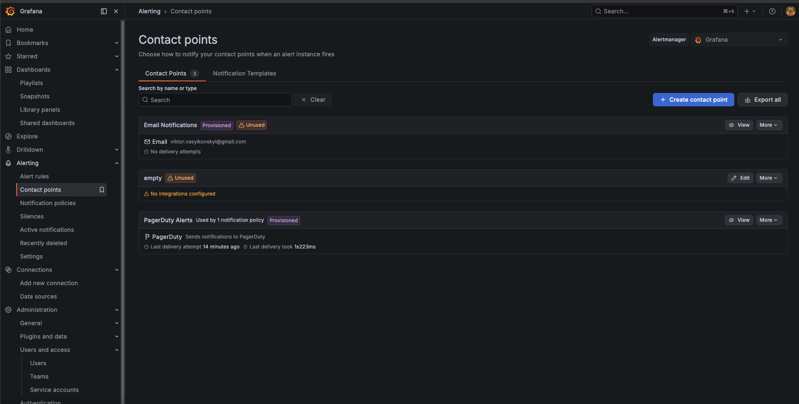
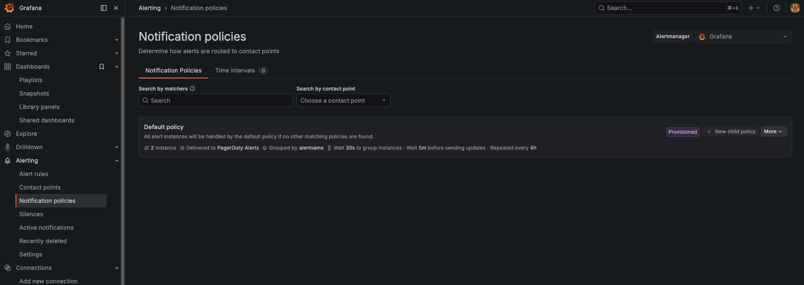
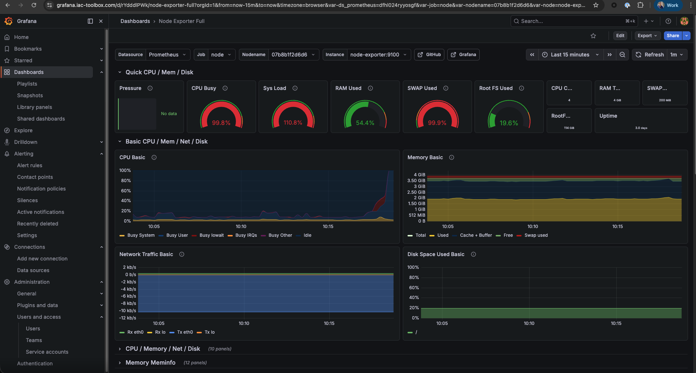
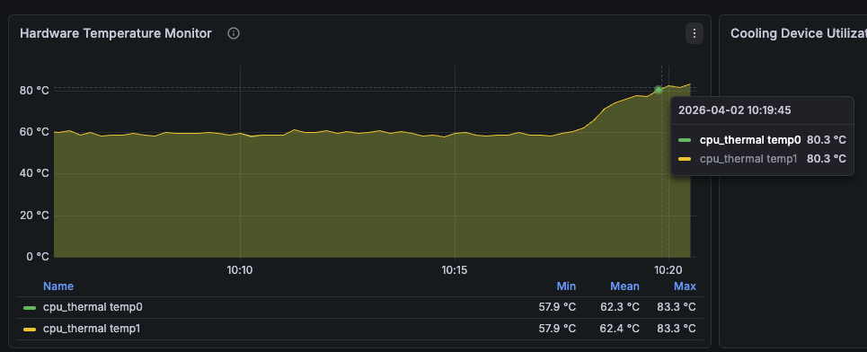
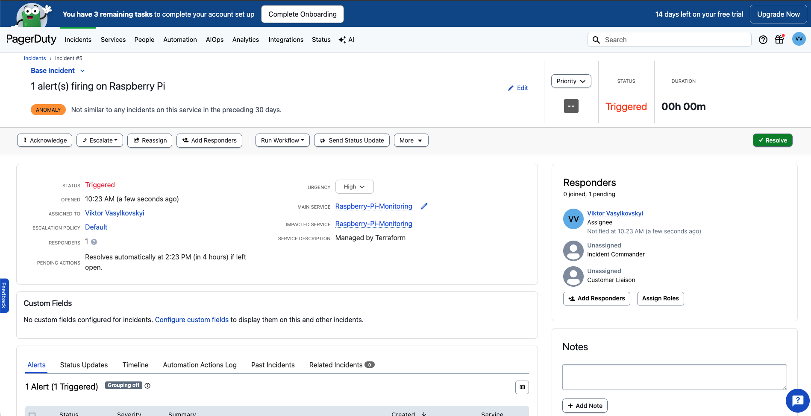

**Previous:** [Grafana Alerts](./v0-13-grafana-alerts)


You've got alerts firing in Grafana, but email notifications aren't cutting it. You need something that'll wake you up at 3am when your Raspberry Pi goes down. That's where PagerDuty comes in - an incident management platform that'll send push notifications, phone calls, and SMS, escalating until someone responds.

In this guide, we'll enable PagerDuty integration for your Grafana alerts using our automated setup script. Simply add three environment variables to your `.env` file and run the setup script - everything else happens automatically via Terraform.

**What this tutorial covers:**
- Automated PagerDuty service creation
- Grafana integration configured automatically
- All 5 alerts routed to PagerDuty incidents
- Push notifications to mobile device
- Incident lifecycle management (trigger → acknowledge → resolve)

**Time to complete:** 10-15 minutes (mostly PagerDuty account setup)

## Github Repository

All the Terraform configuration and automation scripts from this guide are available in https://github.com/IaC-Toolbox/iac-toolbox-raspberrypi. Clone it and follow along!

## Why PagerDuty?

**Email is passive**: Emails sit in your inbox. You might not see them for hours.

**PagerDuty is active**: Push notifications, phone calls, SMS. It keeps escalating until someone responds.

**Incident tracking**: Every alert becomes an incident with a lifecycle - triggered, acknowledged, resolved. You can see patterns over time.

**On-call schedules**: Rotate who gets alerted. Essential if you're working with a team.

## What We're Building

Our automated setup replaces email-based alert notifications with PagerDuty:

```
┌────────────────────────────────────────────────────────────────┐
│              AUTOMATED PAGERDUTY INTEGRATION                   │
└────────────────────────────────────────────────────────────────┘

  You add to .env:
    PAGERDUTY_TOKEN=xxx
    PAGERDUTY_USER_EMAIL=xxx
       │
       ▼
  You run: ./scripts/setup.sh
       │
       ├─► Terraform detects PagerDuty credentials
       │
       ├─► Creates PagerDuty service automatically
       │    (Raspberry-Pi-Monitoring)
       │
       ├─► Creates Grafana integration
       │    (Events API v2)
       │
       ├─► Configures PagerDuty contact point
       │    (replaces email)
       │
       └─► Updates notification policy
            (routes all 5 alerts to PagerDuty)

  Alert fires → PagerDuty incident → Push notification 📱
```

**What happens automatically:**
- PagerDuty service created: "Raspberry-Pi-Monitoring"
- Grafana integration configured with Events API v2
- Integration key generated and passed to Grafana
- Contact point switched from email to PagerDuty
- All 5 alerts route to PagerDuty incidents

**No manual Terraform commands needed!** Everything runs via the setup script.

## Prerequisites

Before starting, ensure you have:
- Completed the [Grafana Alerts tutorial](./grafana-alerts)
- 5 alerts working (CPU, Memory, Disk, Offline, Temperature)
- Terraform installed (setup script handles this automatically)
- Email for PagerDuty account signup

If you haven't set up Grafana alerts yet, complete that tutorial first.

## Step 1: Create PagerDuty Account & Get API Token

### Sign Up for PagerDuty

Head over to [pagerduty.com](https://www.pagerduty.com/) and sign up for a free account.

**Choose your region carefully:**
- **Europe**: Select EU region → URL will be `https://yourcompany.eu.pagerduty.com`
- **Other regions**: Select US → URL will be `https://yourcompany.pagerduty.com`

Note your region - you'll need it for the `.env` configuration.

**Free Tier Includes:**
- ✅ Unlimited incidents
- ✅ Mobile app (iOS/Android)
- ✅ Push notifications
- ✅ Email notifications
- ✅ 1 escalation policy
- ✅ Up to 5 users
- ✅ 25 SMS per month

### Generate API Token

Once logged in to your PagerDuty account:

1. Navigate to **Integrations** → **API Access Keys**
   (or **Developer Tools** → **API Access** on some accounts)

2. Click **Create New API Key**

3. Configure the token:
   - **Name**: "Terraform-Homelab" (or any descriptive name)
   - **Description**: "Automated alert provisioning for Raspberry Pi"
   - **Permissions**: Select **Read/Write** (required to create services)

4. Click **Create Key**

5. **IMPORTANT**: Copy the token immediately - you won't see it again!
   - Store it in a password manager
   - Or save it in a secure note temporarily

The API token looks like: `u+AbCdEf123456789...` (long alphanumeric string)

## Step 2: Add PagerDuty Credentials to .env

Navigate to your project configuration directory:

```bash
cd ansible-configurations
```

Open your `.env` file and add the PagerDuty configuration:

```bash
nano .env  # or vim, code, etc.
```

Add these three variables at the bottom (scroll past existing configs):

```bash
# ============================================
# PagerDuty Integration (Optional)
# ============================================
PAGERDUTY_TOKEN=u+YourActualTokenHere123456789...
PAGERDUTY_SERVICE_REGION=us  # or "eu" if you chose EU region
PAGERDUTY_USER_EMAIL=your-pagerduty-email@example.com
```

**Replace with your actual values:**
- `PAGERDUTY_TOKEN`: The API token you just copied from PagerDuty
- `PAGERDUTY_SERVICE_REGION`: `us` or `eu` (based on your PagerDuty URL)
- `PAGERDUTY_USER_EMAIL`: The email address you used to sign up for PagerDuty

**Region Selection:**
- If your PagerDuty URL is `https://yourcompany.pagerduty.com` → use `us`
- If your PagerDuty URL is `https://yourcompany.eu.pagerduty.com` → use `eu`

Save and close the file (`:wq` in vim, `Ctrl+X` in nano).

### Verify Configuration

Check that variables are set correctly:

```bash
grep PAGERDUTY .env
```

You should see all three PagerDuty variables with your values.

## Step 3: Run Automated Setup

Now that PagerDuty credentials are configured, the setup script will automatically create everything you need.

Navigate back to the project root:

```bash
cd ..  # Back to iac-toolbox-raspberrypi root
```

Run the setup script:

```bash
./scripts/setup.sh --terraform-only
```

Use `--terraform-only` since your infrastructure (Grafana, Prometheus) is already deployed. This flag skips Ansible and only runs Terraform to update the alert configuration.

### What Happens During Setup

The script automatically:

1. **Loads environment variables** from `.env`
2. **Generates terraform.tfvars** with PagerDuty credentials
3. **Initializes Terraform** and downloads PagerDuty provider
4. **Creates PagerDuty service**: "Raspberry-Pi-Monitoring"
5. **Creates Grafana integration** with Events API v2
6. **Generates integration key** automatically
7. **Replaces email contact point** with PagerDuty contact point
8. **Updates notification policy** to route to PagerDuty
9. **Applies changes** with auto-approve (no manual confirmation)

Watch the output - you'll see:

```bash
Configuring Grafana alerts with Terraform...
✓ Generated terraform.tfvars

Initializing Terraform...
Initializing provider plugins...
- Finding PagerDuty/pagerduty versions matching "~> 3.0"...
Terraform has been successfully initialized!

Applying Grafana alert configuration...
pagerduty_service.raspberry_pi[0]: Creating...
pagerduty_service.raspberry_pi[0]: Creation complete after 1s
pagerduty_service_integration.grafana[0]: Creating...
pagerduty_service_integration.grafana[0]: Creation complete after 1s
grafana_contact_point.pagerduty[0]: Creating...
grafana_contact_point.pagerduty[0]: Creation complete after 1s
grafana_notification_policy.default: Updating...
grafana_notification_policy.default: Update complete after 1s
grafana_contact_point.email[0]: Destroying...
grafana_contact_point.email[0]: Destruction complete after 1s

Apply complete! Resources: 3 added, 1 changed, 1 destroyed.

✓ Grafana alerts configured successfully

========================================
Setup completed successfully!
========================================

Grafana Alerts:
  - Access: https://grafana.iac-toolbox.com/alerting/list
  - 5 alerts configured: CPU (5%), Memory (90%), Disk (80%), Offline (5m), Temp (75°C)
  - Notifications: PagerDuty (incidents created automatically)
  - PagerDuty Service: Raspberry-Pi-Monitoring
  - Install mobile app: iOS/Android for push notifications
```

The entire process takes about 30 seconds.

## Step 4: Verify PagerDuty Integration

Let's confirm everything was created correctly.

### Check PagerDuty Service

Open your PagerDuty dashboard:

```
https://your-company.pagerduty.com/service-directory
```

You should see:
- **Service Name**: "Raspberry-Pi-Monitoring"
- **Status**: Active (green)
- **Integration**: Grafana (Events API v2)

Click on the service to see details:
- Escalation policy: "Default"
- Auto-resolve timeout: 4 hours
- Acknowledgement timeout: 10 minutes

### Check Grafana Contact Point

Open Grafana:

```
https://grafana.iac-toolbox.com
```

Navigate to **Alerting** → **Contact points**




You should see:
- ✅ **PagerDuty Alerts** (active contact point)
- ❌ **Email Notifications** (deleted - no longer present)

Click on "PagerDuty Alerts" to verify:
- Integration key is configured (shows as `***sensitive***`)
- Severity: critical
- Summary template present

### Check Notification Policy

Navigate to **Alerting** → **Notification policies**




You should see:
- **Default policy** routes to → **PagerDuty Alerts**
- Group by: alertname
- Group wait: 30s
- Repeat interval: 4h

### Check Alert Rules

Navigate to **Alerting** → **Alert rules** → **Homelab Alerts**

All 5 alerts should still be present:
- High CPU Usage
- High Memory Usage
- Low Disk Space
- Device Offline
- High CPU Temperature

No changes to alert rules - only the routing changed.

## Step 5: Install Mobile App & Test

### Install PagerDuty Mobile App

Before testing, install the PagerDuty app:
- **iOS**: [App Store](https://apps.apple.com/app/pagerduty/id594039512)
- **Android**: [Play Store](https://play.google.com/store/apps/details?id=com.pagerduty.android)

Log in with your PagerDuty account. Enable notifications!

### Trigger a CPU Alert

SSH to your Pi and stress the CPU:

```bash
ssh <your-user>@<raspberry-pi>

# Install stress tool if not already installed
sudo apt-get install -y stress

# Stress all CPU cores for 6 minutes
stress --cpu $(nproc) --timeout 360s
```

### Watch It Flow






Here's what happens:

**Minute 1-5**: CPU spikes above 80% (testing threshold)
- Grafana evaluates every 5 minutes
- Condition is true but `for = "5m"` hasn't elapsed yet
- Alert in "Pending" state

**Minute 5-10**: Alert fires!
- Grafana sends event to PagerDuty contact point
- PagerDuty receives the event via Events API v2
- Incident is created in PagerDuty

**Minute 10+**: You get notified
- 📱 Push notification on your phone
- 📧 Email from PagerDuty
- (If configured) SMS or phone call
- (If configured) SMS or phone call

**Check PagerDuty UI:**
```
https://your-company.pagerduty.com/incidents
```

You should see a new incident: "High CPU Usage"

### Acknowledge the Incident




In the mobile app or web UI:
1. Click on the incident
2. Click **Acknowledge**

This tells PagerDuty "I see it, I'm working on it" and stops the escalation.

### Resolve the Incident

Kill the stress test:
```bash
pkill stress
```

Wait 5-10 minutes for CPU to drop. The alert should auto-resolve in Grafana, which then resolves the PagerDuty incident.

Or manually resolve it:
1. Click on the incident
2. Click **Resolve**

**Congratulations!** You just completed the full incident lifecycle.

## Verify in PagerDuty UI

Check your PagerDuty dashboard:

**Service Directory:**
```
https://your-company.pagerduty.com/service-directory
```

You should see:
- **Raspberry-Pi-Monitoring** service
- **Grafana** integration listed under it
- Green checkmark if everything is connected

**Recent Incidents:**

Click on the test incident to see:
- Alert details from Grafana
- Timeline of notifications sent
- When it was acknowledged and resolved
- Which user was on-call

## Understanding the Flow

Here's exactly what happens when an alert fires:

```
1. Prometheus scrapes metrics (every 15s)
   ↓
2. Grafana evaluates alert rules (every 60s)
   ↓
3. Condition true for 5 minutes
   ↓
4. Grafana fires alert
   ↓
5. Contact point receives it
   ↓
6. Notification sent to PagerDuty API
   ↓
7. PagerDuty creates incident
   ↓
8. Escalation policy kicks in
   ↓
9. You get notified (push, email, SMS, call)
   ↓
10. You acknowledge → stops escalation
   ↓
11. You fix the issue
   ↓
12. Alert resolves in Grafana
   ↓
13. PagerDuty incident auto-resolves
```

The `for` duration (5 minutes in our CPU alert) prevents false alarms from brief spikes.

## Troubleshooting

### Setup Failed with "401 Unauthorized"

**Symptom**: Terraform fails during setup with authentication error

**Cause**: Wrong or expired PagerDuty API token

**Fix**:
1. Generate new token in PagerDuty UI (Integrations → API Access Keys)
2. Update `.env` with new token:
   ```bash
   cd ansible-configurations
   nano .env
   # Update PAGERDUTY_TOKEN=new-token-here
   ```
3. Re-run setup:
   ```bash
   cd ..
   ./scripts/setup.sh --terraform-only
   ```

### "User not found" Error

**Symptom**: Terraform fails with "user not found with email: xxx"

**Cause**: Email mismatch between `.env` and PagerDuty account

**Fix**:
1. Check your email in PagerDuty: People & Teams → Users
2. Copy the exact email (case-sensitive)
3. Update `.env`:
   ```bash
   PAGERDUTY_USER_EMAIL=exact-email@example.com
   ```
4. Re-run setup

### Alert Fires But No PagerDuty Incident

**Symptom**: Alert shows "Firing" in Grafana but no incident in PagerDuty

**Debug steps**:

1. **Test contact point in Grafana:**
   - Go to Alerting → Contact points → PagerDuty Alerts
   - Click "Test"
   - Should create test incident in PagerDuty

2. **Check integration key:**
   ```bash
   cd terraform/grafana-alerts
   terraform output pagerduty_integration_key
   ```
   Verify key exists and is not "not-configured"

3. **Test PagerDuty API directly:**
   ```bash
   curl -X POST \
     -H "Content-Type: application/json" \
     -d '{
       "routing_key": "YOUR_INTEGRATION_KEY",
       "event_action": "trigger",
       "payload": {
         "summary": "Manual test incident",
         "severity": "critical",
         "source": "curl-test"
       }
     }' \
     https://events.pagerduty.com/v2/enqueue
   ```
   Should return `202 Accepted`

4. **Check Grafana logs:**
   ```bash
   ssh pi@raspberrypi.local
   docker logs grafana --tail 50 | grep -i pagerduty
   ```

**No notifications on phone?**

Check the PagerDuty mobile app:
- Are you logged in?
- Are notifications enabled in iOS/Android settings?
- Is your user on-call? (Check PagerDuty → On-Call → Schedules)

By default, you're always on-call if you're the only user.

**Incident created but not resolving automatically?**

Grafana might not be sending the resolve event. Check Grafana alert rules:
```hcl
no_data_state  = "NoData"
exec_err_state = "Error"
```

These should be set, not "Alerting". Otherwise no-data or errors trigger new alerts.

### Getting Too Many Notifications

**Symptom**: Being paged repeatedly for same issue

**Tune these settings in PagerDuty UI:**
- Escalation Policy → Edit "Default"
- Increase acknowledgement timeout from 10min to 30min
- Add escalation rules if needed

**Or update Terraform files:**
Edit `terraform/grafana-alerts/pagerduty.tf`:
```hcl
acknowledgement_timeout = 1800  # 30 minutes instead of 10
```

Then apply:
```bash
cd terraform/grafana-alerts
terraform apply -auto-approve
```

**Reduce repeat notifications in Grafana:**
Edit `terraform/grafana-alerts/alerts.tf`:
```hcl
repeat_interval = "12h"  # Instead of 4h
```

### Switching Back to Email

To disable PagerDuty and return to email:

1. Remove PagerDuty variables from `.env`:
   ```bash
   cd ansible-configurations
   nano .env
   # Delete or comment out PAGERDUTY_TOKEN line
   ```

2. Re-run setup:
   ```bash
   cd ..
   ./scripts/setup.sh --terraform-only
   ```

Terraform will automatically:
- Destroy PagerDuty resources
- Create email contact point
- Update notification policy

## PagerDuty Free vs Paid

**Free Tier includes:**
- Unlimited incidents
- Mobile app
- Email, push notifications
- 1 escalation policy
- 5 users
- 25 SMS per month

**Paid plans add:**
- Phone call notifications
- Multiple escalation policies
- Advanced analytics
- Slack integration
- Postmortems
- SLA reporting

For a personal Raspberry Pi or small project, free is plenty!

## Understanding the Automated Flow

Here's what the setup script does behind the scenes:

### Terraform Resources Created

When PAGERDUTY_TOKEN is present in `.env`:

1. **PagerDuty Service** (`pagerduty_service.raspberry_pi`)
   - Name: "Raspberry-Pi-Monitoring"
   - Auto-resolve: 4 hours
   - Acknowledgement timeout: 10 minutes

2. **Grafana Integration** (`pagerduty_service_integration.grafana`)
   - Type: Events API v2
   - Integration key generated automatically

3. **PagerDuty Contact Point** (`grafana_contact_point.pagerduty`)
   - Replaces email contact point
   - Integration key from step 2

4. **Updated Notification Policy** (`grafana_notification_policy.default`)
   - Routes to PagerDuty instead of email

### Conditional Logic

The Terraform code uses conditionals:

```hcl
locals {
  pagerduty_enabled = var.pagerduty_token != ""
}

resource "grafana_contact_point" "email" {
  count = local.pagerduty_enabled ? 0 : 1
  # Only created if PagerDuty NOT configured
}

resource "grafana_contact_point" "pagerduty" {
  count = local.pagerduty_enabled ? 1 : 0
  # Only created if PagerDuty IS configured
}
```

This means:
- Empty `PAGERDUTY_TOKEN` → Email contact point
- Set `PAGERDUTY_TOKEN` → PagerDuty contact point

No manual switching needed!

## Next Steps

You now have production-grade incident management!

**Immediate actions:**
1. Install PagerDuty mobile app (iOS/Android)
2. Enable push notifications in phone settings
3. Test with a real alert (lower CPU threshold temporarily)
4. Practice incident workflow: acknowledge → investigate → resolve

**Tuning:**
- Monitor for false positives over next week
- Adjust thresholds if needed
- Tune alert "for" duration (currently 5m for all)
- Consider different thresholds for different times (maintenance windows)

**Advanced (optional):**
- Set up Grafana mute timings for planned maintenance
- Create custom escalation policies (paid feature)
- Add more alert rules for application-specific metrics
- Integrate Slack for non-critical notifications

## Summary

You've automated PagerDuty integration for Grafana alerts with zero manual Terraform commands!

**What you accomplished:**
- ✅ Added 3 environment variables to `.env`
- ✅ Ran one command: `./scripts/setup.sh --terraform-only`
- ✅ PagerDuty service created automatically
- ✅ Grafana integration configured
- ✅ All 5 alerts route to PagerDuty incidents
- ✅ Push notifications on mobile device

**The automated flow:**
1. Environment variables → `terraform.tfvars`
2. Terraform detects PagerDuty credentials
3. Creates PagerDuty service: "Raspberry-Pi-Monitoring"
4. Creates Grafana integration with Events API v2
5. Switches contact point from email to PagerDuty
6. Updates notification policy routing

**No manual Terraform needed!** Everything integrated into the setup script.

**To switch back to email:**
- Remove `PAGERDUTY_TOKEN` from `.env`
- Re-run `./scripts/setup.sh --terraform-only`
- Automatically destroys PagerDuty resources and restores email

Your Raspberry Pi monitoring is now production-ready with active alerting. When something breaks at 3am, you'll get a push notification - not an email you might miss until morning.

Install the mobile app, test with a real alert, and practice the incident workflow. 📱

---

**Previous:** [Grafana Alerts](./v0-13-grafana-alerts) | **Next:** [Conclusion](./v0-15-conclusion)
