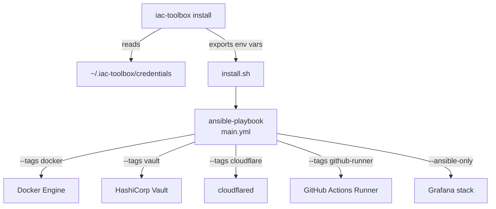

Run Ansible playbooks directly without the CLI. Useful for advanced users and CI pipelines.



## Run playbooks

```bash
cd infrastructure/ansible-configurations

# Full deployment
ansible-playbook -i inventory/all.yml playbooks/main.yml

# Single component
ansible-playbook -i inventory/all.yml playbooks/main.yml --tags docker
ansible-playbook -i inventory/all.yml playbooks/main.yml --tags vault
ansible-playbook -i inventory/all.yml playbooks/main.yml --tags cloudflare
ansible-playbook -i inventory/all.yml playbooks/main.yml --tags github-runner
```

## Inject secrets

Secrets must be exported as environment variables before running playbooks:

```bash
export CLOUDFLARE_API_TOKEN=...
export GRAFANA_ADMIN_PASSWORD=...
export DOCKER_HUB_TOKEN=...
ansible-playbook -i inventory/all.yml playbooks/main.yml
```

## Available tags

| Tag | Component |
|---|---|
| `docker` | Docker Engine |
| `vault` | HashiCorp Vault |
| `cloudflare` | Cloudflare Tunnel (`cloudflared`) |
| `github-runner` | GitHub Actions self-hosted runner |
