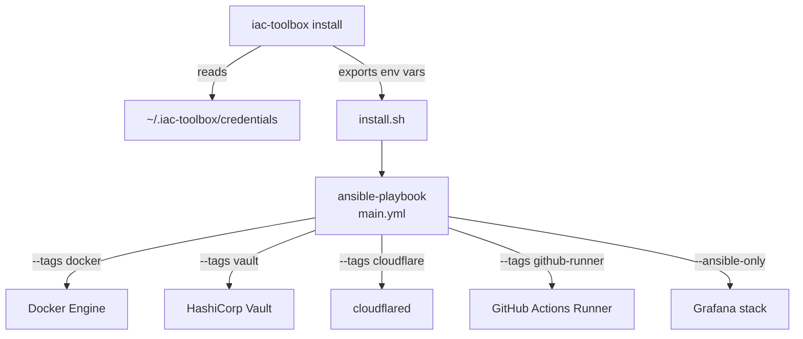

Run Ansible playbooks directly without the CLI. Useful for advanced users and CI pipelines.



## Prerequisites

Ansible must be installed on the control machine (the machine running the playbook).

### Automatic bootstrap

`install.sh` automatically installs Ansible if not present:

| OS | Bootstrap script |
|---|---|
| macOS | `scripts/bootstrap/bootstrap-macos.sh` (uses Homebrew) |
| Debian/Ubuntu | `scripts/bootstrap/bootstrap-debian.sh` (uses `apt`) |

Bootstrap scripts are idempotent — safe to run multiple times.

### Manual Ansible installation

```bash
# macOS
brew install ansible

# Debian/Ubuntu
sudo apt update && sudo apt install -y ansible
```

## Run playbooks

```bash
cd infrastructure/ansible-configurations

# Full deployment
ansible-playbook -i inventory/all.yml playbooks/main.yml

# Single component
ansible-playbook -i inventory/all.yml playbooks/main.yml --tags docker
ansible-playbook -i inventory/all.yml playbooks/main.yml --tags vault
ansible-playbook -i inventory/all.yml playbooks/main.yml --tags cloudflare
ansible-playbook -i inventory/all.yml playbooks/main.yml --tags github-runner
```

## Inject secrets

Secrets must be exported as environment variables before running playbooks:

```bash
export CLOUDFLARE_API_TOKEN=...
export GRAFANA_ADMIN_PASSWORD=...
export DOCKER_HUB_TOKEN=...
ansible-playbook -i inventory/all.yml playbooks/main.yml
```

## Available tags

| Tag | Component | Additional tags |
|---|---|---|
| `docker` | Docker Engine | — |
| `vault` | HashiCorp Vault | `secrets` |
| `cloudflare` | Cloudflare Tunnel (`cloudflared`) | `tunnel` |
| `github-build-workflow` | GitHub Docker build workflow | `ci` |
| `grafana` | Grafana UI | `monitoring` |
| `prometheus` | Prometheus + Node Exporter | `monitoring` |
| `loki` | Loki + Alloy log stack | `logs`, `monitoring` |
| `setup` | Base system packages (Debian only) | `base` |

### Tag combinations

```bash
# Install full observability stack
ansible-playbook -i inventory/all.yml playbooks/main.yml --tags monitoring

# Install secrets + tunnel (for Vault with public domain)
ansible-playbook -i inventory/all.yml playbooks/main.yml --tags secrets,tunnel
```
