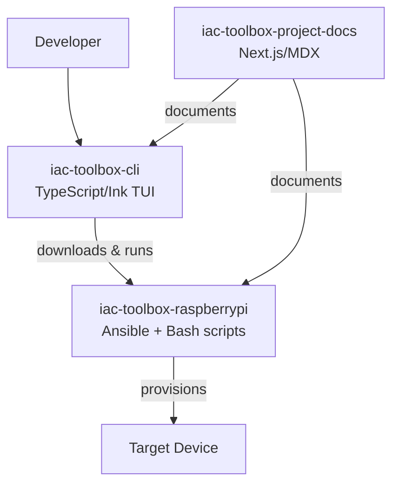
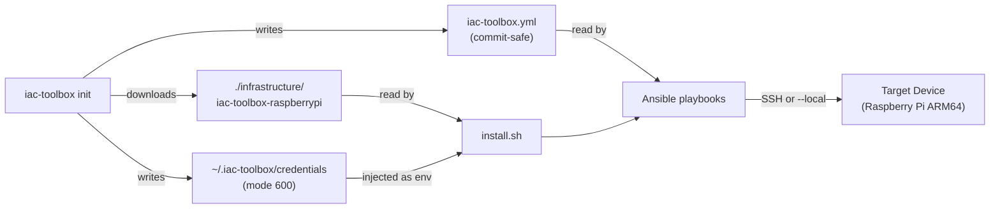
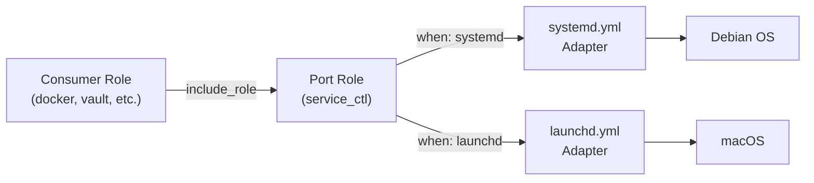

## Repository map

| Repo | Purpose |
|---|---|
| `iac-toolbox-cli` | TUI wizard and CLI subcommands (TypeScript/Ink) |
| `iac-toolbox-raspberrypi` | Ansible playbooks + install scripts (Bash/YAML) |
| `iac-toolbox-project-docs` | This documentation site (Next.js/MDX) |



## Data flow



## Architecture validation

The CLI checks `os.arch()` at startup. On non-ARM64 systems a 3-second warning is shown:

```
⚠️  Detected x86_64 on linux. This tool is optimized for ARM64/Raspberry Pi.
    You can proceed for testing purposes, but some features may not work as expected.
```

## Config and secrets separation

`iac-toolbox.yml` holds all non-secret configuration and is safe to commit to git. Sensitive values are stored exclusively in `~/.iac-toolbox/credentials` (mode 600) and injected as environment variables at deploy time. The `iac-toolbox.yml` file uses `{{ variable }}` placeholders to mark injection points.

## Hexagonal architecture (Ports and Adapters)

The Ansible roles use hexagonal architecture to abstract OS-specific implementations. This enables the same playbooks to run on both Raspberry Pi (Debian/systemd) and macOS (brew/launchd) for local testing.

### Port Roles

Two port roles provide unified interfaces:

| Port Role | Purpose | Adapter Selection |
|---|---|---|
| `service_ctl` | Service lifecycle (start/stop/enable) | Uses `ansible_service_mgr` to select `systemd.yml` or `launchd.yml` |
| `package` | Package installation | Uses `ansible_pkg_mgr` to select `apt.yml` or `brew.yml` |

### How it works



Variables set in `group_vars/all.yml`:
```yaml
package_manager: "{{ ansible_pkg_mgr }}"    # apt | homebrew
service_manager: "{{ ansible_service_mgr }}" # systemd | launchd
```

### Benefits

- **Single playbook** runs on both Raspberry Pi and macOS
- **Local testing** with `--local` flag uses macOS adapters
- **No platform checks** scattered across roles — centralized in port roles
- **Easy extension** — add new adapters (e.g., Alpine/OpenRC) without touching consumer roles
