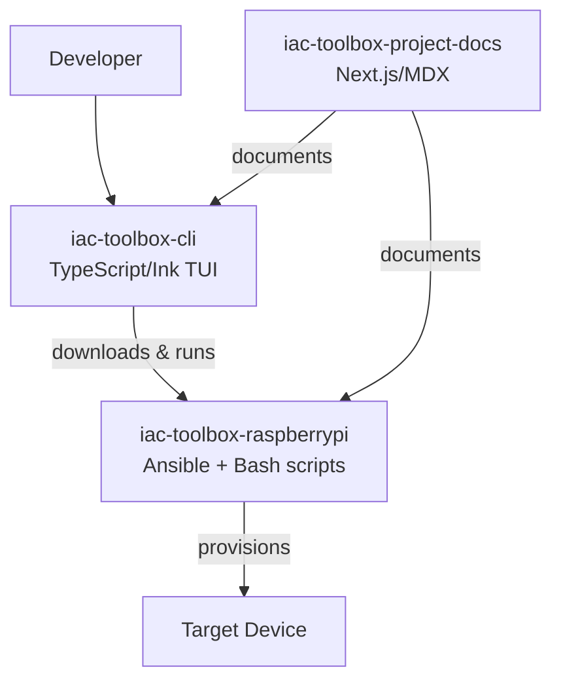
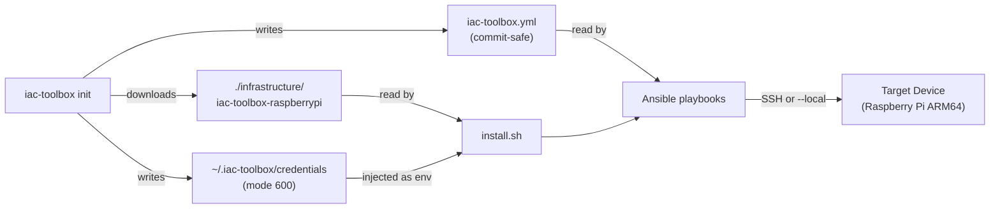

## Repository map

| Repo | Purpose |
|---|---|
| `iac-toolbox-cli` | TUI wizard and CLI subcommands (TypeScript/Ink) |
| `iac-toolbox-raspberrypi` | Ansible playbooks + install scripts (Bash/YAML) |
| `iac-toolbox-project-docs` | This documentation site (Next.js/MDX) |



## Data flow



## Architecture validation

The CLI checks `os.arch()` at startup. On non-ARM64 systems a 3-second warning is shown:

```
⚠️  Detected x86_64 on linux. This tool is optimized for ARM64/Raspberry Pi.
    You can proceed for testing purposes, but some features may not work as expected.
```

## Config and secrets separation

`iac-toolbox.yml` holds all non-secret configuration and is safe to commit to git. Sensitive values are stored exclusively in `~/.iac-toolbox/credentials` (mode 600) and injected as environment variables at deploy time. The `iac-toolbox.yml` file uses `{{ variable }}` placeholders to mark injection points.
