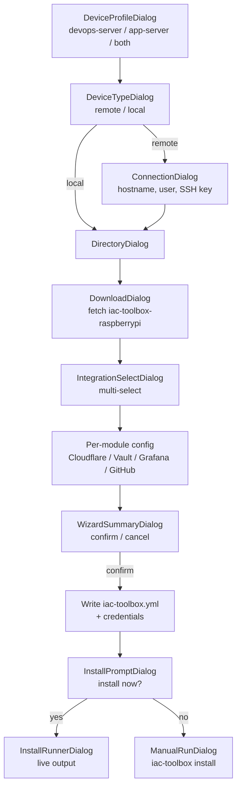

```
iac-toolbox init [--profile <name>]
```

Starts the interactive TUI wizard. Running `iac-toolbox` with no subcommand prints help; `iac-toolbox init` is the explicit form.

## Wizard steps

| Step | Dialog | Description |
|---|---|---|
| 0 | DeviceProfileDialog | Choose server role: DevOps Server, App Server, or Both |
| 1 | DeviceTypeDialog | Choose target: Raspberry Pi ARM64, Local x64, or AWS EC2 (coming soon) |
| 2 | ConnectionDialog | For remote: hostname, username, SSH key path |
| 3 | DirectoryDialog | Where to save infrastructure scripts (`./infrastructure` or CWD) |
| 4 | DownloadDialog | Downloads `iac-toolbox-raspberrypi` scripts to the chosen directory |
| 5 | IntegrationSelectDialog | Multi-select: GitHub Build Workflow, Cloudflare, Vault, Grafana |
| 6 | Per-module config | One dialog per selected integration |
| 7 | WizardSummaryDialog | Review selections, confirm or cancel |
| 8 | InstallPromptDialog | Optionally run `install.sh` immediately |
| 9 | InstallRunnerDialog / ManualRunDialog | Live install output or manual command |



## Flags

| Flag | Default | Description |
|---|---|---|
| `--profile <name>` | `default` | Credential profile to read/write |

## Outputs

- `<directory>/iac-toolbox.yml` — non-secret configuration, safe to commit
- `~/.iac-toolbox/credentials` — secrets, INI format, mode 600
