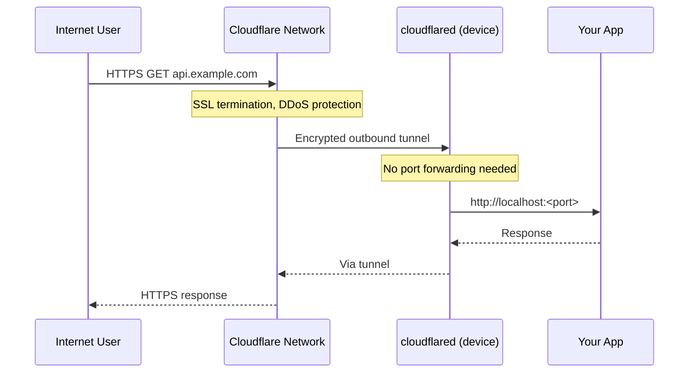

The Cloudflare Tunnel integration uses API token mode (`mode: api`). The wizard validates the token and zone ID against the Cloudflare API before writing config.

## Wizard fields

| Field | Description | Validated |
|---|---|---|
| API token | Cloudflare API token with Tunnel:Edit + DNS:Edit scope | Yes — calls `/user/tokens/verify` |
| Account ID | Found in Cloudflare dashboard sidebar | No |
| Zone ID | Found in domain overview page | Yes — calls `/zones/<id>` |
| Tunnel name | Auto-suggested as `<zoneName>-tunnel` | No |
| Hostname | First domain to expose (e.g. `api.example.com`) | No |
| Service port | Local port the service listens on | No (integer check only) |



## Credential stored

```ini
[default]
cloudflare_api_token = <token>
```

## Config written to iac-toolbox.yml

```yaml
cloudflare:
  enabled: true
  mode: "api"
  tunnel_name: "example.com-tunnel"
  account_id: "abc123"
  zone_id: "def456"
  cloudflare_api_token: "{{ cloudflare_api_token }}"
  domains:
    - hostname: "api.example.com"
      service_port: 80
      service: "http://localhost:80"
```

## Ansible tags

`cloudflare`

## Re-install without wizard

```bash
iac-toolbox cloudflare install
```
