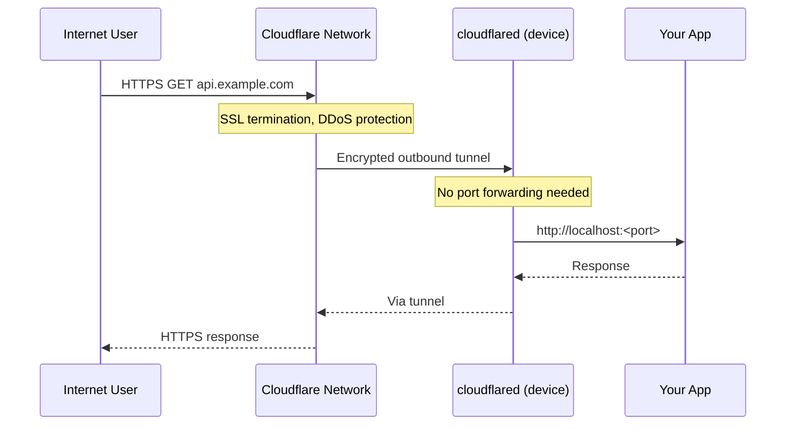

The Cloudflare Tunnel integration supports two modes:

| Mode | Description | Default |
|---|---|---|
| `oauth` | Interactive browser login, uses `cert.pem` | ✓ Yes |
| `api` | Token-based automation, no browser needed | No |

The CLI wizard uses **API mode** and validates credentials before deployment. For manual Ansible runs, **OAuth mode** is the default (requires `cloudflared tunnel login` as a post-deployment step).

## Wizard fields

| Field | Description | Validated |
|---|---|---|
| API token | Cloudflare API token with Tunnel:Edit + DNS:Edit scope | Yes — calls `/user/tokens/verify` |
| Account ID | Found in Cloudflare dashboard sidebar | No |
| Zone ID | Found in domain overview page | Yes — calls `/zones/<id>` |
| Tunnel name | Auto-suggested as `<zoneName>-tunnel` | No |
| Hostname | First domain to expose (e.g. `api.example.com`) | No |
| Service port | Local port the service listens on | No (integer check only) |



## Credential stored

```ini
[default]
cloudflare_api_token = <token>
```

## Config written to iac-toolbox.yml

```yaml
cloudflare:
  enabled: true
  mode: "api"  # or "oauth" for interactive login
  tunnel_name: "example.com-tunnel"
  account_id: "abc123"  # Required for API mode only
  zone_id: "def456"      # Required for API mode only
  cloudflare_api_token: "{{ cloudflare_api_token }}"  # API mode only
  domains:
    - hostname: "api.example.com"
      service_port: 80
      service: "http://localhost:80"
```

### OAuth mode setup

When using `mode: "oauth"` (the Ansible default), you must run the interactive login **after** the playbook completes:

```bash
ssh pi@raspberrypi.local
cloudflared tunnel login
# Then re-run deployment to complete setup:
cd infrastructure/ansible-configurations
ansible-playbook -i inventory/all.yml playbooks/main.yml --tags cloudflare
```

OAuth mode does **not** require `account_id`, `zone_id`, or `cloudflare_api_token` — all configuration is managed via the web UI during login.

## Ansible tags

`cloudflare`

## Re-install without wizard

```bash
iac-toolbox cloudflare install
```
