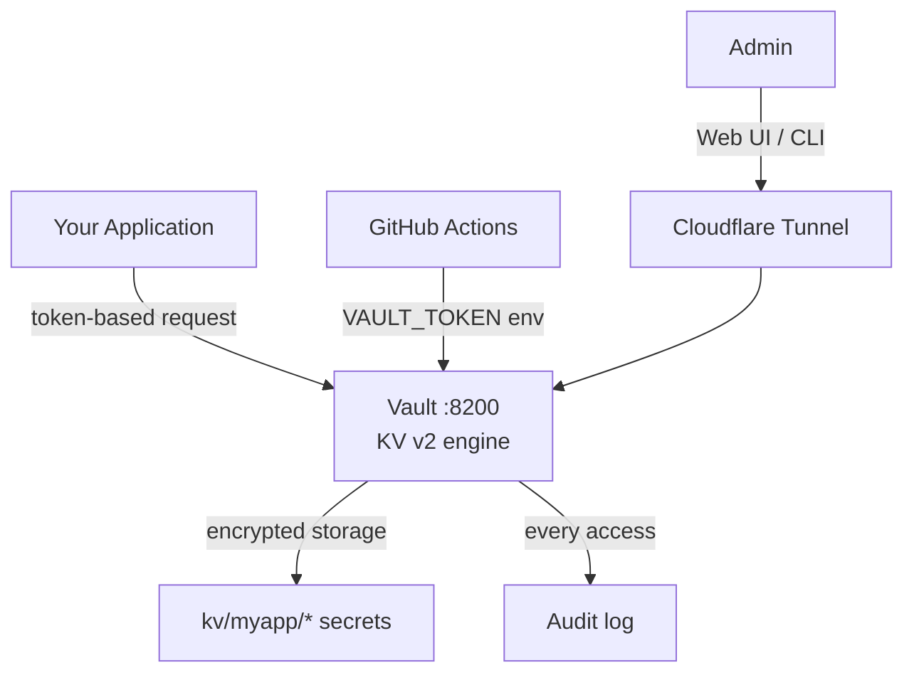

Vault runs in dev-adjacent mode with KV secrets engine and audit log enabled by default. The wizard offers to expose Vault via Cloudflare Tunnel if that integration is also selected.

## Wizard — Cloudflare enabled

```
◆ Expose Vault publicly via Cloudflare?
│ Suggested domain: vault.example.com
│
│ ◉ Yes — use vault.example.com
│ ○ No — local access only (http://localhost:8200)
└
```

## Wizard — Cloudflare not enabled

```
◆ Expose Vault publicly via Cloudflare?
│
│   ○ Yes — not available (Cloudflare Tunnel is not enabled)
│   ● No — local access only (http://localhost:8200)
└
```

## Config written to iac-toolbox.yml

```yaml
vault:
  enabled: true
  version: "latest"
  port: 8200
  enable_kv: true
  enable_audit: true
  domain: "vault.example.com"   # empty string if local only
```



## Ansible tags

`vault`

## Re-install without wizard

```bash
iac-toolbox vault install
```
