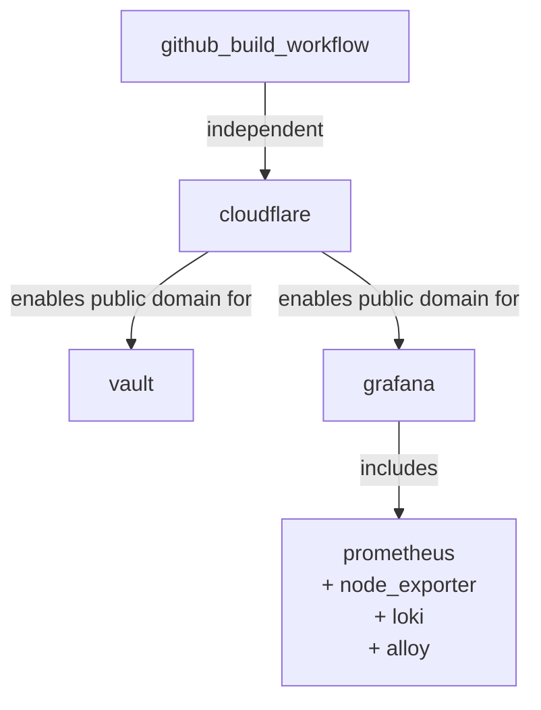

Integrations are selected during `iac-toolbox init` at the IntegrationSelectDialog step. Each selected integration adds a configuration block to `iac-toolbox.yml` and may store credentials in `~/.iac-toolbox/credentials`.

## Available integrations

| Integration | Status | Ansible tag |
|---|---|---|
| GitHub Build Workflow | Available | `github-build-workflow` |
| Cloudflare Tunnel | Available | `cloudflare` |
| HashiCorp Vault | Available | `vault` |
| Grafana (full stack) | Available | runs via `--ansible-only` |
| GitHub Runner | Coming soon | — |
| PagerDuty | Coming soon | — |

## Selection matrix

| Integration | Credentials required | Config in iac-toolbox.yml |
|---|---|---|
| `github_build_workflow` | `docker_hub_token`, `docker_hub_username` | `github_build_workflow.*` |
| `cloudflare` | `cloudflare_api_token` | `cloudflare.*` |
| `vault` | none | `vault.*` |
| `grafana` | `grafana_admin_password` | `grafana.*`, `prometheus.*`, `loki.*`, `alloy.*`, `node_exporter.*` |

## Integration dependencies

Vault and Grafana can optionally be exposed via Cloudflare Tunnel if the `cloudflare` integration is also selected. The wizard detects this and offers a public domain for each service.

