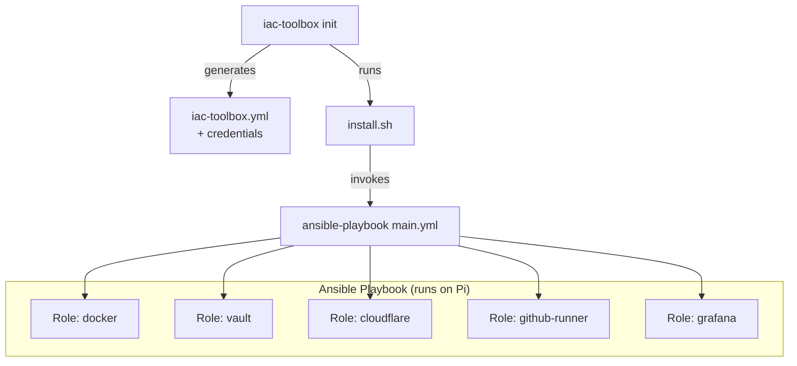

Manually installing software on servers is time-consuming, error-prone, and frankly, boring. Ansible changes all that by letting you define your setup in code and reapply it with ease. In this guide, we'll use Ansible to automate the installation of essential software on your Raspberry Pi. Let's dive in!



## Github Repository

The complete Ansible playbooks and roles from this guide are available in https://github.com/IaC-Toolbox/iac-toolbox-raspberrypi. Feel free to clone it and follow along!

## Why Ansible?

Ansible is a powerful automation tool that makes infrastructure management a breeze:
- **Runs from your local machine** - no agents needed on the target server (one less thing to worry about!)
- **Uses simple YAML syntax** - if you can read it, you can write it
- **Is idempotent** - safe to run multiple times, only makes necessary changes (no more "did I already install this?" questions)
- **Provides version control** - your infrastructure configuration becomes code you can commit to git

## Prepare Ansible on Your Mac

Ansible runs on your Mac (the "control node") and connects to your Raspberry Pi (the "managed node") via SSH to execute tasks.

Install Ansible using Homebrew:

```bash
brew install ansible
```

## Project Structure

We'll organize our Ansible configuration like this:

```
ansible/
├── inventory/
│   └── all.yml           # Defines hosts
├── playbooks/
│   └── playbook.yml      # Defines what to install
├── roles/
│   ├── setup/            # Base software installation
│   ├── docker/           # Docker installation
│   └── cloudflare/       # Cloudflare tunnel (covered later)
└── secrets.yml           # Encrypted secrets (optional)
```

## Step 1: Create Inventory File

The inventory file tells Ansible which servers to manage. Create `inventory/all.yml`:

```yml
# inventory/all.yml
all:
  hosts:
    raspberrypi:
      ansible_host: raspberrypi.local
      ansible_user: pi
      ansible_ssh_private_key_file: ~/.ssh/id_ed25519
```

Replace:
- `raspberrypi.local` with your Pi's hostname or IP address
- `pi` with your username
- `~/.ssh/id_ed25519` with your SSH key path

## Step 2: Create Main Playbook

The playbook defines high-level tasks (called "roles") to execute. Think of it as your infrastructure recipe. Create `playbooks/playbook.yml`:

```yml
# playbooks/playbook.yml
- name: Setup Raspberry Pi
  hosts: all
  become: true

  roles:
    - setup
    - docker
```

Note that `become: true` directive runs tasks with sudo privileges - we need this for installing software.

## Step 3: Create the Setup Role

The setup role installs base software. Create `roles/setup/tasks/main.yml`:

```yml
# roles/setup/tasks/main.yml
- name: Update package list
  apt:
    update_cache: yes
    cache_valid_time: 3600

- name: Upgrade all packages
  apt:
    upgrade: dist

- name: Install essential packages
  apt:
    name:
      - python3
      - python3-pip
      - git
      - curl
      - vim
      - htop
    state: latest
```

## Step 4: Create the Docker Role

Docker will run your containerized applications. Create `roles/docker/tasks/main.yml`:

```yml
# roles/docker/tasks/main.yml
- name: Install Docker dependencies
  apt:
    name:
      - apt-transport-https
      - ca-certificates
      - curl
      - gnupg
      - lsb-release
    state: present

- name: Add Docker GPG key
  apt_key:
    url: https://download.docker.com/linux/debian/gpg
    state: present

- name: Add Docker repository
  apt_repository:
    repo: "deb [arch=arm64] https://download.docker.com/linux/debian {{ ansible_distribution_release }} stable"
    state: present

- name: Install Docker
  apt:
    name:
      - docker-ce
      - docker-ce-cli
      - containerd.io
    state: present
    update_cache: yes

- name: Add user to docker group
  user:
    name: "{{ ansible_user }}"
    groups: docker
    append: yes

- name: Enable Docker service
  systemd:
    name: docker
    enabled: yes
    state: started
```

## Step 5: Run the Playbook

Now for the fun part! Execute the playbook to configure your Raspberry Pi:

```bash
ansible-playbook -i inventory/all.yml playbooks/playbook.yml
```

Ansible will:
1. Connect to your Raspberry Pi via SSH
2. Update system packages
3. Install Python, Git, and essential utilities
4. Install and configure Docker
5. Add your user to the docker group

This will take several minutes on the first run. Grab a coffee!

### Verify Installation

After the playbook completes, let's verify everything worked. SSH into your Raspberry Pi and run:

```bash
# Check Python version
python3 --version

# Check Docker version
docker --version

# Test Docker (you may need to log out and back in for group changes)
docker run hello-world
```

If you see the "Hello from Docker!" message, all is fine and dandy!

## Managing Secrets with Ansible Vault

If your playbook needs sensitive data (API keys, passwords), use Ansible Vault to encrypt them.

### Create Vault Secrets

Create an encrypted secrets file:

```bash
ansible-vault create secrets.yml
```

Enter a password, then add your secrets:

```yml
# secrets.yml
api_key: "your-secret-api-key"
database_password: "your-secret-password"
```

### Use Secrets in Playbook

Reference the secrets file in your playbook:

```yml
# playbooks/playbook.yml
- name: Setup Raspberry Pi
  hosts: all
  become: true
  vars_files:
    - ../secrets.yml

  vars:
    my_api_key: "{{ api_key }}"

  roles:
    - setup
    - docker
```

### Run with Vault Password

When running the playbook, provide the vault password:

```bash
ansible-playbook -i inventory/all.yml playbooks/playbook.yml --ask-vault-pass
```

Or use a password file:

```bash
echo "your-vault-password" > .vault_pass.txt
ansible-playbook -i inventory/all.yml playbooks/playbook.yml --vault-password-file .vault_pass.txt
```

**Important**: Add `.vault_pass.txt` to your `.gitignore` file!

## Troubleshooting

**Connection refused error?**
- Verify your SSH key is added to the SSH agent
- Test SSH connection manually: `ssh pi@raspberrypi.local`
- Check the hostname or IP address in your inventory file

**Permission denied errors?**
- Ensure `become: true` is set in your playbook
- Verify your user has sudo privileges on the Raspberry Pi

**Docker commands don't work?**
- Log out and back in after adding user to docker group
- Or run `newgrp docker` to apply group changes immediately

## Next Steps

And that's a wrap! Your Raspberry Pi now has all the base software needed to run applications. E voilá, your Raspberry Pi is ready for the next step. In the next section, we'll tackle secrets management - setting up Ansible Vault to securely handle API keys and sensitive data for your applications. Continue reading!
