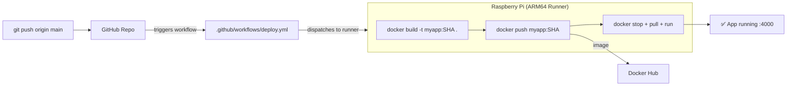

With your Raspberry Pi configured as a GitHub Actions runner, you can now build ARM64 Docker images natively and deploy them automatically on every push. This creates a complete CI/CD pipeline running entirely on your own hardware. Let's dive in!



## Github Repository

Complete example GitHub Actions workflows and Docker configurations from this guide are available in https://github.com/IaC-Toolbox/iac-toolbox-raspberrypi. Feel free to clone it and follow along!

## The ARM64 Challenge

Raspberry Pi uses ARM64 architecture, which is different from the x86_64 architecture used by most cloud servers and development machines. Docker images built for x86_64 won't run on ARM64 and vice versa. This is a common gotcha!

**Solution**: Build Docker images directly on your Raspberry Pi using the self-hosted GitHub Actions runner. This ensures native ARM64 builds without emulation (which would be painfully slow).

## CI/CD Workflow Overview

Our workflow will:
1. Trigger on push to main branch
2. Build Docker image on the Raspberry Pi runner
3. Push image to Docker Hub
4. Pull and run the updated container on the same Pi

## Prerequisites

- Self-hosted GitHub Actions runner configured (previous section)
- Docker Hub account
- Repository with a Dockerfile

## Step 1: Create Docker Hub Credentials

1. Sign up at [Docker Hub](https://hub.docker.com/) if you haven't already
2. Go to **Account Settings** → **Security** → **New Access Token**
3. Create a token with Read & Write permissions
4. Save the token securely

## Step 2: Add GitHub Secrets

Add your Docker Hub credentials to GitHub:

1. Go to your repository **Settings** → **Secrets and variables** → **Actions**
2. Click **New repository secret**
3. Add two secrets:
   - `DOCKER_USERNAME`: Your Docker Hub username
   - `DOCKER_PASSWORD`: Your Docker Hub access token

## Step 3: Create GitHub Actions Workflow

Create `.github/workflows/deploy.yml`:

```yml
name: Build and Deploy

on:
  push:
    branches: [main]
  workflow_dispatch:

jobs:
  build_and_push:
    runs-on: [self-hosted, ARM64]
    outputs:
      tag: ${{ steps.set_tag.outputs.tag }}

    steps:
      - name: Checkout Code
        uses: actions/checkout@v4

      - name: Log in to Docker Hub
        uses: docker/login-action@v3
        with:
          username: ${{ secrets.DOCKER_USERNAME }}
          password: ${{ secrets.DOCKER_PASSWORD }}

      - name: Build Docker Image
        run: |
          TAG=${{ github.sha }}
          echo "Building image with tag: $TAG"
          docker build -t ${{ secrets.DOCKER_USERNAME }}/my-app:$TAG .
          docker build -t ${{ secrets.DOCKER_USERNAME }}/my-app:latest .

      - name: Push Docker Image
        run: |
          TAG=${{ github.sha }}
          docker push ${{ secrets.DOCKER_USERNAME }}/my-app:$TAG
          docker push ${{ secrets.DOCKER_USERNAME }}/my-app:latest

      - name: Set output tag
        id: set_tag
        run: echo "tag=${{ github.sha }}" >> "$GITHUB_OUTPUT"

  deploy:
    runs-on: [self-hosted, ARM64]
    needs: build_and_push

    steps:
      - name: Stop existing container
        run: |
          docker stop my-app || true
          docker rm my-app || true

      - name: Pull and run new container
        run: |
          TAG=${{ needs.build_and_push.outputs.tag }}
          docker pull ${{ secrets.DOCKER_USERNAME }}/my-app:$TAG
          docker run -d \
            --name my-app \
            -p 4000:4000 \
            --restart unless-stopped \
            ${{ secrets.DOCKER_USERNAME }}/my-app:$TAG
```

## Understanding the Workflow

**Triggers**: Runs on every push to main, or manually via `workflow_dispatch`

**Job 1 - build_and_push**:
- Runs on self-hosted ARM64 runner
- Checks out code
- Logs into Docker Hub
- Builds image with commit SHA tag and latest tag
- Pushes both tags to Docker Hub
- Outputs the tag for the next job

**Job 2 - deploy**:
- Runs after build_and_push completes
- Stops and removes existing container
- Pulls the new image
- Runs the new container on port 4000

## Step 4: Managing Environment Variables

If your application needs environment variables, create them on your Pi using Ansible.

Add to `roles/docker/tasks/main.yml`:

```yml
- name: Create environment file for application
  copy:
    dest: /etc/my-app.env
    content: |
      DATABASE_URL={{ database_url }}
      API_KEY={{ api_key }}
    owner: '{{ ansible_user }}'
    group: '{{ ansible_user }}'
    mode: '0600'
```

Then use in workflow:

```yml
- name: Pull and run new container
  run: |
    TAG=${{ needs.build_and_push.outputs.tag }}
    docker pull ${{ secrets.DOCKER_USERNAME }}/my-app:$TAG
    docker run -d \
      --name my-app \
      -p 4000:4000 \
      --env-file /etc/my-app.env \
      --restart unless-stopped \
      ${{ secrets.DOCKER_USERNAME }}/my-app:$TAG
```

## Example Dockerfile

Here's a simple Node.js example:

```dockerfile
FROM node:20-alpine

WORKDIR /app

COPY package*.json ./
RUN npm ci --production

COPY . .

EXPOSE 4000

CMD ["node", "server.js"]
```

## Testing the Pipeline

Now for the moment of truth! Let's test the entire pipeline:

1. Commit and push changes to your repository:

```bash
git add .
git commit -m "Add CI/CD workflow"
git push origin main
```

2. Watch the workflow run in **Actions** tab on GitHub (this is where the magic happens!)

3. Verify the container is running on your Pi:

```bash
ssh pi@raspberrypi.local
docker ps
```

4. Test your application:

```bash
curl http://localhost:4000
# or via Cloudflare tunnel
curl https://api.yourdomain.com
```

If you see your app responding, congratulations - your CI/CD pipeline is working!

## Advanced: Multi-Container Deployments

For applications with multiple services, use Docker Compose.

Create `docker-compose.yml` in your repository:

```yml
version: '3.8'

services:
  api:
    image: ${DOCKER_USERNAME}/my-api:${TAG}
    ports:
      - "4000:4000"
    env_file:
      - /etc/my-app.env
    restart: unless-stopped

  worker:
    image: ${DOCKER_USERNAME}/my-worker:${TAG}
    env_file:
      - /etc/my-app.env
    restart: unless-stopped
```

Update workflow:

```yml
- name: Deploy with Docker Compose
  run: |
    export TAG=${{ needs.build_and_push.outputs.tag }}
    export DOCKER_USERNAME=${{ secrets.DOCKER_USERNAME }}
    docker-compose down
    docker-compose up -d
```

## Troubleshooting

**Build fails with "disk space" error**:
```bash
# Clean up old images
docker system prune -a
```

**Container exits immediately**:
```bash
# Check logs
docker logs my-app
```

**Port already in use**:
```bash
# Find and stop conflicting container
docker ps
docker stop <container-id>
```

## Next Steps

And that's a wrap! You now have a complete on-premises CI/CD pipeline running on your Raspberry Pi. Every push to your repository automatically builds and deploys your application. In the conclusion, we'll review what you've built and discuss where to go from here. Continue reading!
