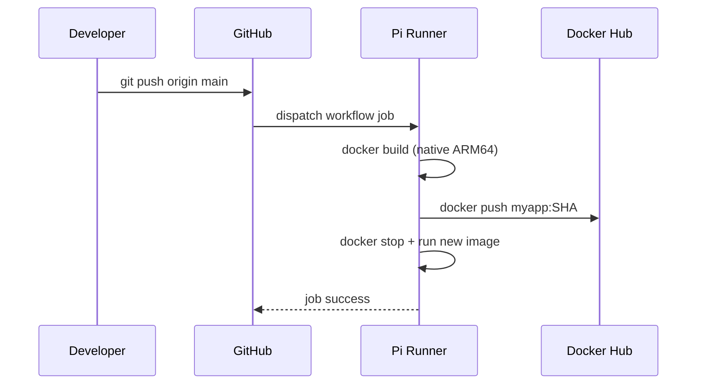

GitHub Actions has quickly become the go-to solution for CI/CD workflows. While GitHub provides hosted runners for various operating systems and architectures, using your Raspberry Pi as a **self-hosted runner** gives you several compelling advantages:

- **ARM64 native builds**: Build Docker images and binaries for ARM64 architecture without emulation (no more slow cross-compilation!)
- **Cost savings**: No GitHub Actions minutes consumed for self-hosted runners (completely free!)
- **Full control**: Access to local resources and custom tooling on your own hardware
- **Always available**: Your runner is always ready when you need it (as long as your Pi is powered on)

In this guide, we'll walk through configuring your Raspberry Pi 4B as a GitHub Actions runner and set it up to start automatically on boot. Let's dive in!



## Github Repository

The complete GitHub Actions runner Ansible role and configuration from this guide are available in https://github.com/IaC-Toolbox/iac-toolbox-raspberrypi. Feel free to clone it and follow along!

## Use Cases for Self-Hosted Runners

Using a Raspberry Pi as a self-hosted runner is particularly useful if you are:

- Building and testing ARM64 Docker images
- Running workflows that interact with IoT or edge devices
- Developing applications for Raspberry Pi or similar platforms
- Learning CI/CD without consuming GitHub Actions minutes
- Testing infrastructure automation locally before deploying to production

## Step 1: Create a Self-Hosted Runner on GitHub

First things first - you need to register your Pi as a runner in your GitHub repository or organization.

### For a Repository

Navigate to your GitHub repository:

1. Go to **Settings** → **Actions** → **Runners**
2. Click **"New self-hosted runner"**
3. Choose:
   - **Operating System**: Linux
   - **Architecture**: ARM64

GitHub will generate a script tailored specifically for your configuration. It will look similar to this:

```bash
# Create a folder
mkdir actions-runner && cd actions-runner

# Download the latest runner package
curl -o actions-runner-linux-arm64-2.315.0.tar.gz -L \
  https://github.com/actions/runner/releases/download/v2.315.0/actions-runner-linux-arm64-2.315.0.tar.gz

# Extract the installer
tar xzf ./actions-runner-linux-arm64-2.315.0.tar.gz

# Configure the runner
./config.sh --url https://github.com/<your-username>/<repo> --token <runner-token>
```

**Important**: Copy the exact commands from your GitHub UI, as the token is unique and time-limited.

## Step 2: Install the Runner on Your Raspberry Pi

SSH into your Raspberry Pi:

```bash
ssh pi@raspberrypi.local
```

Run the commands provided by GitHub to download, extract, and configure the runner:

```bash
mkdir actions-runner && cd actions-runner
curl -o actions-runner-linux-arm64-2.315.0.tar.gz -L https://github.com/actions/runner/releases/download/v2.315.0/actions-runner-linux-arm64-2.315.0.tar.gz
tar xzf ./actions-runner-linux-arm64-2.315.0.tar.gz
./config.sh --url https://github.com/<your-username>/<repo> --token <runner-token>
```

During configuration, you'll be prompted for:
- **Runner name**: Choose a descriptive name (e.g., `rpi-runner`)
- **Runner group**: Press Enter for default
- **Labels**: Add custom labels like `rpi`, `arm64`, `docker` (useful for targeting specific jobs)
- **Work folder**: Press Enter for default (`_work`)

## Step 3: Test the Runner

Before setting up the service, test the runner manually:

```bash
./run.sh
```

You should see output like:

```
√ Connected to GitHub
√ Listening for Jobs
```

Keep this terminal open and trigger a test workflow from GitHub. If everything works, you'll see the job execute on your Pi.

Press `Ctrl+C` to stop the runner once you've confirmed it works.

## Step 4: Install as a System Service

To ensure the runner starts automatically on boot and runs in the background, install it as a systemd service:

```bash
sudo ./svc.sh install
```

This command:
- Creates a systemd service file
- Configures the runner to start on boot
- Sets up automatic restarts on failure

### Start the Service

Start the runner service:

```bash
sudo ./svc.sh start
```

### Verify the Service

Check that the service is running:

```bash
sudo ./svc.sh status
```

You should see output indicating the service is active and running.

### Service Management Commands

```bash
# Start the runner
sudo ./svc.sh start

# Stop the runner
sudo ./svc.sh stop

# Check status
sudo ./svc.sh status

# Restart the runner
sudo ./svc.sh restart

# Uninstall the service
sudo ./svc.sh uninstall
```

## Automating with Ansible

Now that you understand the manual setup, let's automate it! This is especially useful if you need to set up multiple runners or want to rebuild your Pi from scratch.

### Create GitHub Runner Role

Create `roles/github-runner/tasks/main.yml`:

```yml
# roles/github-runner/tasks/main.yml
- name: Update apt packages
  apt:
    update_cache: yes
    upgrade: yes

- name: Install required packages
  apt:
    name:
      - git
      - docker.io
      - curl
      - jq
    state: present

- name: Create runner directory
  file:
    path: "{{ runner_dir }}"
    state: directory
    owner: "{{ ansible_user }}"
    group: "{{ ansible_user }}"

- name: Download GitHub Actions runner tarball
  become_user: "{{ ansible_user }}"
  get_url:
    url: "https://github.com/actions/runner/releases/download/v{{ runner_version }}/actions-runner-linux-arm64-{{ runner_version }}.tar.gz"
    dest: "{{ runner_dir }}/actions-runner.tar.gz"
    mode: '0644'

- name: Extract GitHub Actions runner
  become_user: "{{ ansible_user }}"
  unarchive:
    src: "{{ runner_dir }}/actions-runner.tar.gz"
    dest: "{{ runner_dir }}"
    remote_src: yes

- name: Check if runner is already configured
  stat:
    path: "{{ runner_dir }}/.runner"
  register: runner_configured

- name: Configure GitHub Actions runner
  become_user: "{{ ansible_user }}"
  shell: |
    ./config.sh --unattended \
      --url {{ github_repo_url }} \
      --token {{ runner_token }} \
      --labels {{ runner_labels }} \
      --work _work
  args:
    chdir: "{{ runner_dir }}"
  when: not runner_configured.stat.exists

- name: Install runner as a service
  shell: |
    cd {{ runner_dir }}
    sudo ./svc.sh install {{ ansible_user }}
    sudo ./svc.sh start
  args:
    creates: /etc/systemd/system/actions.runner.*

- name: Find GitHub Actions runner service file
  find:
    paths: /etc/systemd/system
    patterns: "actions.runner.*.service"
  register: runner_service

- name: Enable and start the runner service
  systemd:
    name: "{{ runner_service.files[0].path | basename }}"
    enabled: yes
    state: started
  when: runner_service.files | length > 0
```

### Create Variables File

Create `roles/github-runner/defaults/main.yml`:

```yml
# roles/github-runner/defaults/main.yml
runner_version: "2.315.0"
runner_dir: "/home/{{ ansible_user }}/actions-runner"
runner_labels: "rpi,arm64,docker"
```

### Update Playbook with Runner Token

Update `playbooks/playbook.yml`:

```yml
# playbooks/playbook.yml
- name: Setup Raspberry Pi
  hosts: all
  become: true
  vars_files:
    - ../secrets.yml

  vars:
    github_repo_url: "https://github.com/your-username/your-repo"
    runner_token: "{{ github_runner_token }}"

  roles:
    - setup
    - docker
    - secrets
    - github-runner
```

### Add Runner Token to Secrets

The runner token is time-limited, so you'll need to generate it fresh. Add it to your `secrets.yml.j2`:

```yaml
# secrets.yml.j2
---
openai_api_key: "{{ lookup('env', 'OPENAI_API_KEY') }}"
github_runner_token: "{{ lookup('env', 'GITHUB_RUNNER_TOKEN') }}"
```

### Get Fresh Runner Token

Before running the playbook, get a fresh token from GitHub:

1. Go to **Settings** → **Actions** → **Runners**
2. Click **"New self-hosted runner"**
3. Copy the token from the command that looks like:
   ```bash
   ./config.sh --url https://github.com/... --token ABCDEFGH123456...
   ```

Add it to your `.env`:

```bash
# .env
GITHUB_RUNNER_TOKEN=your-token-here
```

Regenerate the vault:

```bash
rm secrets.yml
export $(grep -v '^#' .env | xargs)
ansible-playbook ./playbooks/seed_vault.yml
```

### Run the Playbook

```bash
ansible-playbook -i inventory/all.yml playbooks/playbook.yml --vault-password-file .vault_pass.txt
```

The runner will be automatically installed and started!

### Why Both Manual and Automated?

You might wonder why we showed both approaches. Here's the reasoning:

**Manual setup** helps you understand what's happening under the hood. When things break (and they will!), you'll know how to troubleshoot.

**Ansible automation** makes it reproducible and scalable. Need to rebuild? Just run the playbook. Have multiple Pis? Run it on all of them.

Best practice: Set up manually first to understand it, then automate for production use.

## Step 5: Use the Runner in Your Workflows

Now that your runner is registered and running, you can target it in your GitHub Actions workflows.

### Basic Example

Create or update `.github/workflows/build.yml` in your repository:

```yml
name: Build on Raspberry Pi

on:
  push:
    branches: [main]
  pull_request:
    branches: [main]

jobs:
  build:
    runs-on: [self-hosted, Linux, ARM64]

    steps:
      - name: Checkout Code
        uses: actions/checkout@v4

      - name: Run Tests
        run: |
          echo "Running on: $(uname -m)"
          echo "OS: $(uname -s)"
```

### Using Custom Labels

If you added custom labels during setup (like `rpi`, `docker`), you can use them for more specific targeting:

```yml
jobs:
  build:
    runs-on: [self-hosted, rpi, arm64, docker]

    steps:
      - name: Build Docker Image
        run: |
          docker build -t my-app:latest .
```

This ensures the job only runs on runners with all specified labels.

## Step 6: Monitor the Runner

### View Logs

If you need to troubleshoot, check the runner logs:

```bash
# View recent logs
sudo journalctl -u actions.runner.* -n 100

# Follow logs in real-time
sudo journalctl -u actions.runner.* -f
```

### GitHub UI

You can also monitor your runner from GitHub:
1. Go to **Settings** → **Actions** → **Runners**
2. Your runner should show as "Idle" when waiting for jobs, or "Active" when running a job

## Troubleshooting

**Runner doesn't appear in GitHub?**
- Check that the service is running: `sudo ./svc.sh status`
- Verify network connectivity from your Pi
- Check logs: `sudo journalctl -u actions.runner.* -n 50`

**Jobs failing with "permission denied"?**
- Ensure the runner user has necessary permissions (e.g., docker group for Docker builds)
- Check file permissions in the `_work` directory

**Runner goes offline randomly?**
- Check system logs: `sudo journalctl -xe`
- Verify your Pi has adequate power supply
- Ensure your network connection is stable

## Security Considerations

**Important**: Self-hosted runners execute code from your repository. Only use self-hosted runners with repositories you trust. For public repositories, consider the security implications carefully.

Best practices:
- Use self-hosted runners only for private repositories or repositories you control
- Keep your Raspberry Pi system updated
- Limit runner permissions to only what's necessary
- Monitor runner activity regularly

## Next Steps

And that's a wrap! Your Raspberry Pi is now a fully functional GitHub Actions runner. This setup opens the door to a more customized and hardware-aware DevOps pipeline. In the next section, we'll set up a Cloudflare tunnel to expose your Pi securely to the internet, enabling public access to services running on it. Happy hacking! 🚀
