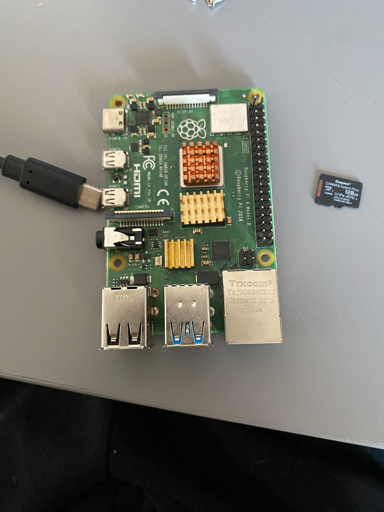
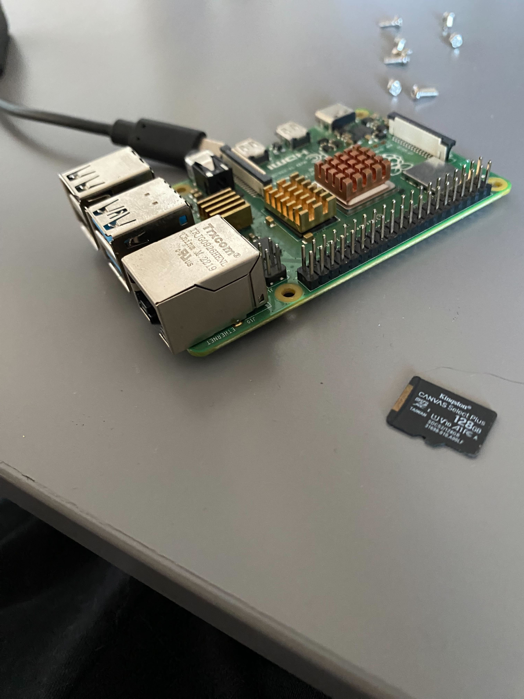
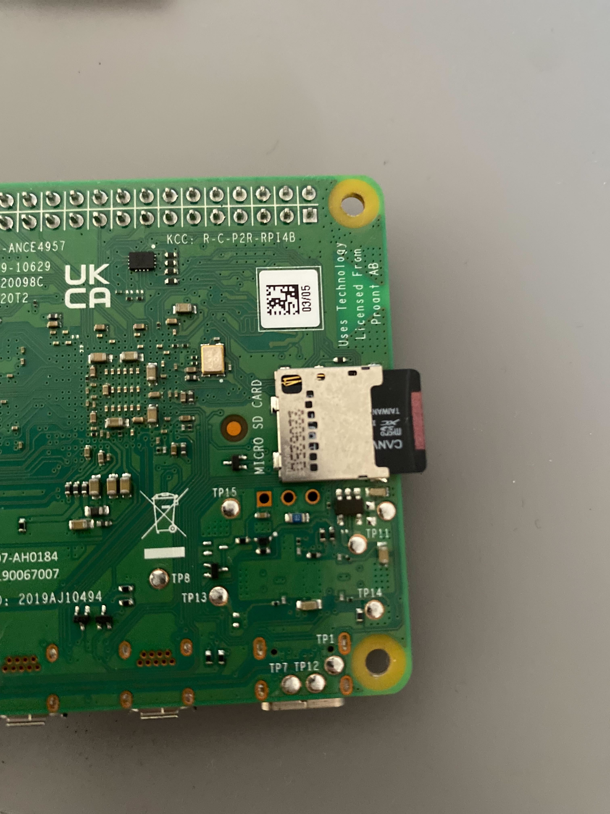
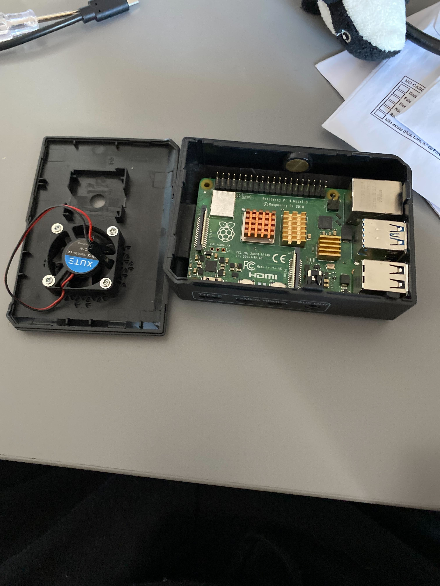
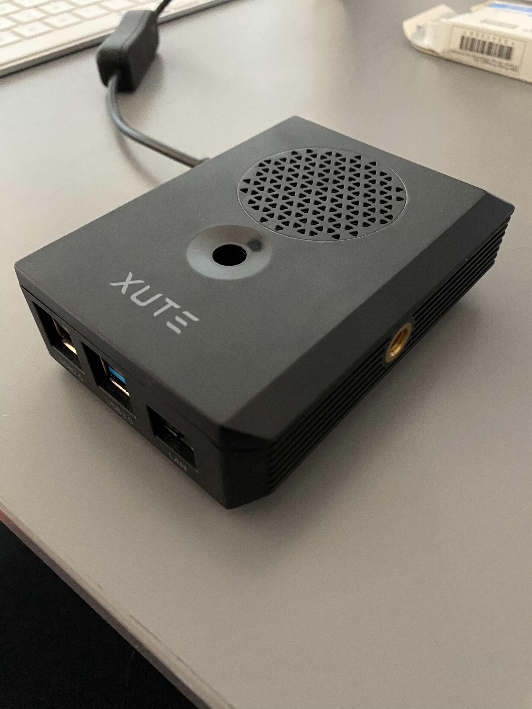
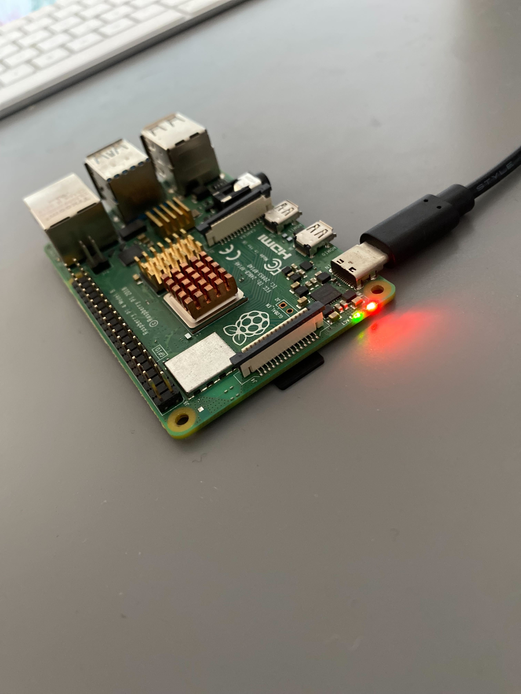

Before diving into the software setup, let's talk about what you'll need hardware-wise. The good news? It's a short list and won't break the bank!

## Github Repository

All the Ansible configurations and setup scripts from this guide series are available in https://github.com/IaC-Toolbox/iac-toolbox-raspberrypi. Feel free to clone it and follow along!

```
┌─────────────────────────────────────────────────────────┐
│           COMPLETE RASPBERRY PI SETUP                   │
├─────────────────────────────────────────────────────────┤
│                                                         │
│  ┌────────────────────────────────────────────┐        │
│  │    Raspberry Pi 4B (4GB or 8GB RAM)        │        │
│  │    • ARM64 CPU                             │        │
│  │    • 4 USB ports                           │        │
│  │    • Gigabit Ethernet                      │        │
│  │    • WiFi + Bluetooth                      │        │
│  └─────────────┬──────────────────────────────┘        │
│                │                                        │
│  ┌─────────────▼──────────────┐  ┌──────────────────┐  │
│  │    microSD Card            │  │   Power Supply   │  │
│  │    • 32GB minimum          │  │   • 5V/3A USB-C  │  │
│  │    • 128GB recommended     │  │   • Official     │  │
│  │    • Class 10 or U3        │  │   • Required!    │  │
│  └────────────────────────────┘  └──────────────────┘  │
│                                                         │
│  ┌────────────────────────────────────────────┐        │
│  │         OPTIONAL COMPONENTS                │        │
│  │  • Case with cooling (recommended)         │        │
│  │  • Ethernet cable (better than WiFi)       │        │
│  │  • Micro HDMI + keyboard (troubleshooting) │        │
│  └────────────────────────────────────────────┘        │
└─────────────────────────────────────────────────────────┘

        Total Cost: $70-120 (one-time purchase)
        vs Cloud: $360-480/year recurring
```

## Required Hardware

### Raspberry Pi 4B

The heart of your infrastructure. I recommend the 4GB or 8GB RAM version:

- **4GB RAM**: Good for personal projects, light Docker workloads, and learning
- **8GB RAM**: Better for multiple containers or heavier applications

You can buy it from various retailers. Prices typically range from $50-80 depending on RAM.



### MicroSD Card

This will hold your operating system and all data:

- **Capacity**: 32GB minimum, 64GB or 128GB recommended
- **Speed**: Class 10 or better (U3 is ideal)
- **Brand**: Stick with reliable brands like SanDisk, Samsung, or Kingston

**Recommendation**: [Kingston 128GB microSD Card](https://amzn.eu/d/06cuIcV) - reliable and fast

Why larger is better? Docker images, logs, and application data add up quickly. A 128GB card gives you breathing room.



Once you have your microSD card flashed with the OS, simply insert it into the Pi:



### Power Supply

The official Raspberry Pi power supply is your safest bet:

- **Official**: 5V/3A USB-C power supply with the Raspberry Pi logo
- **Why official?**: Raspberry Pi 4B can be picky about power. Cheap adapters cause random crashes and corruption.

Don't cheap out here - a bad power supply will cause endless headaches!

### Case (Optional but Recommended)

Protect your Pi from dust, accidents, and curious fingers:

- **Basic cases**: $5-10, provides physical protection
- **Cases with cooling**: $10-20, includes heatsinks or fans
- **Example**: [Raspberry Pi Case with Cooling](https://www.amazon.co.uk/Raspberry-Starter-MicroSD-Supply-Cooling/dp/B09ZNWNZTD)

For 24/7 operation, get one with passive cooling (heatsinks) or a small fan.



Here's what it looks like when assembled and closed:



## Optional but Useful

### Ethernet Cable

While WiFi works, wired Ethernet is:
- More reliable
- Lower latency
- Better for 24/7 operation

If your Pi will be near your router, use Ethernet!

### Micro HDMI Cable

Only needed for initial troubleshooting. Once SSH is working, you won't need it.

### USB Keyboard

Same as above - just for initial setup if SSH doesn't work immediately.

## Total Cost Breakdown

Let's talk numbers:

**Minimal Setup** (~$70-90):
- Raspberry Pi 4B (4GB): $55
- 32GB microSD card: $8
- Official power supply: $8
- Basic case: $5

**Recommended Setup** (~$100-120):
- Raspberry Pi 4B (8GB): $75
- 128GB microSD card: $15
- Official power supply: $8
- Case with cooling: $15
- Ethernet cable: $5

Compare this to cloud costs of $360-480/year, and you see why this makes sense!

## What You Don't Need

**Monitor**: This is a headless setup - no display needed!

**Mouse**: SSH access only - save your money.

**USB Hub**: The Pi 4B has enough ports for most setups.

**Expensive Storage**: A good microSD card is fine. Don't spend extra on M.2 SSDs unless you need extreme performance.

## Before You Buy

**Check availability**: Raspberry Pi stock can be limited. Check multiple retailers.

**Bundle deals**: Sometimes buying a kit (Pi + power + case + SD card) is cheaper than individual parts.

**Used Pi**: If buying used, test it thoroughly - damaged GPIO pins or faulty power circuitry isn't worth the savings.

## Next Steps

Got your hardware? Perfect! Once everything is connected and powered on, you should see the status LEDs light up:



Now let's dive in and get started by setting up the Raspberry Pi operating system!
