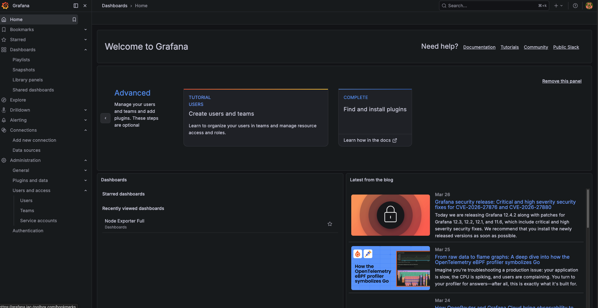

Your Raspberry Pi needs a visualization platform to display metrics and create dashboards. In this guide, we'll deploy Grafana using automated Ansible - giving you a powerful open-source visualization tool ready in minutes.

**What this tutorial covers:**
- Automated Grafana deployment using Ansible
- Configuring Grafana admin password
- Exposing Grafana via Cloudflare tunnel at grafana.iac-toolbox.com
- Accessing and exploring the Grafana UI

**Time to complete:** 5-10 minutes (automated deployment)

## Github Repository

All the configuration and deployment scripts from this guide are available in https://github.com/IaC-Toolbox/iac-toolbox-raspberrypi. Clone it and follow along!

## What is Grafana?

Grafana is an open-source analytics and visualization platform that lets you query, visualize, alert on, and explore your metrics. Think of it as a dashboard for your infrastructure - you can see real-time graphs of CPU usage, memory consumption, network traffic, and anything else you want to monitor.

**Why Grafana?**

- **Open Source & Free**: Community edition is completely free with no limitations
- **Beautiful Dashboards**: Create stunning, interactive visualizations of your data
- **Wide Data Source Support**: Works with Prometheus, InfluxDB, Elasticsearch, and 50+ other sources
- **Lightweight**: Runs efficiently on Raspberry Pi ARM64 architecture
- **Powerful Alerting**: Set up alerts for when things go wrong
- **Active Community**: Thousands of pre-built dashboards you can import

## Architecture Overview

Here's how Grafana fits into your infrastructure:

```
┌────────────────────────────────────────────────────────────────┐
│                   GRAFANA ARCHITECTURE                         │
└────────────────────────────────────────────────────────────────┘

  🌍 You (anywhere in the world)
       │
       │ HTTPS Request
       │ https://grafana.iac-toolbox.com
       ▼
  ┌──────────────────────────────┐
  │   Cloudflare Network         │
  │   • Handles SSL/TLS          │
  │   • DDoS protection          │
  └───────────┬──────────────────┘
              │
              │ Encrypted tunnel
              │
  ┌───────────▼──────────────────────────────────────────────┐
  │         Raspberry Pi                                      │
  │                                                           │
  │  ┌─────────────────────────────────────────────────┐     │
  │  │  Grafana (Port 3000)                            │     │
  │  │  • Web UI for visualizations                    │     │
  │  │  • Admin password from .env                     │     │
  │  │  • Ready for data sources                       │     │
  │  │  • Deployed via Ansible                         │     │
  │  └─────────────────────────────────────────────────┘     │
  │                                                           │
  └───────────────────────────────────────────────────────────┘
```

**How it works:**

1. **Ansible** reads your configuration from `.env` file
2. **Grafana** is deployed automatically via Docker Compose
3. **Admin password** is set from `GRAFANA_ADMIN_PASSWORD` environment variable
4. **Password backup** is optionally stored in Vault (if Vault is running)
5. **Cloudflare Tunnel** exposes Grafana securely at `grafana.iac-toolbox.com`
6. **Systemd** manages the Grafana service for auto-start on reboot

## Prerequisites

Before starting, ensure you have:
- Cloned the [iac-toolbox-raspberrypi](https://github.com/IaC-Toolbox/iac-toolbox-raspberrypi) repository
- Raspberry Pi accessible via SSH
- Ansible installed on your local machine (Mac/Linux)
- Docker installed on Raspberry Pi
- Cloudflare tunnel configured (optional, for remote access)

## Step 1: Configure Grafana Password

Add your Grafana admin password to the `.env` file. The password can be **any string you choose**.

Navigate to the Ansible configuration directory:

```bash
cd ansible-configurations
```

**Option 1: Generate a secure random password (recommended)**

```bash
# Generate and add to .env file
echo "GRAFANA_ADMIN_PASSWORD=$(openssl rand -base64 32)" >> .env
```

**Option 2: Set your own password**

Edit `.env` and add:

```bash
GRAFANA_ADMIN_PASSWORD=YourSecurePassword123!
```

**Important notes:**
- The password can be **any string** - there are no special requirements
- Choose something memorable or use a password manager
- The password will be automatically backed up to Vault if Vault is running

Verify the password was added:

```bash
grep GRAFANA_ADMIN_PASSWORD .env
```

## Step 2: Deploy Grafana with Ansible

Load the environment variables and run the Ansible playbook:

```bash
# Load .env file
source .env

# Deploy Grafana
./run-playbook.sh playbooks/main.yml --tags grafana
```

The Ansible playbook will automatically:
1. Read `GRAFANA_ADMIN_PASSWORD` from your environment
2. Create Grafana directory structure on Raspberry Pi (`/home/user/grafana/`)
3. Generate docker-compose.yml with your password
4. Pull the Grafana Docker image
5. Create systemd service for auto-start on reboot
6. Start Grafana container
7. Create shared `monitoring` Docker network
8. Backup password to Vault (if Vault is running)

**What gets deployed:**

```yaml
# Generated docker-compose.yml on Raspberry Pi
services:
  grafana:
    image: grafana/grafana:latest
    container_name: grafana
    restart: unless-stopped
    ports:
      - "3000:3000"
    volumes:
      - grafana_data:/var/lib/grafana
    environment:
      - GF_SECURITY_ADMIN_USER=admin
      - GF_SECURITY_ADMIN_PASSWORD=<your-password>
      - GF_SERVER_ROOT_URL=https://grafana.iac-toolbox.com
      - GF_SERVER_DOMAIN=grafana.iac-toolbox.com
    networks:
      - monitoring

volumes:
  grafana_data:

networks:
  monitoring:
    name: monitoring
    driver: bridge
```

Watch the deployment progress - it should complete in 1-2 minutes.

## Step 3: Verify Deployment

Check that Grafana is running:

```bash
# Check container status
ssh <your-user>@<raspberry-pi> 'docker ps | grep grafana'

# Check systemd service
ssh <your-user>@<raspberry-pi> 'sudo systemctl status grafana'

# Test local access
ssh <your-user>@<raspberry-pi> 'curl -f http://localhost:3000/api/health'
```

Expected output: `{"database":"ok"}`

## Step 4: Access Grafana UI

**Option 1: Via Cloudflare Tunnel (recommended)**

Open your browser and navigate to:

```
https://grafana.iac-toolbox.com
```

**Option 2: Local Access**

```
http://<raspberry-pi-ip>:3000
```

**Login credentials:**
- **Username**: `admin`
- **Password**: The password you set in `.env` file

You should see the Grafana welcome screen!



## Step 5: Explore Grafana UI

Since this is Phase 1, you won't have any data sources or dashboards yet. Let's explore what's available:

### What You Can Do Now

1. **Explore the Interface**
   - Navigate through the menu (☰ icon)
   - Check out "Connections" → "Data sources" (empty for now)
   - Browse "Dashboards" (none yet)
   - Review "Configuration" settings


2. **User Management**
   - Go to "Administration" → "Users"
   - See your admin account
   - Can add additional users/viewers if needed

3. **Check Settings**
   - Your Grafana is configured for: `https://grafana.iac-toolbox.com`
   - Admin user: `admin`
   - Data persisted in Docker volume
   - Connected to `monitoring` Docker network

### What's Next?

This completes Grafana setup! You now have:
- ✅ Grafana running and accessible
- ✅ Secure admin login configured
- ✅ Cloudflare tunnel exposing HTTPS endpoint
- ✅ Systemd service for auto-start on reboot
- ✅ Shared Docker network ready for other services

**Next Step: Add Prometheus**
In the next tutorial, we'll add Prometheus and Node Exporter to collect and store metrics. This will give you real data to visualize in Grafana!

## Troubleshooting

### Ansible Deployment Fails

**Check environment variable is set:**

```bash
cd ansible-configurations
grep GRAFANA_ADMIN_PASSWORD .env
```

If missing, add it:

```bash
echo "GRAFANA_ADMIN_PASSWORD=$(openssl rand -base64 32)" >> .env
source .env
```

**Re-run deployment:**

```bash
./run-playbook.sh playbooks/main.yml --tags grafana
```

### Container Won't Start

**Check Grafana logs:**

```bash
ssh <your-user>@<raspberry-pi> 'docker logs grafana'
```

**Check systemd service:**

```bash
ssh <your-user>@<raspberry-pi> 'sudo journalctl -u grafana -n 50'
```

**Restart manually:**

```bash
ssh <your-user>@<raspberry-pi> 'sudo systemctl restart grafana'
```

### Can't Access via Cloudflare

**Verify tunnel is running:**

```bash
ssh <your-user>@<raspberry-pi> 'sudo systemctl status cloudflared'
```

**Check Cloudflare tunnel configuration includes Grafana:**

```bash
ssh <your-user>@<raspberry-pi> 'cat ~/.cloudflared/config.yml'
```

Should include:
```yaml
- hostname: grafana.iac-toolbox.com
  service: http://localhost:3000
```

### Grafana Login Fails

**Check your password in .env file:**

```bash
cd ansible-configurations
grep GRAFANA_ADMIN_PASSWORD .env
```

**Reset password and redeploy:**

```bash
# Update .env with new password
nano .env

# Redeploy
source .env
./run-playbook.sh playbooks/main.yml --tags grafana
```

The docker-compose.yml will be regenerated with the new password.

### Reset Grafana Completely

If you need to start fresh:

```bash
# SSH to Pi
ssh <your-user>@<raspberry-pi>

# Stop and remove
sudo systemctl stop grafana
docker stop grafana
docker rm grafana

# Remove data volume (optional - loses all dashboards/settings)
docker volume rm grafana_grafana_data

# Redeploy
exit
cd ansible-configurations
source .env
./run-playbook.sh playbooks/main.yml --tags grafana
```

## Summary

Congratulations! You've successfully deployed Grafana using automated Ansible configuration.

**✅ What You Accomplished:**
- Grafana visualization platform deployed
- Secure password configuration via `.env`
- Systemd service for automatic startup
- Cloudflare tunnel for HTTPS access
- Shared Docker network created for future services

**📝 Key Files Created:**
- `/home/<user>/grafana/docker-compose.yml` - Container configuration
- `/etc/systemd/system/grafana.service` - Systemd service
- Vault backup: `kv/observability/grafana` (if Vault running)

### **🔑 Access Details:**
- **URL**: https://grafana.iac-toolbox.com
- **Username**: admin
- **Password**: Your `GRAFANA_ADMIN_PASSWORD` from `.env`

### **🎯 What Makes This Different:**

Unlike manual deployment, this automated approach:
- Takes 5 minutes instead of 20-25 minutes
- Eliminates human error in configuration
- Password can be any string you choose
- Automatically backed up to Vault
- Survives reboots (systemd managed)
- Integrated with your infrastructure

### **🚀 Next Tutorial:**

Ready to see actual metrics? Continue with the Prometheus setup guide to add metrics collection and Node Exporter. You'll get system monitoring dashboards showing CPU, memory, disk, and network stats in real-time!
